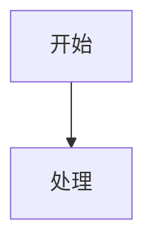

# 鱼巢流程图落盘

## Core Rule

When the user asks to draw a flowchart, do not only answer in chat. Create durable files:

```text
D:\鱼巢\流程图\<filename>.md
D:\鱼巢\流程图\<filename>.html
```

The `.md` and `.html` filenames must match except for extension.

## Start Context

1. Confirm the workspace. If it is `D:\鱼巢`, use `D:\鱼巢\流程图`.
2. If the flowchart represents an active plan, root-cause path, demand tree, task lifecycle, method execution, external observation, or thread boundary, read the relevant current plan/spec files named by `AGENTS.md` and `计划/计划索引.md` before drawing.
3. If the user only asks for a conceptual flowchart and no code/spec authority is needed, create the files directly.
4. Use scoped `rg` / short reads when deriving the chart from code. Do not paste large code blocks into the diagram.

## File Naming

Use this pattern unless the user gives an exact filename:

```text
YYYYMMDD_<主题>_流程图_v0.1.md
YYYYMMDD_<主题>_流程图_v0.1.html
```

Rules:

- Keep filenames compact and Chinese-readable.
- If a matching topic already exists, increment `v0.2`, `v0.3`, etc. Do not overwrite unless the user explicitly asks to update that exact file.
- For subdomain folders already present under `流程图/`, use them only when the target clearly belongs there. Otherwise write to the root `流程图/`.

## Markdown Format

The `.md` file should contain:

````markdown
# <title>

更新时间：YYYY-MM-DD

## 依据

```text
<source files, logs, plans, or user-provided material>
```

## 说明

<short boundary notes; no inflated completion claims>

## 流程图



## 关键边界

```text
<constraints and non-goals>
```
````

Use Mermaid `flowchart TD` by default. Use `sequenceDiagram` only when the user specifically asks for a timeline or message sequence.

## HTML Format

The `.html` file must be standalone enough to open in a browser and render the same Mermaid content through CDN:

```html
<!doctype html>
<html lang="zh-CN">
<head>
  <meta charset="utf-8">
  <meta name="viewport" content="width=device-width, initial-scale=1">
  <title><!-- same title --></title>
  <style>
    body { margin: 0; font-family: "Microsoft YaHei", "Segoe UI", Arial, sans-serif; background: #f7f8fa; color: #1f2328; }
    header { padding: 18px 24px 12px; border-bottom: 1px solid #d8dee4; background: #fff; }
    h1 { margin: 0 0 8px; font-size: 22px; font-weight: 650; }
    .hint { margin: 0; font-size: 13px; color: #57606a; line-height: 1.6; max-width: 1280px; }
    main { padding: 20px; }
    .canvas { min-width: 1800px; padding: 16px; border: 1px solid #d8dee4; background: #fff; overflow: auto; }
    .mermaid { min-width: 1760px; }
    .notes { margin-top: 18px; padding: 16px; border: 1px solid #d8dee4; background: #fff; max-width: 1180px; line-height: 1.65; font-size: 14px; }
  </style>
</head>
<body>
  <header>
    <h1><!-- same title --></h1>
    <p class="hint"><!-- short purpose/boundary --></p>
  </header>
  <main>
    <section class="canvas">
      <pre class="mermaid">
flowchart TD
    A["开始"] --> B["处理"]
      </pre>
    </section>
    <section class="notes"><!-- concise notes --></section>
  </main>
  <script type="module">
    import mermaid from "https://cdn.jsdelivr.net/npm/mermaid@10/dist/mermaid.esm.min.mjs";
    mermaid.initialize({ startOnLoad: true, securityLevel: "loose", flowchart: { useMaxWidth: false, htmlLabels: true, curve: "basis" }, theme: "base", themeVariables: { fontFamily: "Microsoft YaHei, Segoe UI, Arial, sans-serif", lineColor: "#6a737d" } });
  </script>
</body>
</html>
```

Escape HTML-sensitive characters inside the Mermaid block when needed. Prefer `<br/>` for line breaks in node labels.

## Diagram Quality

- Keep each node decision-oriented: state, action, condition, output, or boundary.
- Label edges when the branch matters.
- Put hard boundaries and forbidden paths into dashed constraint edges or a separate boundary cluster.
- For `D:\鱼巢`, preserve project boundaries: threads are not action sources, task planning/execution are not instinct methods, external changes are not self method action dynamics, and `I64_MAX` is not a real settlement value.
- Do not claim `自我苏醒完成` or `初步成熟完成` from a flowchart.

## Validation

Before final response:

1. Confirm both files exist.
2. Confirm the `.md` contains a Mermaid fenced block.
3. Confirm the `.html` contains the same Mermaid graph text and Mermaid CDN import.
4. For substantial or user-facing diagrams, run `git diff --check -- <md> <html>` if inside a git repo.
5. In the final answer, provide clickable absolute links to both files.
