# 下一步候选步骤视图生成逻辑图 v0.1

更新时间：2026-06-05

## 用途

本图是 `任务筹办普通函数状态机流程图 v0.2` 中：

```text
生成下一步候选步骤视图
促成 / 避免 / 条件补齐 / 方法就绪 / 证据补齐 / 副作用约束 / 学习缺口
```

的细分逻辑图。

本图接收上一阶段生成的目标比较和临时因果材料，生成七类候选步骤集合。它不决定哪条路径好用，不把候选写成正式需求，也不直接执行方法。

## 判断原则

```text
1. 候选步骤视图是任务筹办的临时材料，不是正式需求树。
2. 七类候选可以并存：一条促成路径可能同时需要条件补齐、方法就绪、证据补齐和副作用约束。
3. 促成候选来自主果命中当前目标；避免候选来自主果反向破坏当前目标。
4. 条件补齐只处理命中路径上的未知或未满足条件，不在筹办器里硬编码领域前置规则。
5. 方法就绪只补方法最小契约缺口，不直接生成“调用某方法”的命令。
6. 证据补齐只补证据，不直接冒充业务目标已经达成。
7. 副作用约束必须绑定被破坏的根分区或目标特征，不能停留在抽象风险描述。
8. 无促成、避免、条件、方法、证据路径时，生成学习缺口候选；因果来源结构损坏时才走逻辑错误。
9. 所有候选必须收束成明确目标比较，后续再进入归类、去重、环路检测、预算截断、目标化和提交裁决。
```

## 详细逻辑图

```mermaid
flowchart TD
    INPUT["输入: 临时因果材料<br/>根需求 / 根分区 / 目标比较 / 因果路径项 / 已入树子需求摘要"]
    INIT_VIEW["初始化下一步候选步骤视图<br/>七类集合为空 / 记录快照和生成轮次"]
    SOURCE_LOOP["遍历因果路径项<br/>世界树因果 / 遗传因果 / 需求侧条件 / 方法条件 / 动作动态证据"]

    ITEM_GATE{"路径项是否结构完整?<br/>来源因果 / 角色 / 层级 / 证据引用"}
    ITEM_ERROR["筹办回执: 路径项结构异常<br/>引用悬空 / 角色非法 / 层级非法"]
    ROLE_GATE{"路径项角色或主果关系?"}

    PROMOTE_GATE{"主果是否命中<br/>当前目标比较?"}
    PROMOTE_BUILD["构造促成候选<br/>以因模板或中间状态作为下一步目标"]
    PROMOTE_TARGET_GATE{"促成候选是否能<br/>收束成明确目标比较?"}
    PROMOTE_ADD["加入促成集合<br/>expected_gain / source_causal / evidence_refs / depth"]

    AVOID_GATE{"主果是否反向破坏<br/>当前目标比较?"}
    AVOID_BUILD["构造避免候选<br/>把失败路径改写为需避免的明确目标状态"]
    AVOID_TARGET_GATE{"避免候选是否有<br/>明确目标特征比较?"}
    AVOID_ADD["加入避免集合<br/>blocked_effect / avoid_target / source_causal"]

    CONDITION_GATE{"命中路径条件模板<br/>是否未知或未满足?"}
    CONDITION_BUILD["构造条件补齐候选<br/>条件状态达到可用 / 明确 / 满足"]
    CONDITION_TARGET_GATE{"条件候选是否能<br/>表达为明确目标比较?"}
    CONDITION_ADD["加入条件补齐集合<br/>condition_ref / required_state / source_path"]

    METHOD_GATE{"路径项是否含方法模板<br/>或方法支撑需求?"}
    METHOD_CONTRACT_GATE{"方法最小契约是否完整?<br/>输入 / 前置 / 动作入口 / 输出模式 / 动作动态落账"}
    METHOD_READY_BUILD["构造方法就绪候选<br/>补动作入口 / 输入参数模式 / 输出结果模式 / 条件结果对"]
    METHOD_TARGET_GATE{"方法就绪候选是否能<br/>表达为方法状态目标比较?"}
    METHOD_READY_ADD["加入方法就绪集合<br/>method_ref / missing_contract / readiness_target"]
    METHOD_HINT["记录方法候选依据<br/>不进入七类缺口集合 / 留给方法筹办候选召回"]

    EVIDENCE_GATE{"因果证据是否不足?<br/>样本少 / 最近失败 / 未验证 / 归因不明"}
    EVIDENCE_BUILD["构造证据补齐候选<br/>证据状态足够 / 反馈可信 / 归因确认"]
    EVIDENCE_TARGET_GATE{"证据候选是否能<br/>表达为证据状态目标比较?"}
    EVIDENCE_ADD["加入证据补齐集合<br/>evidence_ref / sample_need / verify_target"]

    SIDE_GATE{"路径是否存在副作用<br/>破坏其他根分区或目标特征?"}
    SIDE_BUILD["构造副作用约束候选<br/>副作用可接受 / 风险受控 / 约束已满足"]
    SIDE_TARGET_GATE{"副作用候选是否绑定<br/>被破坏目标和明确比较?"}
    SIDE_ADD["加入副作用约束集合<br/>affected_partition / affected_target / constraint_target"]

    NO_MATCH_ACC["累计本轮命中状态<br/>促成 / 避免 / 条件 / 方法 / 证据 / 副作用"]
    LOOP_MORE{"是否还有路径项?"}

    EMPTY_GATE{"七类集合是否全空?"}
    LEARNING_BUILD["构造学习缺口候选<br/>目标特征促成因果待补齐 / 满足路径待学习 / 可执行方法待建立"]
    LEARNING_TARGET_GATE{"学习候选是否能<br/>表达为明确学习目标比较?"}
    LEARNING_ADD["加入学习缺口集合<br/>learning_target / missing_knowledge / trigger_reason"]

    CANONICALIZE["候选字段规范化<br/>目标比较 / 生成类型 / 关系类型 / 获取途径建议 / 幂等键"]
    CANDIDATE_GATE{"候选字段是否齐全?<br/>父需求 / 根分区 / 目标宿主 / 特征 / 比较符 / 目标值"}
    BAD_CANDIDATE["候选不可目标化<br/>进入缺口草案来源分类"]

    VIEW_READY["输出: 下一步候选步骤视图<br/>促成 / 避免 / 条件补齐 / 方法就绪 / 证据补齐 / 副作用约束 / 学习缺口"]
    NEXT_STAGE["交给后续模块<br/>归类候选项 / 去重过滤 / 翻译草案 / 提交裁决"]

    RECEIPT_OUT["输出统一筹办回执<br/>候选视图 / 异常分类 / 压力材料"]
    NO_WRITE_NOTE["边界: 本图不入树<br/>不写任务状态 / 不执行方法 / 不直接选择路径"]
    PRESSURE["压力材料<br/>七类集合反复为空 / 候选反复不可目标化 / 方法就绪长期缺口 / 证据长期不足 / 副作用长期不可接受"]

    INPUT --> INIT_VIEW --> SOURCE_LOOP --> ITEM_GATE
    ITEM_GATE -->|否| ITEM_ERROR --> RECEIPT_OUT
    ITEM_GATE -->|是| ROLE_GATE

    ROLE_GATE --> PROMOTE_GATE
    PROMOTE_GATE -->|是| PROMOTE_BUILD --> PROMOTE_TARGET_GATE
    PROMOTE_TARGET_GATE -->|是| PROMOTE_ADD --> CONDITION_GATE
    PROMOTE_TARGET_GATE -->|否| BAD_CANDIDATE
    PROMOTE_GATE -->|否| AVOID_GATE

    AVOID_GATE -->|是| AVOID_BUILD --> AVOID_TARGET_GATE
    AVOID_TARGET_GATE -->|是| AVOID_ADD --> CONDITION_GATE
    AVOID_TARGET_GATE -->|否| BAD_CANDIDATE
    AVOID_GATE -->|否| CONDITION_GATE

    CONDITION_GATE -->|是| CONDITION_BUILD --> CONDITION_TARGET_GATE
    CONDITION_TARGET_GATE -->|是| CONDITION_ADD --> METHOD_GATE
    CONDITION_TARGET_GATE -->|否| BAD_CANDIDATE
    CONDITION_GATE -->|否| METHOD_GATE

    METHOD_GATE -->|是| METHOD_CONTRACT_GATE
    METHOD_GATE -->|否| EVIDENCE_GATE
    METHOD_CONTRACT_GATE -->|完整| METHOD_HINT --> EVIDENCE_GATE
    METHOD_CONTRACT_GATE -->|不完整| METHOD_READY_BUILD --> METHOD_TARGET_GATE
    METHOD_TARGET_GATE -->|是| METHOD_READY_ADD --> EVIDENCE_GATE
    METHOD_TARGET_GATE -->|否| BAD_CANDIDATE

    EVIDENCE_GATE -->|不足| EVIDENCE_BUILD --> EVIDENCE_TARGET_GATE
    EVIDENCE_TARGET_GATE -->|是| EVIDENCE_ADD --> SIDE_GATE
    EVIDENCE_TARGET_GATE -->|否| BAD_CANDIDATE
    EVIDENCE_GATE -->|足够| SIDE_GATE

    SIDE_GATE -->|有| SIDE_BUILD --> SIDE_TARGET_GATE
    SIDE_TARGET_GATE -->|是| SIDE_ADD --> NO_MATCH_ACC
    SIDE_TARGET_GATE -->|否| BAD_CANDIDATE
    SIDE_GATE -->|无| NO_MATCH_ACC

    NO_MATCH_ACC --> LOOP_MORE
    LOOP_MORE -->|有| SOURCE_LOOP
    LOOP_MORE -->|无| EMPTY_GATE

    EMPTY_GATE -->|全空| LEARNING_BUILD --> LEARNING_TARGET_GATE
    LEARNING_TARGET_GATE -->|是| LEARNING_ADD --> CANONICALIZE
    LEARNING_TARGET_GATE -->|否| BAD_CANDIDATE
    EMPTY_GATE -->|非空| CANONICALIZE

    CANONICALIZE --> CANDIDATE_GATE
    CANDIDATE_GATE -->|否| BAD_CANDIDATE --> RECEIPT_OUT
    CANDIDATE_GATE -->|是| VIEW_READY --> NEXT_STAGE --> RECEIPT_OUT

    NO_WRITE_NOTE -.约束.-> VIEW_READY
    NO_WRITE_NOTE -.约束.-> METHOD_HINT
    NO_WRITE_NOTE -.约束.-> NEXT_STAGE

    EMPTY_GATE -.反复全空.-> PRESSURE
    BAD_CANDIDATE -.反复不可目标化.-> PRESSURE
    METHOD_READY_ADD -.长期缺方法契约.-> PRESSURE
    EVIDENCE_ADD -.长期证据不足.-> PRESSURE
    SIDE_ADD -.长期副作用不可接受.-> PRESSURE

    classDef gate fill:#fff8e8,stroke:#9a6a1a,color:#24160a;
    classDef prep fill:#e8f4ff,stroke:#2f6f9f,color:#102030;
    classDef receipt fill:#f1edff,stroke:#6c56a4,color:#1d1730;
    classDef warn fill:#ffecec,stroke:#b84a4a,color:#401111;
    classDef pressure fill:#fff0f3,stroke:#b4234a,color:#3a0d18;

    class ITEM_GATE,ROLE_GATE,PROMOTE_GATE,PROMOTE_TARGET_GATE,AVOID_GATE,AVOID_TARGET_GATE,CONDITION_GATE,CONDITION_TARGET_GATE,METHOD_GATE,METHOD_CONTRACT_GATE,METHOD_TARGET_GATE,EVIDENCE_GATE,EVIDENCE_TARGET_GATE,SIDE_GATE,SIDE_TARGET_GATE,LOOP_MORE,EMPTY_GATE,LEARNING_TARGET_GATE,CANDIDATE_GATE gate;
    class INPUT,INIT_VIEW,SOURCE_LOOP,PROMOTE_BUILD,PROMOTE_ADD,AVOID_BUILD,AVOID_ADD,CONDITION_BUILD,CONDITION_ADD,METHOD_READY_BUILD,METHOD_READY_ADD,METHOD_HINT,EVIDENCE_BUILD,EVIDENCE_ADD,SIDE_BUILD,SIDE_ADD,NO_MATCH_ACC,LEARNING_BUILD,LEARNING_ADD,CANONICALIZE,VIEW_READY,NEXT_STAGE,RECEIPT_OUT prep;
    class ITEM_ERROR,BAD_CANDIDATE receipt;
    class NO_WRITE_NOTE warn;
    class PRESSURE pressure;
```



## 七类候选说明

| 候选类型 | 生成条件 | 目标口径 | 备注 |
| --- | --- | --- | --- |
| 促成 | 因果主果命中当前目标 | 把因模板或中间状态收束成下一步目标比较 | 可与条件、方法、证据、副作用候选并存 |
| 避免 | 因果主果反向破坏当前目标 | 改写为明确的避免目标状态 | 不能只写“避免某事” |
| 条件补齐 | 命中路径的条件模板未知或未满足 | 条件状态达到可用、明确或满足 | 来源必须来自因果条件、需求侧条件或方法条件 |
| 方法就绪 | 路径含方法模板，但方法最小契约不完整 | 方法入口、参数模式、输出模式、条件结果对等状态补齐 | 不直接调用方法 |
| 证据补齐 | 因果证据不足、未验证、失败近期或归因不明 | 证据状态足够、反馈可信、归因确认 | 不冒充业务目标达成 |
| 副作用约束 | 路径会破坏其他根分区或目标特征 | 副作用可接受、风险受控或约束满足 | 必须绑定被影响目标 |
| 学习缺口 | 七类路径材料为空，且不是结构损坏 | 促成因果待补齐、满足路径待学习、可执行方法待建立 | 作为候选进入后续提交裁决 |

## 候选字段建议

```text
candidate_id
parent_demand_id
root_partition
generation_type
relation_type_suggestion
target_host
target_feature_type
current_state_snapshot
target_compare_operator
target_value
source_causal_ref
evidence_refs
method_ref
affected_partition
affected_target
expected_gain
estimated_cost
risk_level
generation_depth
idempotency_key
diagnostic_reason
pressure_material
```

## 接入建议

```text
1. 在 v0.2 的 `PATH_VIEW` 位置调用本判断。
2. 本图输出 `VIEW_READY` 后，再进入 `PATH_CLASSIFY`。
3. 方法契约完整时只记录方法候选依据，不直接指定当前方法。
4. 任何候选无法形成明确目标比较时，进入缺口草案来源分类。
5. 七类集合可以并存，后续路径评价再按收益、可执行性、风险和证据选择。
```
