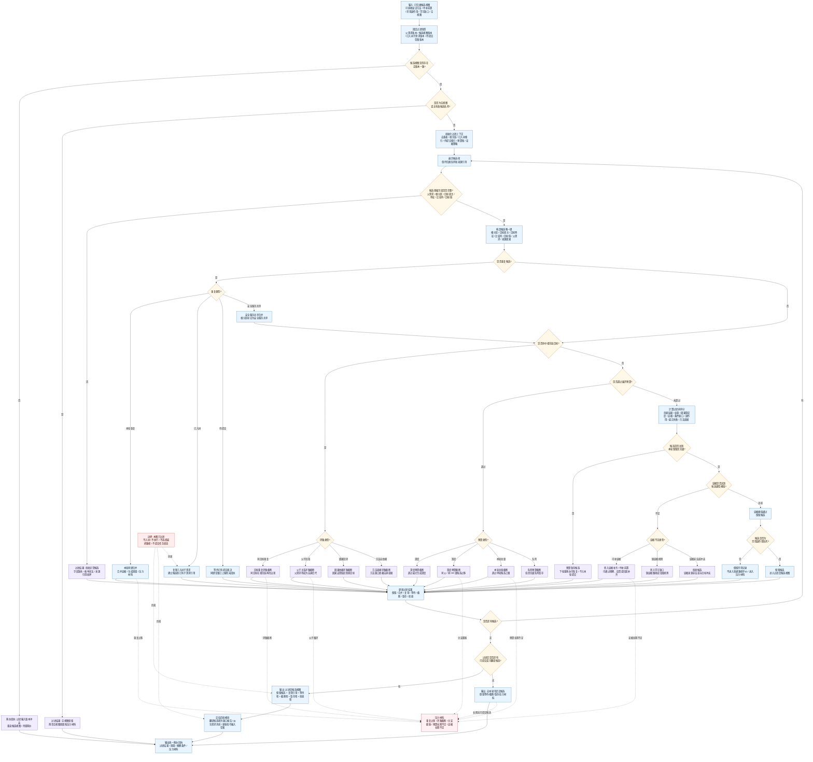

# 下一步候选过滤与分支膨胀控制逻辑图 v0.1

更新时间：2026-06-05

## 用途

本图是 `任务筹办普通函数状态机流程图 v0.2` 中：

```text
去重 / 环路检测 / 预算截断 / 证据阈值
避免候选分支膨胀
```

的细分逻辑图。

本图接收已归类候选视图，对候选做去重、复用、环路截断、预算控制和证据阈值过滤。它不生成正式需求节点、不选择最终路径、不执行方法。

## 判断原则

```text
1. 过滤不是删除材料；被截断、合并、复用、等待和拒绝的候选都必须留下原因。
2. 去重优先使用需求唯一键：根分区、目标宿主、目标特征类型、目标比较符、目标值、父需求、来源因果可选。
3. 同父目标完全一致的候选必须合并或复用；不得重复入树。
4. 安全和服务都需要同一子需求时，可以标记为安全服务共享，不新增第三套需求树。
5. 若候选目标在祖先链中再次出现，必须截断该路径继续展开，记录循环截断，不删除原节点。
6. 预算截断按父需求、OR 组、本轮总量、生成深度和队列类型共同控制，防止分支膨胀。
7. 证据阈值不足时，直接执行类候选不得通过；可补证据的候选转入证据补齐或待补前置。
8. 学习缺口候选允许低证据启动，但必须带缺口来源和学习目标，不能冒充可执行路径。
9. 过滤结果只进入后续目标化翻译和提交裁决，不能越过提交入口。
```

## 详细逻辑图



## 过滤出口说明

| 出口 | 含义 | 后续处理 |
| --- | --- | --- |
| 保留候选 | 去重、环路、预算和证据阈值均通过 | 进入目标化翻译 |
| 复用已入树 | 同父目标已有正式子需求 | 关联已有子需求，等待或读取其状态 |
| 等待已有提交 | 同键草案已提交但未回执 | 等待提交入口结果 |
| 本轮合并 | 同轮同键候选重复 | 合并证据、来源和压力材料 |
| 环路截断 | 命中祖先链、父子循环、因果回环或方法自依赖 | 停止该路径继续生长，记录截断原因 |
| 预算暂存 | 超过深度、宽度、本轮总量或队列预算 | 暂存低优先级候选，下轮可恢复 |
| 证据转前置 | 证据不足但可观察、反馈或归因补齐 | 转为证据补齐或待补前置 |
| 证据转学习 | 缺证据路径或归因规则 | 转为学习缺口 |
| 拒绝异常 | 字段非法、证据非法、来源冲突 | 逻辑错误或诊断回执 |

## 过滤字段建议

```text
filter_view_id
source_classified_view_id
accepted_candidates[]
merged_candidates[]
reused_child_refs[]
pending_submit_refs[]
loop_truncated_candidates[]
budget_parked_candidates[]
evidence_gap_candidates[]
learning_gap_candidates[]
rejected_candidates[]
filter_reason_by_candidate
budget_snapshot
evidence_policy_snapshot
pressure_materials[]
```

## 接入建议

```text
1. 在 v0.2 的 `PATH_FILTER` 位置调用本判断。
2. 过滤后仍有保留候选时，进入 `PATH_TRANSLATE`。
3. 过滤后只有复用、等待、截断或暂存时，返回对应等待 / 重筹办回执。
4. 去重和预算截断不能静默丢弃候选，必须保留原因和恢复条件。
5. 证据不足不能让直接执行候选通过；应转证据补齐、学习缺口或拒绝异常。
```
