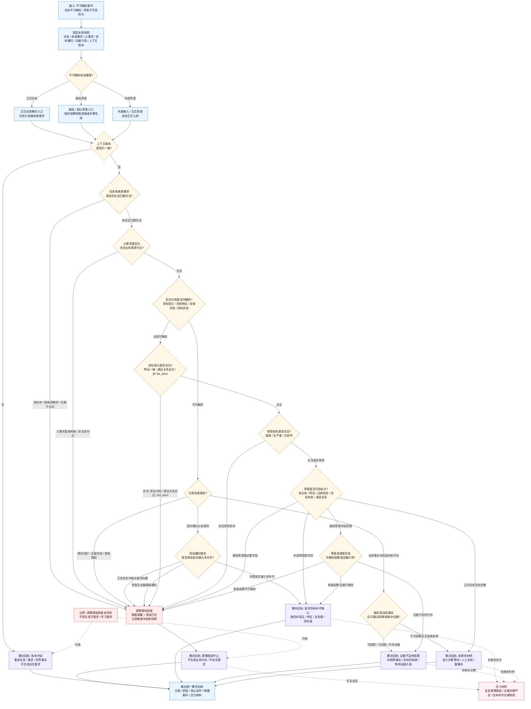

# 不可解析来源分类判断逻辑图 v0.1

更新时间：2026-06-05

## 用途

本图是 `任务筹办普通函数状态机流程图 v0.2` 中 `不可解析来源分类?` 的细分图。

适用入口：

```text
TARGET_SOURCE_GATE:
    来源需求目标不可解析。

PATH_SOURCE_GATE:
    缺口草案 / 候选路径草案不可目标化。
```

本图只做分类判断，不直接创建需求、不直接写任务状态、不执行方法。

## 分类原则

```text
1. 已进入任务筹办阶段的正式任务，默认应该已有完整来源需求目标。
2. 正式任务中缺任务、缺来源需求、引用悬空、枚举非法、状态特征冲突、哨兵值进入目标等，优先归为逻辑错误。
3. 外部输入、交互输入或尚未正式入树的草案，如果只是缺目标槽位，可归为真实需求目标补齐缺口。
4. 当前事实不存在、观察材料不足、证据不足但仍可观察时，归为证据不足待观察。
5. 若快照前后不一致，归为版本冲突，先重读上下文，不生成业务分支。
6. 不能判明来源时，按诊断等待处理；不得静默当作真实需求派生。
```

## 判断逻辑图



## 输出分类

| 分类 | 判定条件 | 输出 | 禁止事项 |
| --- | --- | --- | --- |
| 逻辑错误 | 正式任务缺来源需求、父需求非法、引用悬空、类型错配、枚举非法、I64_MAX 进入目标、草案生成器漏填必要槽位 | `ERROR_RECEIPT` | 不生成业务分支，不派生需求 |
| 版本冲突 | 读取快照后任务、需求、目标状态或世界事实版本变化 | `VERSION_CONFLICT` | 不按旧快照继续筹办 |
| 真实目标补齐缺口 | 外部真实输入或未入树草案确实缺目标宿主、目标特征、当前值或目标值 | `TARGET_GAP` | 不当成逻辑错误静默丢弃 |
| 证据不足待观察 | 缺当前事实、缺观察材料、证据引用不足，但可以通过观察或读取补齐 | `EVIDENCE_GAP` | 不直接生成目标子需求 |
| 来源未判明 | 不能证明是逻辑错误，也不能证明是真实需求或可观察证据缺口 | `DIAGNOSTIC_WAIT` | 不静默兜底，不直接派生 |

## 接入建议

```text
1. 在 `TARGET_SOURCE_GATE` 和 `PATH_SOURCE_GATE` 之后调用本分类函数。
2. 分类函数只返回结构化分类和原因，不直接写需求树。
3. `逻辑错误` 必须走弹窗 / 错误日志 / 结构化回执。
4. `真实目标补齐缺口` 才允许进入目标补齐缺口回执或派生需求草案。
5. `证据不足待观察` 优先进入观察事实补证据链，不直接冒充目标需求。
6. `版本冲突` 只触发重读上下文或待重筹办。
```
