# 任务筹办普通函数流程图 v0.1

更新时间：2026-06-05

## 用途

本图用于梳理任务筹办普通函数内部的三段职责：

```text
找路径 -> 找方法 -> 找条件
```

本图只展开任务筹办普通函数自身的判断顺序。外部逻辑以模块表示，不展开内部细节。

依据：

- `规范/自我线程与任务管理线程权责边界规范20260512.md`
- `规范/任务筹办与执行边界规范20260512.md`
- `规范/任务筹办按方法能力查找到就绪因果链规范20260513.md`
- `规范/需求临时因果视图展开规范20260526.md`
- `任务模块.筹办.ixx`

## 任务筹办普通函数总图

```mermaid
flowchart TD
    %% 输入
    TASK["任务信息节点<br/>任务状态 / 来源需求 / 任务虚拟存在"]
    DEMAND["来源需求<br/>目标宿主 / 目标特征 / 当前状态 / 目标状态"]
    CONTEXT["任务上下文<br/>场景 / 子任务 / 子需求 / 当前方法 / 回执缓存"]

    %% 外部模块
    M_TARGET_VIEW["外部模块: 需求目标语义视图读取<br/>不展开"]
    M_CAUSAL_VIEW["外部模块: 临时因果视图生成<br/>世界树因果 / 遗传因果 / 已入树子需求"]
    M_DEMAND_SUBMIT["外部模块: 需求提交入口<br/>派生需求 / 更新指令 / 缺口入树裁决"]
    M_METHOD_TREE["外部模块: 方法树与结果能力索引<br/>候选召回 / 结果能力命中"]
    M_METHOD_HEAD["外部模块: 待学习方法头创建或复用<br/>新建后等待重筹办"]
    M_COND_RESULT["外部模块: 条件结果对服务<br/>读取 / 建立 / 验证"]
    M_PARAM_BIND["外部模块: 参数绑定器<br/>任务上下文 -> 方法输入参数"]
    M_INPUT_SCENE["外部模块: 可执行输入参数场景构造<br/>输入条件包 / 目标方法 / 目标宿主"]
    M_STATE_SUBMIT["外部模块: 同步筹办回执 / 提交任务状态变化<br/>任务管理界面线程负责调用"]
    M_PRESSURE["外部模块: 全循环压力账<br/>失败退出 / 阻断 / 反复等待"]

    %% 入口检查
    ENTER["进入任务筹办普通函数<br/>单步循环，不递归执行子链"]
    READ["读取任务 / 来源需求 / 任务层级<br/>只读上下文，不裸写状态"]
    TARGET_GATE{"来源需求目标<br/>是否完整可解析?"}
    STATE_GATE{"任务是否可筹办?<br/>未终结 / 未取消 / 未失败"}
    CHILD_GATE{"是否存在活动子需求<br/>或阻塞父任务的子任务?"}
    LEAF_GATE{"是否已是普通可任务化叶子任务?"}

    %% 找路径
    PATH_START["找路径<br/>读取目标语义和因果视图"]
    PATH_VIEW["生成路径候选视图<br/>促成 / 避免 / 条件补齐 / 方法就绪 / 证据补齐 / 副作用约束 / 学习缺口"]
    PATH_GATE{"路径是否已闭合到<br/>普通可任务化目标?"}
    PATH_DRAFT["形成缺口报告或派生需求草案<br/>不得在筹办函数内直接生成需求节点"]
    PATH_WAIT["筹办回执: 等待路径闭合<br/>派生需求消息 / 更新指令输入草案"]

    %% 找方法
    METHOD_START["找方法<br/>按目标特征查方法结果能力"]
    CANDIDATE_FILL["填充候选方法集<br/>先填充，再选择"]
    CANDIDATE_GATE{"候选方法集<br/>是否为空?"}
    METHOD_HEAD_RECEIPT["筹办回执: 已建立方法头待重入<br/>本轮不直接执行新生方法头"]
    SELECT_GATE{"候选数量"}
    BIND_ONE["单候选直接绑定当前方法"]
    SELECT_RULE["多候选按确定规则选择<br/>排序 / 权重 / 稳定度 / 禁止项"]
    CURRENT_METHOD["当前方法确定<br/>只代表候选选择完成"]

    %% 找条件
    CONDITION_START["找条件<br/>检查当前方法自身状态 / 入口 / 条件 / 参数"]
    METHOD_READY_GATE{"当前方法状态<br/>是否可用?"}
    ENTRY_GATE{"是否有可执行动作入口?"}
    CR_GATE{"是否存在有效条件结果对?"}
    PARAM_GATE{"参数是否可绑定?"}
    COND_GATE{"方法条件是否满足<br/>且禁止项未命中?"}
    INPUT_SCENE_GATE{"可执行输入参数场景<br/>是否可构造?"}
    READY_RECEIPT["筹办回执: 可就绪<br/>当前方法 + 可执行输入参数场景 + 无筹办缺口"]

    %% 缺口回执
    TARGET_GAP["筹办回执: 目标补齐缺口<br/>缺目标宿主 / 特征 / 当前值 / 目标值"]
    STATE_WAIT["筹办回执: 任务不可筹办<br/>已终结 / 取消 / 失败 / 等待外部恢复"]
    CHILD_WAIT["筹办回执: 等待活动子需求或子任务<br/>父任务待重筹办"]
    METHOD_STATE_GAP["筹办回执: 候选方法不可用<br/>方法状态缺口"]
    ENTRY_GAP["筹办回执: 缺执行入口<br/>方法可调用动作缺口"]
    CR_GAP["筹办回执: 缺条件结果对<br/>经验配对缺口"]
    PARAM_GAP["筹办回执: 参数配对失败<br/>缺参数 / 参数未绑定 / 场景不闭合"]
    CONDITION_GAP["筹办回执: 条件不满足<br/>需求侧条件 / 因果条件 / 方法条件"]
    INPUT_SCENE_GAP["筹办回执: 输入场景不可构造<br/>可执行输入参数场景缺口"]

    %% 输出
    RECEIPT_OUT["输出任务推进回执<br/>建议状态 / 建议阶段 / 缺口类型 / 派生提示 / 诊断摘要"]
    NO_DIRECT_WRITE["边界: 筹办只产出回执<br/>不直接写需求树 / 不直接写任务状态 / 不执行方法"]

    subgraph INPUTS["筹办输入"]
        TASK --> ENTER
        DEMAND --> ENTER
        CONTEXT --> ENTER
    end

    subgraph ENTRY_CHECK["入口检查"]
        ENTER --> READ --> M_TARGET_VIEW --> TARGET_GATE
        TARGET_GATE -->|否| TARGET_GAP
        TARGET_GATE -->|是| STATE_GATE
        STATE_GATE -->|否| STATE_WAIT
        STATE_GATE -->|是| CHILD_GATE
        CHILD_GATE -->|是| CHILD_WAIT
        CHILD_GATE -->|否| LEAF_GATE
    end

    subgraph FIND_PATH["第一段: 找路径"]
        LEAF_GATE -->|否, 仍需路径筹办| PATH_START
        PATH_START --> M_CAUSAL_VIEW --> PATH_VIEW --> PATH_GATE
        PATH_GATE -->|未闭合| PATH_DRAFT --> M_DEMAND_SUBMIT --> PATH_WAIT
        PATH_GATE -->|已闭合| METHOD_START
        LEAF_GATE -->|是| METHOD_START
    end

    subgraph FIND_METHOD["第二段: 找方法"]
        METHOD_START --> M_METHOD_TREE --> CANDIDATE_FILL --> CANDIDATE_GATE
        CANDIDATE_GATE -->|空| M_METHOD_HEAD --> METHOD_HEAD_RECEIPT
        CANDIDATE_GATE -->|非空| SELECT_GATE
        SELECT_GATE -->|1 个| BIND_ONE --> CURRENT_METHOD
        SELECT_GATE -->|多个| SELECT_RULE --> CURRENT_METHOD
    end

    subgraph FIND_CONDITION["第三段: 找条件"]
        CURRENT_METHOD --> CONDITION_START --> METHOD_READY_GATE
        METHOD_READY_GATE -->|否| METHOD_STATE_GAP
        METHOD_READY_GATE -->|是| ENTRY_GATE
        ENTRY_GATE -->|否| ENTRY_GAP
        ENTRY_GATE -->|是| M_COND_RESULT --> CR_GATE
        CR_GATE -->|否| CR_GAP
        CR_GATE -->|是| M_PARAM_BIND --> PARAM_GATE
        PARAM_GATE -->|否| PARAM_GAP
        PARAM_GATE -->|是| COND_GATE
        COND_GATE -->|否| CONDITION_GAP
        COND_GATE -->|是| M_INPUT_SCENE --> INPUT_SCENE_GATE
        INPUT_SCENE_GATE -->|否| INPUT_SCENE_GAP
        INPUT_SCENE_GATE -->|是| READY_RECEIPT
    end

    subgraph OUTPUTS["回执输出"]
        TARGET_GAP --> RECEIPT_OUT
        STATE_WAIT --> RECEIPT_OUT
        CHILD_WAIT --> RECEIPT_OUT
        PATH_WAIT --> RECEIPT_OUT
        METHOD_HEAD_RECEIPT --> RECEIPT_OUT
        METHOD_STATE_GAP --> RECEIPT_OUT
        ENTRY_GAP --> RECEIPT_OUT
        CR_GAP --> RECEIPT_OUT
        PARAM_GAP --> RECEIPT_OUT
        CONDITION_GAP --> RECEIPT_OUT
        INPUT_SCENE_GAP --> RECEIPT_OUT
        READY_RECEIPT --> RECEIPT_OUT
        RECEIPT_OUT --> M_STATE_SUBMIT
    end

    subgraph PRESSURE_FLOW["压力材料"]
        TARGET_GAP -.反复出现.-> M_PRESSURE
        STATE_WAIT -.等待失效.-> M_PRESSURE
        PATH_WAIT -.路径长期不闭合.-> M_PRESSURE
        METHOD_STATE_GAP -.方法长期不可用.-> M_PRESSURE
        ENTRY_GAP -.缺入口.-> M_PRESSURE
        CR_GAP -.缺经验配对.-> M_PRESSURE
        PARAM_GAP -.参数长期不可配.-> M_PRESSURE
        CONDITION_GAP -.条件长期不满足.-> M_PRESSURE
    end

    subgraph RULES["硬规则"]
        NO_DIRECT_WRITE -.约束.-> PATH_DRAFT
        NO_DIRECT_WRITE -.约束.-> RECEIPT_OUT
        NO_DIRECT_WRITE -.约束.-> M_STATE_SUBMIT
    end

    classDef prep fill:#e8f4ff,stroke:#2f6f9f,color:#102030;
    classDef gate fill:#fff8e8,stroke:#9a6a1a,color:#24160a;
    classDef external fill:#eef7ed,stroke:#3f7f4f,color:#102010;
    classDef receipt fill:#f1edff,stroke:#6c56a4,color:#1d1730;
    classDef warn fill:#ffecec,stroke:#b84a4a,color:#401111;
    classDef pressure fill:#fff0f3,stroke:#b4234a,color:#3a0d18;

    class ENTER,READ,PATH_START,PATH_VIEW,PATH_DRAFT,METHOD_START,CANDIDATE_FILL,BIND_ONE,SELECT_RULE,CURRENT_METHOD,CONDITION_START,READY_RECEIPT,RECEIPT_OUT prep;
    class TARGET_GATE,STATE_GATE,CHILD_GATE,LEAF_GATE,PATH_GATE,CANDIDATE_GATE,SELECT_GATE,METHOD_READY_GATE,ENTRY_GATE,CR_GATE,PARAM_GATE,COND_GATE,INPUT_SCENE_GATE gate;
    class M_TARGET_VIEW,M_CAUSAL_VIEW,M_DEMAND_SUBMIT,M_METHOD_TREE,M_METHOD_HEAD,M_COND_RESULT,M_PARAM_BIND,M_INPUT_SCENE,M_STATE_SUBMIT external;
    class TARGET_GAP,STATE_WAIT,CHILD_WAIT,PATH_WAIT,METHOD_HEAD_RECEIPT,METHOD_STATE_GAP,ENTRY_GAP,CR_GAP,PARAM_GAP,CONDITION_GAP,INPUT_SCENE_GAP receipt;
    class NO_DIRECT_WRITE warn;
    class M_PRESSURE pressure;
```



## 本图暂定结论

1. 任务筹办普通函数只展开三段：找路径、找方法、找条件。
2. 找路径读取来源需求目标语义和世界树因果信息；临时因果视图、派生需求入树裁决等外部逻辑只作为模块出现。
3. 找路径发现未闭合时，只输出缺口报告、派生需求消息或更新指令输入草案，不直接生成需求节点。
4. 找方法只在普通可任务化叶子任务上执行，必须先填充候选方法集，再从候选集中选择当前方法。
5. 无候选方法时，筹办可以调用外部模块创建或复用待学习目标方法头，但本轮只返回 `已建立方法头待重入`。
6. 找条件只检查当前方法自身状态、执行入口、条件结果对、参数绑定、方法条件和可执行输入参数场景。
7. 参数绑定、条件结果对服务、可执行输入参数场景构造、任务状态提交都作为外部模块，不在本图展开。
8. 任务筹办只产出任务推进回执和建议状态，不直接写任务状态、不直接写需求树、不执行方法。
9. 反复目标缺失、路径不闭合、方法不可用、缺执行入口、缺条件结果对、参数不可配、条件不满足等都可成为全循环压力账材料。

## 后续细分图建议

```text
找路径细分图：需求目标语义视图 -> 临时因果视图 -> 缺口报告 / 派生需求草案
找方法细分图：结果能力索引 -> 候选集 -> 单候选 / 多候选选择 -> 当前方法绑定
找条件细分图：方法状态 -> 执行入口 -> 条件结果对 -> 参数绑定 -> 输入场景
```
