# 任务筹办普通函数状态机流程图 v0.2

更新时间：2026-06-05

## 用途

本图是在 `20260605_任务筹办普通函数流程图_v0.1.md` 基础上补完 P0 级状态机约束后的版本。

v0.2 仍保持三段职责：

```text
找下一步可选步骤 -> 找方法 -> 找条件
```

但相对 v0.1 增加了以下状态机硬点：

```text
1. 逻辑错误也必须进入结构化回执出口。
2. 需求提交入口必须返回提交结果，不能默认子需求已成立。
3. 筹办回执由任务管理界面线程消费，筹办函数不直接提交任务状态。
4. 方法候选进入逐个试探和回退，不因首选方法失败就误判全局失败。
5. 子路径关系类型拆成 AND 必经 / OR 替代 / 顺序链 / 证据补齐 / 学习支撑。
6. 等待回执必须携带唤醒条件、超时策略、重筹办触发和压力材料。
7. 可就绪回执必须携带上下文版本快照，供执行前批准模块复核。
```

依据：

- `规范/自我线程与任务管理线程权责边界规范20260512.md`
- `规范/任务筹办与执行边界规范20260512.md`
- `规范/任务筹办按方法能力查找到就绪因果链规范20260513.md`
- `规范/需求临时因果视图展开规范20260526.md`
- `流程图/20260605_任务筹办普通函数流程图_v0.1.md`
- `计划/待完成项/20260605_任务筹办OR路径闭合与学习拦截实现计划_v0.1.md`

## 状态机总图

```mermaid
flowchart TD
    %% 输入
    TASK["任务信息节点<br/>任务状态 / 来源需求 / 任务虚拟存在"]
    DEMAND["来源需求<br/>目标宿主 / 目标特征 / 当前状态 / 目标状态"]
    CONTEXT["任务上下文<br/>场景 / 子任务 / 子需求 / 当前方法 / 回执缓存"]

    %% 外部模块
    M_TARGET_VIEW["外部模块: 需求目标语义视图读取"]
    M_CAUSAL_VIEW["外部模块: 临时因果视图生成<br/>世界树因果 / 遗传因果 / 已入树子需求"]
    M_DEMAND_SUBMIT["外部模块: 需求提交入口<br/>派生需求 / 更新指令 / 缺口入树裁决"]
    M_METHOD_TREE["外部模块: 方法树与结果能力索引<br/>候选召回 / 结果能力命中"]
    M_METHOD_HEAD["外部模块: 待学习方法头创建或复用<br/>新建后等待重筹办"]
    M_COND_RESULT["外部模块: 条件结果对服务<br/>读取 / 建立 / 验证"]
    M_PARAM_BIND["外部模块: 参数绑定器<br/>任务上下文 -> 方法输入参数"]
    M_INPUT_SCENE["外部模块: 可执行输入参数场景构造<br/>输入条件包 / 目标方法 / 目标宿主"]
    M_STATE_SUBMIT["外部模块: 同步筹办回执 / 提交任务状态变化<br/>任务管理界面线程调用"]
    M_PRESSURE["外部模块: 全循环压力账<br/>失败退出 / 阻断 / 反复等待"]

    %% 通用状态
    ENTER["进入任务筹办普通函数<br/>单步循环，不递归执行子链"]
    READ["读取任务 / 来源需求 / 任务层级<br/>只读上下文，不裸写状态"]
    VERSION_SNAPSHOT["记录上下文版本快照<br/>任务 / 需求 / 方法 / 条件结果对 / 输入场景 / 世界事实"]
    TARGET_GATE{"来源需求目标<br/>是否完整可解析?"}
    TARGET_SOURCE_GATE{"不可解析来源分类?"}
    LOGIC_ERROR["逻辑错误处理<br/>弹窗提醒 + 错误日志<br/>不生成业务分支"]
    ERROR_RECEIPT["筹办回执: 逻辑错误中止<br/>不派生需求 / 不写需求树"]
    EVIDENCE_GAP["筹办回执: 证据不足待观察<br/>补观察事实 / 补材料来源"]
    STATE_GATE{"任务是否可筹办?<br/>未终结 / 未取消 / 未失败"}
    STRUCT_LEAF_GATE{"是否已是目标结构叶子?<br/>无需继续拆分路径"}

    %% 找下一步
    PATH_START["找下一步可选步骤<br/>读取目标语义和因果视图"]
    PATH_VIEW["生成下一步候选步骤视图<br/>促成 / 避免 / 条件补齐 / 方法就绪 / 证据补齐 / 副作用约束 / 学习缺口"]
    PATH_CLASSIFY["归类下一步候选项<br/>可直接尝试方法 / 待补前置 / 禁用副作用 / 学习缺口 / 空视图"]
    PATH_FILTER["去重 / 环路检测 / 预算截断 / 证据阈值<br/>避免候选分支膨胀"]
    PATH_TRANSLATE["翻译候选项为本轮可提交目标<br/>缺口报告 / 派生需求消息 / 更新指令输入草案"]
    PATH_SOURCE_GATE{"缺口草案来源分类?"}
    RELATION_DRAFT_GATE{"候选关系类型?"}
    PATH_DRAFT["构造路径草案<br/>携带获取途径 / 幂等键 / 证据引用 / 生成深度"]
    SUBMIT_RESULT{"需求提交结果?"}
    PATH_OR_WAIT["筹办回执: 等待 OR 子需求继续分解<br/>携带唤醒条件和等待失效策略"]
    PATH_AND_WAIT["筹办回执: 等待 AND 必经子需求闭合"]
    PATH_SEQ_WAIT["筹办回执: 等待顺序链前序步骤闭合"]
    LEARNING_WAIT["筹办回执: 等待学习任务结果<br/>学习完成后父任务重筹办"]
    SUBMIT_REJECT["筹办回执: 需求提交被拒<br/>记录拒绝原因 / 不假装等待"]
    VERSION_CONFLICT["筹办回执: 上下文版本冲突<br/>重读上下文 / 待重筹办"]

    CHILD_GATE{"是否已有子路径<br/>或逻辑组织子需求?"}
    REL_GATE{"子路径关系类型?"}
    AND_CLOSE_GATE{"AND 必经路径<br/>是否全部闭合?"}
    OR_CLOSE_GATE{"OR 替代路径<br/>是否至少一条闭合?"}
    OR_FORCE_WAIT{"未闭合 OR 路径<br/>是否有更高优先级强制等待理由?"}
    SEQ_GATE{"顺序链前序步骤<br/>是否闭合?"}
    PATH_UNCLOSED_GATE{"是否存在<br/>已判定无法闭合路径?"}
    UNCLOSED_TYPE{"无法闭合路径<br/>是否为必经路径或全部 OR 失败?"}
    PATH_PRUNE["标记低优先级学习候选<br/>不阻塞已闭合 OR 路径"]
    CHILD_WAIT["筹办回执: 等待活动子需求或子任务<br/>父任务待重筹办"]
    PATH_EVAL["路径选择评价<br/>只评价可用闭合路径<br/>标准: 收益 + 可执行性"]
    PATH_SELECT["选择好用路径<br/>输出 selected_path / child_demand / child_task / 选择原因"]
    PATH_SELECT_WAIT["筹办回执: 完整路径已选择<br/>等待选中路径执行或重筹办"]
    LEARNING_INTERCEPT["学习任务拦截<br/>无法闭合必经路径 -> 学习任务草案"]

    %% 找方法
    METHOD_START["找方法<br/>按目标特征查方法结果能力"]
    CANDIDATE_FILL["填充候选方法集<br/>先填充，再排序"]
    CANDIDATE_GATE{"候选方法集<br/>是否为空?"}
    METHOD_HEAD_RECEIPT["筹办回执: 已建立方法头待重入<br/>本轮不直接执行新生方法头"]
    METHOD_ORDER["候选排序<br/>直接达成优先 / 风险 / 成本 / 稳定度 / 禁止项"]
    CANDIDATE_LOOP["取下一个候选方法<br/>写入候选试探上下文"]
    CURRENT_METHOD["当前候选方法<br/>只代表本轮试探对象"]

    %% 找条件
    CONDITION_START["找条件<br/>检查当前候选方法状态 / 入口 / 条件 / 参数"]
    METHOD_READY_GATE{"当前方法状态<br/>是否可用?"}
    ENTRY_GATE{"是否有可执行动作入口?"}
    CR_GATE{"是否存在有效条件结果对?"}
    PARAM_GATE{"参数是否可绑定?"}
    COND_GATE{"方法条件状态?"}
    INPUT_SCENE_GATE{"可执行输入参数场景<br/>是否可构造?"}
    CANDIDATE_FAIL["缓存候选失败原因<br/>不立即输出全局缺口"]
    NEXT_METHOD{"还有候选方法?"}
    BEST_METHOD_GAP["筹办回执: 所有候选方法均不可闭合<br/>输出最优失败原因"]
    CONDITION_GAP["筹办回执: 条件暂不满足<br/>可等待条件变化"]
    READY_RECEIPT["筹办回执: 可就绪<br/>当前方法 + 可执行输入参数场景 + 版本快照"]

    %% 其他缺口
    TARGET_GAP["真实需求分支: 目标补齐缺口<br/>缺目标宿主 / 特征 / 当前值 / 目标值"]
    STATE_WAIT["筹办回执: 任务不可筹办<br/>已终结 / 取消 / 失败 / 等待外部恢复"]

    %% 输出
    RECEIPT_OUT["输出统一任务推进回执<br/>建议状态 / 建议阶段 / 缺口类型 / 派生提示 / 等待元数据 / 压力材料 / 诊断摘要"]
    WAIT_META["等待回执必须携带<br/>wait_reason / wake_event_types / timeout_policy / replan_trigger / pressure_trigger"]
    CALLER["调用方: 任务管理界面线程<br/>消费筹办回执"]
    NO_DIRECT_WRITE["边界: 筹办只产出回执<br/>不直接写需求树 / 不直接写任务状态 / 不执行方法"]

    subgraph INPUTS["筹办输入"]
        TASK --> ENTER
        DEMAND --> ENTER
        CONTEXT --> ENTER
    end

    subgraph ENTRY_CHECK["入口检查"]
        ENTER --> READ --> VERSION_SNAPSHOT --> M_TARGET_VIEW --> TARGET_GATE
        TARGET_GATE -->|否| TARGET_SOURCE_GATE
        TARGET_SOURCE_GATE -->|逻辑错误 / 结构损坏| LOGIC_ERROR --> ERROR_RECEIPT
        TARGET_SOURCE_GATE -->|真实需求缺口| TARGET_GAP
        TARGET_SOURCE_GATE -->|证据不足但可观察| EVIDENCE_GAP
        TARGET_GATE -->|是| STATE_GATE
        STATE_GATE -->|否| STATE_WAIT
        STATE_GATE -->|是| STRUCT_LEAF_GATE
    end

    subgraph FIND_PATH["第一段: 找下一步可选步骤"]
        STRUCT_LEAF_GATE -->|否, 检查子路径| CHILD_GATE
        CHILD_GATE -->|没有, 需要生成候选步骤| PATH_START
        PATH_START --> M_CAUSAL_VIEW --> PATH_VIEW --> PATH_CLASSIFY --> PATH_FILTER --> PATH_TRANSLATE --> PATH_SOURCE_GATE
        PATH_SOURCE_GATE -->|逻辑错误 / 不可目标化| LOGIC_ERROR
        PATH_SOURCE_GATE -->|证据不足| EVIDENCE_GAP
        PATH_SOURCE_GATE -->|真实可选步骤| RELATION_DRAFT_GATE
        RELATION_DRAFT_GATE -->|OR 替代| PATH_DRAFT
        RELATION_DRAFT_GATE -->|AND 必经| PATH_DRAFT
        RELATION_DRAFT_GATE -->|顺序链| PATH_DRAFT
        RELATION_DRAFT_GATE -->|证据补齐| PATH_DRAFT
        RELATION_DRAFT_GATE -->|学习支撑| LEARNING_INTERCEPT
        PATH_DRAFT --> M_DEMAND_SUBMIT --> SUBMIT_RESULT
        LEARNING_INTERCEPT --> M_DEMAND_SUBMIT
        SUBMIT_RESULT -->|OR 子需求已入树 / 已复用| PATH_OR_WAIT
        SUBMIT_RESULT -->|AND 子需求已入树 / 已复用| PATH_AND_WAIT
        SUBMIT_RESULT -->|顺序步骤已入树 / 已复用| PATH_SEQ_WAIT
        SUBMIT_RESULT -->|学习任务已入树 / 已复用| LEARNING_WAIT
        SUBMIT_RESULT -->|被拒绝| SUBMIT_REJECT
        SUBMIT_RESULT -->|证据不足| EVIDENCE_GAP
        SUBMIT_RESULT -->|目标不完整| TARGET_GAP
        SUBMIT_RESULT -->|版本冲突| VERSION_CONFLICT

        CHILD_GATE -->|已有| REL_GATE
        REL_GATE -->|AND 必经| AND_CLOSE_GATE
        REL_GATE -->|OR 替代| OR_CLOSE_GATE
        REL_GATE -->|顺序链| SEQ_GATE
        REL_GATE -->|证据补齐| EVIDENCE_GAP
        REL_GATE -->|学习支撑| LEARNING_WAIT
        AND_CLOSE_GATE -->|是| PATH_EVAL
        AND_CLOSE_GATE -->|否| PATH_UNCLOSED_GATE
        OR_CLOSE_GATE -->|是| OR_FORCE_WAIT
        OR_CLOSE_GATE -->|否| PATH_UNCLOSED_GATE
        OR_FORCE_WAIT -->|是| CHILD_WAIT
        OR_FORCE_WAIT -->|否| PATH_EVAL
        SEQ_GATE -->|是| PATH_EVAL
        SEQ_GATE -->|否| PATH_SEQ_WAIT
        PATH_UNCLOSED_GATE -->|有无法闭合路径| UNCLOSED_TYPE
        PATH_UNCLOSED_GATE -->|没有, 继续分解| CHILD_WAIT
        UNCLOSED_TYPE -->|是, 必经或全部 OR 失败| LEARNING_INTERCEPT
        UNCLOSED_TYPE -->|否, OR 替代低优先级| PATH_PRUNE --> PATH_EVAL
        PATH_EVAL --> PATH_SELECT --> PATH_SELECT_WAIT
        STRUCT_LEAF_GATE -->|是| METHOD_START
    end

    subgraph FIND_METHOD["第二段: 找方法"]
        METHOD_START --> M_METHOD_TREE --> CANDIDATE_FILL --> CANDIDATE_GATE
        CANDIDATE_GATE -->|空| M_METHOD_HEAD --> METHOD_HEAD_RECEIPT
        CANDIDATE_GATE -->|非空| METHOD_ORDER --> CANDIDATE_LOOP --> CURRENT_METHOD
    end

    subgraph FIND_CONDITION["第三段: 找条件"]
        CURRENT_METHOD --> CONDITION_START --> METHOD_READY_GATE
        METHOD_READY_GATE -->|否| CANDIDATE_FAIL
        METHOD_READY_GATE -->|是| ENTRY_GATE
        ENTRY_GATE -->|否| CANDIDATE_FAIL
        ENTRY_GATE -->|是| M_COND_RESULT --> CR_GATE
        CR_GATE -->|否| CANDIDATE_FAIL
        CR_GATE -->|是| M_PARAM_BIND --> PARAM_GATE
        PARAM_GATE -->|否| CANDIDATE_FAIL
        PARAM_GATE -->|是| COND_GATE
        COND_GATE -->|禁止项命中| CANDIDATE_FAIL
        COND_GATE -->|暂不满足但可等待| CONDITION_GAP
        COND_GATE -->|满足| M_INPUT_SCENE --> INPUT_SCENE_GATE
        INPUT_SCENE_GATE -->|否| CANDIDATE_FAIL
        INPUT_SCENE_GATE -->|是| READY_RECEIPT
        CANDIDATE_FAIL --> NEXT_METHOD
        NEXT_METHOD -->|有| CANDIDATE_LOOP
        NEXT_METHOD -->|无| BEST_METHOD_GAP
    end

    subgraph OUTPUTS["回执输出"]
        ERROR_RECEIPT --> RECEIPT_OUT
        TARGET_GAP --> RECEIPT_OUT
        EVIDENCE_GAP --> RECEIPT_OUT
        STATE_WAIT --> RECEIPT_OUT
        CHILD_WAIT --> RECEIPT_OUT
        PATH_OR_WAIT --> RECEIPT_OUT
        PATH_AND_WAIT --> RECEIPT_OUT
        PATH_SEQ_WAIT --> RECEIPT_OUT
        LEARNING_WAIT --> RECEIPT_OUT
        SUBMIT_REJECT --> RECEIPT_OUT
        VERSION_CONFLICT --> RECEIPT_OUT
        PATH_SELECT_WAIT --> RECEIPT_OUT
        METHOD_HEAD_RECEIPT --> RECEIPT_OUT
        CONDITION_GAP --> RECEIPT_OUT
        BEST_METHOD_GAP --> RECEIPT_OUT
        READY_RECEIPT --> RECEIPT_OUT
        RECEIPT_OUT -.由任务管理界面线程消费.-> CALLER --> M_STATE_SUBMIT
    end

    subgraph WAIT_RULES["等待元数据"]
        STATE_WAIT -.需要.-> WAIT_META
        CHILD_WAIT -.需要.-> WAIT_META
        PATH_OR_WAIT -.需要.-> WAIT_META
        PATH_AND_WAIT -.需要.-> WAIT_META
        PATH_SEQ_WAIT -.需要.-> WAIT_META
        LEARNING_WAIT -.需要.-> WAIT_META
        PATH_SELECT_WAIT -.需要.-> WAIT_META
        METHOD_HEAD_RECEIPT -.需要.-> WAIT_META
        CONDITION_GAP -.需要.-> WAIT_META
    end

    subgraph PRESSURE_FLOW["压力材料"]
        ERROR_RECEIPT -.反复逻辑错误.-> M_PRESSURE
        TARGET_GAP -.真实缺口反复出现.-> M_PRESSURE
        EVIDENCE_GAP -.证据长期不足.-> M_PRESSURE
        SUBMIT_REJECT -.子需求提交反复被拒.-> M_PRESSURE
        CHILD_WAIT -.子路径长期未闭合.-> M_PRESSURE
        PATH_OR_WAIT -.OR 子需求长期无进展.-> M_PRESSURE
        LEARNING_WAIT -.学习任务长期无结果.-> M_PRESSURE
        PATH_SELECT_WAIT -.选中路径长期未执行.-> M_PRESSURE
        METHOD_HEAD_RECEIPT -.方法头长期无结果.-> M_PRESSURE
        CONDITION_GAP -.条件长期不满足.-> M_PRESSURE
        BEST_METHOD_GAP -.所有候选均不可闭合.-> M_PRESSURE
        PATH_FILTER -.候选分支爆炸或重复过多.-> M_PRESSURE
    end

    subgraph RULES["硬规则"]
        NO_DIRECT_WRITE -.约束.-> PATH_DRAFT
        NO_DIRECT_WRITE -.约束.-> RECEIPT_OUT
        NO_DIRECT_WRITE -.约束.-> CALLER
        NO_DIRECT_WRITE -.逻辑错误不生成业务分支.-> ERROR_RECEIPT
    end

    classDef prep fill:#e8f4ff,stroke:#2f6f9f,color:#102030;
    classDef gate fill:#fff8e8,stroke:#9a6a1a,color:#24160a;
    classDef external fill:#eef7ed,stroke:#3f7f4f,color:#102010;
    classDef receipt fill:#f1edff,stroke:#6c56a4,color:#1d1730;
    classDef warn fill:#ffecec,stroke:#b84a4a,color:#401111;
    classDef pressure fill:#fff0f3,stroke:#b4234a,color:#3a0d18;

    class ENTER,READ,VERSION_SNAPSHOT,PATH_START,PATH_VIEW,PATH_CLASSIFY,PATH_FILTER,PATH_TRANSLATE,PATH_DRAFT,PATH_PRUNE,PATH_EVAL,PATH_SELECT,METHOD_START,CANDIDATE_FILL,METHOD_ORDER,CANDIDATE_LOOP,CURRENT_METHOD,CONDITION_START,CANDIDATE_FAIL,READY_RECEIPT,RECEIPT_OUT,CALLER,WAIT_META prep;
    class TARGET_GATE,TARGET_SOURCE_GATE,STATE_GATE,STRUCT_LEAF_GATE,PATH_SOURCE_GATE,RELATION_DRAFT_GATE,SUBMIT_RESULT,CHILD_GATE,REL_GATE,AND_CLOSE_GATE,OR_CLOSE_GATE,OR_FORCE_WAIT,SEQ_GATE,PATH_UNCLOSED_GATE,UNCLOSED_TYPE,CANDIDATE_GATE,METHOD_READY_GATE,ENTRY_GATE,CR_GATE,PARAM_GATE,COND_GATE,INPUT_SCENE_GATE,NEXT_METHOD gate;
    class M_TARGET_VIEW,M_CAUSAL_VIEW,M_DEMAND_SUBMIT,M_METHOD_TREE,M_METHOD_HEAD,M_COND_RESULT,M_PARAM_BIND,M_INPUT_SCENE,M_STATE_SUBMIT external;
    class ERROR_RECEIPT,TARGET_GAP,EVIDENCE_GAP,STATE_WAIT,CHILD_WAIT,PATH_OR_WAIT,PATH_AND_WAIT,PATH_SEQ_WAIT,LEARNING_WAIT,SUBMIT_REJECT,VERSION_CONFLICT,PATH_SELECT_WAIT,METHOD_HEAD_RECEIPT,CONDITION_GAP,BEST_METHOD_GAP receipt;
    class NO_DIRECT_WRITE,LOGIC_ERROR warn;
    class M_PRESSURE pressure;
```



## v0.2 定案结论

1. `LOGIC_ERROR` 必须输出结构化 `ERROR_RECEIPT`，否则调用方会悬空。
2. `M_DEMAND_SUBMIT` 后必须经过 `SUBMIT_RESULT`，只有已入树或已复用才进入等待。
3. `RECEIPT_OUT` 到任务状态提交必须是“调用方消费”关系，不能画成筹办函数直接提交。
4. `LEAF_GATE` 改为“目标结构叶子”，避免把结构叶子误写成已可执行。
5. 子路径关系必须显式拆成 `AND 必经 / OR 替代 / 顺序链 / 证据补齐 / 学习支撑`。
6. OR 替代路径不要求所有路径闭合；至少一条路径闭合且无更高优先级强制等待理由时，可以进入路径评价。
7. 无法闭合路径只有在必经路径或全部 OR 失败时才强制学习拦截；低优先级 OR 失败可先标为学习候选。
8. 方法选择必须支持候选回退；单个候选失败先缓存失败原因，再尝试下一个候选。
9. 所有候选方法均不可闭合时，才输出 `BEST_METHOD_GAP`，并携带最优失败原因。
10. 等待类回执必须携带唤醒事件、超时策略、重筹办触发和压力触发。
11. 可就绪回执必须携带上下文版本快照，供任务执行前批准模块复核。
12. 候选步骤必须在入树前经过去重、祖先链环路检测、预算截断和证据阈值过滤。

## 与当前代码的关系

v0.2 是状态机目标图，不表示代码已经全部实现。

当前代码已经接近：

```text
目标语义闸门
临时因果视图
派生需求消息上报
普通派生需求入树裁决
方法候选填充
候选方法输入闭合检查
```

仍需按计划补齐：

```text
派生需求消息获取途径
OR 路径组入树承接
路径闭合状态视图
无法闭合路径学习拦截
路径收益 / 可执行性选择
候选方法回退
等待元数据和版本快照
```
