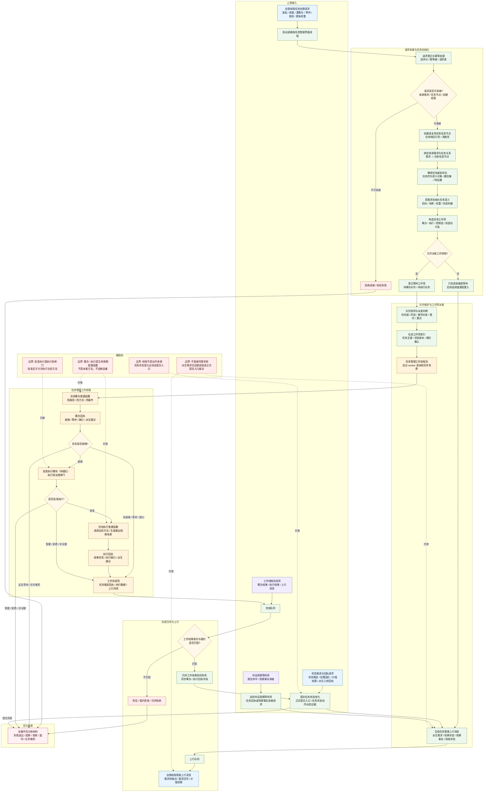

# 任务管理界面线程主要功能流程图 v0.1

更新时间：2026-06-05

## 用途

本图用于梳理任务管理界面线程在鱼巢内部循环中的主要职责。重点区分：

- 自我线程负责需求治理、任务发起意图、调度意图、需求回写和价值结算裁决。
- 任务管理界面线程负责承接任务治理请求、创建 / 复用任务、维护队列、派发工作项、归并工作结果、推进任务状态和上行回执。
- 任务管理工作线程负责执行任务筹办普通函数和任务执行普通函数。
- 任务筹办 / 任务执行不是本能方法，不进入方法候选集，不作为方法动作动态来源。

依据：

- `规范/自我线程与任务管理线程权责边界规范20260512.md`
- `规范/任务筹办与执行边界规范20260512.md`
- `规范/任务根据需求初始化规范20260509.md`
- `规范/任务推进状况回执闭环规范20260508.md`
- `任务模块.管理界面线程.ixx`
- `任务模块.管理线程协议.ixx`
- `任务模块.管理界面线程.impl.cpp`

## 任务管理界面线程总图



## 本图暂定结论

1. 任务管理界面线程的核心位置是任务域接口层：承接自我线程的治理意图，并把它转换成任务生命周期可处理的任务壳、工作项和队列状态。
2. 它负责创建或复用任务信息节点、绑定来源需求、确保任务虚拟存在、初始化任务语义。
3. 它维护待筹办队列、待执行队列、完成队列、死信队列、在途工作项索引、等待任务索引和挂起任务索引。
4. 它负责派发任务工作项给任务管理工作线程，并按优先级、阶段、最早派发时间、租约和重试次数排序。
5. 任务筹办和任务执行由任务管理工作线程调用，但二者仍是任务生命周期普通函数，不是本能方法。
6. 任务筹办的职责是找路径、找方法、找条件；任务执行的职责是批准后调用当前方法并生成输出结果场景和执行回执。
7. 工作线程完成后，界面线程负责校验身份和租约，归并结果到任务壳，同步回执字段，并通过正式提交入口推进任务状态。
8. 界面线程向自我线程上行派生需求消息、结果状态消息、观察事实承接请求和线程状态消息。
9. 界面线程不直接写需求树，不直接结算安全值 / 服务值；需求树变化和价值结算由自我线程或正式提交入口裁决。
10. 拒绝承接、租约失效、死信、批准拒绝、反复等待、队列堆积等都应作为全循环压力账材料。

## 后续细分图建议

```text
任务治理请求承接细分图
任务工作项派发与租约重派细分图
任务筹办回执归并细分图
执行批准模块细分图
任务完成归并与上行消息细分图
外设观察等待项承接细分图
```
