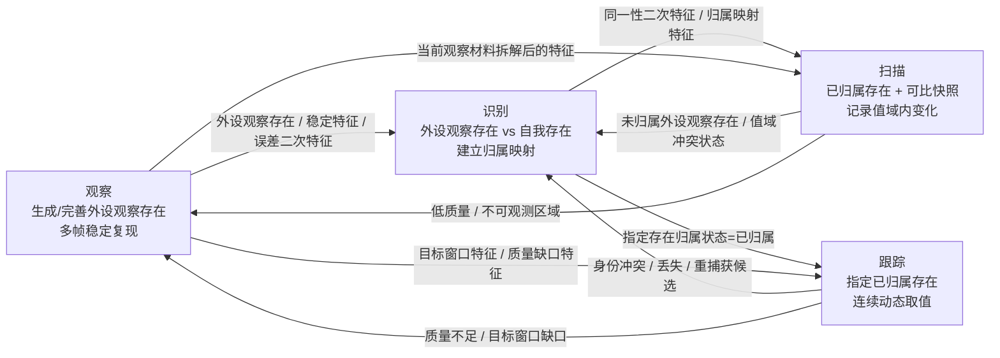
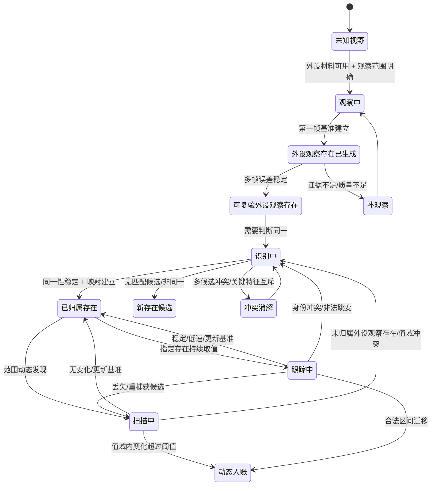

# 外设四本能方法关系与状态机 v0.1

更新时间：2026-06-05

## 总结

```text
观察立存在，识别定归属，扫描记变化，跟踪守动态。
```

完整口径：

```text
观察生成外设观察存在，
识别建立归属映射，
扫描发现已归属存在的特征变化，
跟踪持续读取指定存在的动态特征。
```

正式认知链只承接：

```text
存在
特征
二次特征
状态动态
```

线程通信容器可以存在于外设线程与任务管理工作线程之间，但拆解后不能作为需求目标、方法输出、因果节点或世界树事实。

## 四方法关系图



## 状态机



## 去容器化替换表

下表左列只是工程旧称或线程通信层口头说法，不是正式承接对象。

| 非正式旧称 | 正式承接对象 |
| --- | --- |
| 观察报告 | 外设观察存在集合 + 特征集合 + 误差二次特征 + 状态动态 |
| 识别提交结果 | 同一性二次特征 + 归属映射特征 + 归属状态动态 |
| 扫描报告 | 已归属存在当前特征 + 特征变化二次特征 + 特征变化状态动态 |
| 跟踪报告 | 指定存在当前特征 + 预测误差二次特征 + 跟踪状态动态 |
| 质量缺口报告 | 质量缺口特征 + 质量缺口状态动态 |
| 结果包 | 方法输出特征集合 + 状态动态集合 |

## 因果链

```text
观察:
    外设材料可用
        -> 外设观察存在.基准状态 == 已建立
        -> 多帧误差落入特征值域
        -> 外设观察存在.稳定复现状态 == 稳定
        -> 外设观察存在.观察完成状态 == 已完成
```

```text
识别:
    外设观察存在.特征集合
        + 自我存在.特征集合
        + 同一性比较值域
        -> 外设观察存在_自我存在.同一性状态 == 同一
        -> 外设观察存在.自我归属状态 == 已归属
```

```text
扫描:
    自我存在.归属状态 == 已归属
        + 当前特征值
        + 上一轮基准特征值
        + 当前值落入存在特征值域
        -> 自我存在.特征变化动态 == 已生成
```

```text
跟踪:
    指定存在.归属状态 == 已归属
        + 跟踪窗口明确
        + 当前特征值落入细分值域区间
        + 当前特征值落入预测区间
        + 预测误差值 < 阈值
        -> 指定存在.跟踪状态 == 稳定
        -> 指定存在.动态区间迁移动态 == 已生成
```

## 定案

```text
相机线程可以传输容器，
但自我不能把容器当世界。

拆开之后，能入账的只有：
    存在
    特征
    二次特征
    状态动态
```
