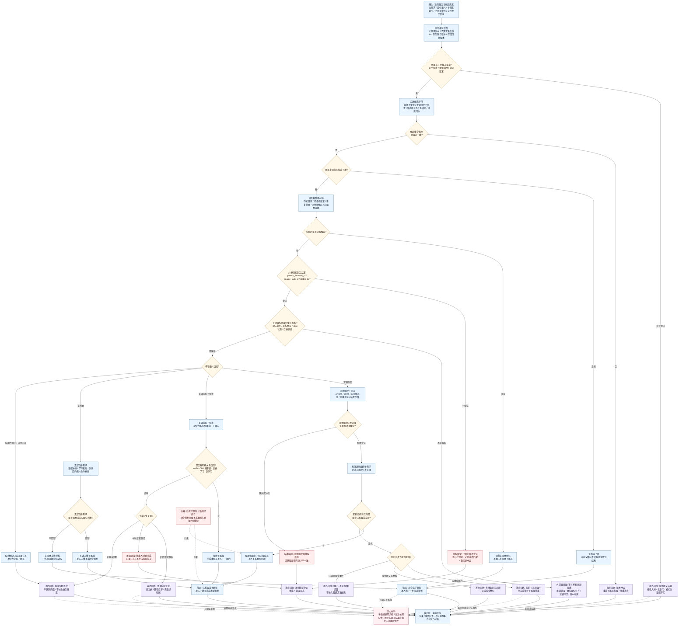

# 子路径或逻辑组织子需求判断逻辑图 v0.1

更新时间：2026-06-05

## 用途

本图是 `任务筹办普通函数状态机流程图 v0.2` 中：

```text
是否已有子路径
或逻辑组织子需求?
```

的细分判断图。

本图只判断当前任务目标下是否已有可被筹办继续读取的子路径结构，不判断子路径是否已经闭合，也不选择哪条路径好用。

## 判断原则

```text
1. 待提交草案不算已有子路径，只有需求提交入口回执为已入树或已复用后，才算正式子路径。
2. 子路径必须有合法父子归属、来源需求引用、目标语义视图和关系类型。
3. 逻辑组织子需求必须能识别为 AND组、OR组、方法路径组、因果子链、证据补齐、学习支撑或副作用约束等组织语义。
4. 普通业务子需求只有携带明确关系类型或可由获取途径稳定确定关系时，才算当前父目标的子路径。
5. 历史材料、重复草案、被拒绝草案、已失效候选、纯日志、非阻塞证据材料，不算已有阻塞子路径。
6. 缺父子关系、引用悬空、目标语义非法、逻辑组织获取途径缺失，优先进入诊断或逻辑错误，不直接生成业务分支。
7. 输出为“有子路径”后，下一步仍需进入子路径关系类型判断，再看 AND / OR / 顺序链 / 支撑类路径如何闭合。
```

## 判断逻辑图



## 输出分类

| 分类 | 判定条件 | 下一步 |
| --- | --- | --- |
| 已有合法子路径 | 子项归属合法、目标可解析、关系类型明确，或逻辑组织节点有合法成员 | 进入子路径关系类型判断 |
| 等待提交结果 | 只有待裁决草案，尚未收到已入树或已复用回执 | 等待提交入口回执 |
| 无合法子路径 | 没有候选子项，或仅剩非阻塞材料、历史材料、失效候选 | 进入找下一步可选步骤 |
| 组织节点需展开 | 已有逻辑组织子需求，但内部还没有合法成员且本轮应继续展开 | 生成或等待子路径草案 |
| 组织节点可聚合 | 逻辑组织节点已有满足聚合或结算条件的材料 | 进入聚合 / 结算回执 |
| 待关系规范化 | 旧数据缺关系类型，但不是本轮草案错误 | 诊断等待或兼容迁移，不生成业务分支 |
| 逻辑错误中止 | 子项归属不合法、引用悬空、草案入树缺关系、逻辑组织获取途径缺失或冲突 | 弹窗 + 错误日志 + 结构化回执 |

## 接入建议

```text
1. 在 v0.2 的 `CHILD_GATE` 位置调用本判断。
2. 本判断只确认“是否有可继续读取的子路径结构”，不判断闭合状态。
3. `HAS_CHILD_PATH` 后必须继续进入 `REL_GATE`，再判断 AND / OR / 顺序链 / 支撑类路径。
4. 待提交草案必须等提交结果，不能提前当作已有子路径。
5. 逻辑错误只弹窗、记日志、返回结构化回执，不派生业务需求。
6. 长期没有子路径、关系缺失或组织节点展开失败，都应进入压力材料。
```
