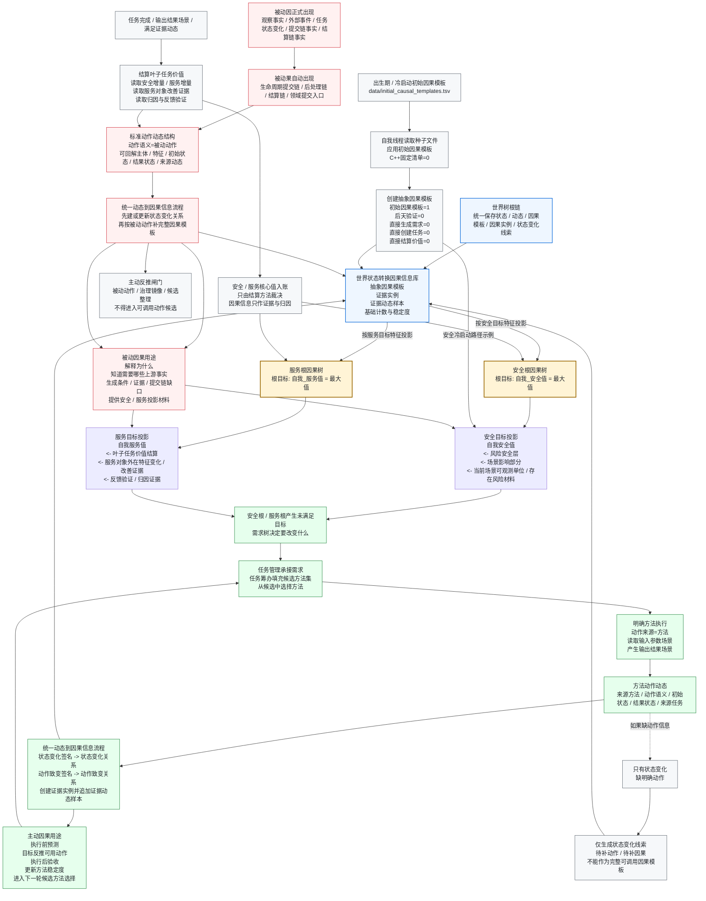

# 安全 / 服务双根：主动与被动因果信息生成链图 v0.1

更新时间：2026-06-05

## 口径

本图按“目标投影双根”呈现当前项目已有因果信息生成链：

```text
安全根：自我_安全值 -> 目标状态最大值
服务根：自我_服务值 -> 目标状态最大值
```

工程存储口径仍是：状态、动态、因果模板、因果实例和状态变化线索挂在世界树根链；安全根和服务根是从这套世界状态转换因果信息中，按目标特征投影出的两棵目标因果树。

## 总图



## 双根展开

| 根 | 根目标 | 当前已能挂接的主要因果材料 | 边界 |
| --- | --- | --- | --- |
| 安全根 | `自我_安全值 = 最大值` | 风险安全层、风险安全_场景影响部分、当前场景可观测单位取得、D455观察确认路径、任务结算后的安全增量证据。 | D455 / 外设材料不能直接证明安全值增加；候选安全值、投影安全值、正式入账安全值必须区分。 |
| 服务根 | `自我_服务值 = 最大值` | 叶子任务价值结算、服务对象外在特征状态变化数、服务对象外在特征状态改善证据、反馈验证、归因证据、任务完成事实。 | 服务链不能借用“无负向证据默认良好”；服务值入账必须有目标特征真实改善和结算方法裁决。 |

## 主动因果链

```text
安全 / 服务根目标未达成
-> 需求树生成正式需求
-> 任务管理承接
-> 任务筹办按目标填充候选方法集
-> 从候选集中选择明确方法
-> 方法读取输入参数场景并执行
-> 生成方法动作动态
-> 因果类按动态生成状态变化关系
-> 若动态有明确动作，生成动作致变关系
-> 创建因果实例并追加证据动态样本
-> 因果模板可参与预测、反推、验收和稳定度更新
```

主动因果能进入“反推可用动作”的前提：

```text
1. 因果模板有动作信息；
2. 动作语义不是 被动动作；
3. 动作语义不是治理镜像；
4. 动作语义不是候选整理 / 条件检查等生命周期整理动作；
5. 能映射回已实现的方法或本能方法动作入口。
```

## 被动因果链

```text
上游事实正式出现
-> 命中被动规则
-> 被动果自动出现
-> 生成标准动作动态
-> 动作语义写为 被动动作
-> 进入同一套动态到因果信息流程
-> 形成状态变化关系或被动动作完整因果模板
-> 追加证据动态样本
-> 进入安全 / 服务目标投影
```

被动因果的输出不是“下一步调用被动动作”，而是：

```text
1. 解释上游事实为什么导致本轮状态变化；
2. 说明后续需要哪些条件、上游事实、提交链或结算链；
3. 在被动因已具备但被动果缺失时，生成提交链 / 后处理链 / 结算链缺口；
4. 为安全根和服务根提供投影材料、验收材料或结算证据。
```

## 初始因果链

```text
data/initial_causal_templates.tsv
-> 自我线程读取并应用种子行
-> 创建出生期初始因果模板
-> 标记为初始假设 / 待后天验证
-> 被安全根或服务根的目标投影视图读取
-> 后续被运行动态样本强化、削弱、分化或覆盖
```

当前种子文件中已明确存在安全冷启动路径：

```text
风险安全层明确状态
<- 风险安全_场景影响部分已入账状态
<- 获取当前场景所有可被观测单位
<- D455观察确认路径完成状态 / 已有场景缓存路径完成状态 / 交互者说明路径完成状态
```

## 必须保留的判断边界

| 判断点 | 当前口径 |
| --- | --- |
| 因果树根 | 目标投影上画双根：安全根、服务根；底层权威存储仍是世界树根链。 |
| 主动因果 | 来自明确方法执行后的方法动作动态，可在通过闸门后反推候选动作。 |
| 被动因果 | 来自被动规则、提交链、后处理链或结算链的标准动作动态；不能被反推成可调用方法。 |
| 状态变化线索 | 只有初始状态和结果状态、缺动作时，只能作为待补动作线索。 |
| 初始因果模板 | 冷启动 / 遗传被动因果假设；不直接生成需求、任务或价值结算。 |
| 安全 / 服务值 | 因果信息不直接写核心值；只提供解释、预测、反推、审查、验收和结算证据。 |

## 代码锚点

```text
因果类::按动态创建因果信息
因果类::按动态补全两层因果
因果类::追加证据动态样本
因果类::追加证据实例
因果类::反推自我动作组合
世界树类::按动态创建因果信息
自我线程模块.impl.cpp / 私有_确保初始因果模板_线程侧
自我线程模块.impl.cpp / 私有_读取或确保被动触发初始因果_线程侧
自我动作实现模块.ixx / 词_被动动作
自我动作实现模块.ixx / 确认结算叶子任务价值规格
data/initial_causal_templates.tsv
```
