# 当前代码状态：任务完成被动因果流程图 v0.1

更新时间：2026-06-05

## 口径

本图是从“活动需求已经正式入树”到“任务完成、需求收束、叶子任务价值结算”的任务完成流程图。

它仍然按被动因果表达：

```text
正式入账事实 / 回执 / 状态动作动态 = 被动因
生命周期提交链 / 后处理链 / 结算链自动出现的治理结果 = 被动果
```

任务筹办和任务执行只是任务生命周期普通函数，只形成过程回执；任务完成的权威动作动态来自 `提交任务状态变化`，不是来自任务筹办 / 任务执行本身。

## 总图

```mermaid
flowchart TB
    START["被动因<br/>活动需求正式入树<br/>目标宿主 / 目标特征类型 / 满足关系 / 目标值完整"]
    CREATE["被动果<br/>承接需求创建任务<br/>任务信息节点创建<br/>任务虚拟存在创建<br/>任务状态 = 未启动"]
    MIRROR["被动果<br/>任务语义镜像入任务虚拟存在<br/>任务发起存在 / 作用对象 / 上下文<br/>当前状态 / 目标状态 / 满足关系 / 权重"]

    PREP_READY["被动因<br/>任务状态允许筹办<br/>任务目标可解析<br/>任务虚拟存在已绑定"]
    PREP_FN["普通函数事实<br/>任务筹办<br/>读取需求目标和任务虚拟存在<br/>判断父任务 / 中间任务 / 叶子任务"]

    PREP_PARENT["筹办回执<br/>父任务 / 中间任务<br/>等待子需求 / 子任务回流 / 归并 / 待重筹办"]
    PREP_LEAF["筹办回执<br/>叶子任务<br/>候选方法集 / 当前方法<br/>可执行输入参数场景<br/>筹办缺口类型 / 建议任务状态"]
    METHOD_GAP["被动因<br/>当前方法缺口<br/>无确定候选 / 候选方法不可用<br/>缺执行入口 / 缺条件结果对"]
    METHOD_FLOW["转入方法完善被动因果流程图<br/>目标: 方法虚拟存在达到可用<br/>完成后触发任务待重筹办"]

    SYNC_PREP["被动果<br/>同步筹办回执到任务壳<br/>候选方法虚拟存在集 / 当前方法虚拟存在<br/>输入参数场景 / 筹办缺口写入任务虚拟存在<br/>被动整理, 不生成主链动作动态"]
    SUBMIT_READY["被动果<br/>提交任务状态变化<br/>任务状态动作动态 D1<br/>未启动/筹办中 -> 就绪/等待中/待重筹办/无法执行"]

    EXEC_GATE["被动因<br/>任务状态 = 就绪<br/>当前方法虚拟存在已引用<br/>可执行输入参数场景已入账"]
    EXEC_FN["普通函数事实<br/>任务执行<br/>调用当前方法<br/>读取方法运行存在 / 输出结果场景<br/>比较输出结果与来源需求目标"]
    D0["上游证据<br/>D0 世界事实动作动态<br/>当前业务方法或提交类方法造成现实事实变化"]
    EXEC_RECEIPT["执行回执<br/>目标是否达成<br/>本轮是否推进 / 推进量 / 剩余差距<br/>执行结果类型 / 执行缺口"]

    SYNC_EXEC["被动果<br/>同步执行回执到任务壳<br/>目标是否达成 / 推进量 / 剩余差距<br/>当前方法运行存在 / 输出结果场景 / 执行缺口<br/>写入任务虚拟存在"]
    SUBMIT_DONE["被动果<br/>提交任务状态变化<br/>任务状态动作动态 D1<br/>执行中 -> 完成/等待中/待重筹办/失败"]

    DONE_CAUSE["被动因<br/>任务状态动作动态 D1 已入账<br/>任务状态 = 完成<br/>输出结果场景 / D0 / 满足证据可回查"]
    SELF_REVIEW["被动果<br/>自我线程复核来源需求<br/>任务完成不直接等于需求满足<br/>必须比较输出结果与需求目标"]
    DEMAND_CLOSE["被动果<br/>来源需求收束后处理<br/>写需求有效截止 / 最近结算任务 / 最近结算时间<br/>刷新父子需求权重和结构角色<br/>不生成独立需求状态方法动作动态"]
    SETTLE_GATE["被动因<br/>叶子任务可结算<br/>任务完成事实 + 满足证据合法 + 未重复结算"]
    VALUE["被动果<br/>D2 叶子任务价值结算动作动态<br/>方法: 结算叶子任务价值<br/>安全值 / 服务值 / 结算增量入账"]
    PARENT_WAKE["被动果<br/>父任务重筹办<br/>子需求满足或子任务完成后<br/>父任务: 等待中 -> 待重筹办<br/>必须串到权威任务状态动作动态"]
    CAUSAL["被动果<br/>统一因果吸收<br/>D0 / D1 / D2 进入动作动态因果账本<br/>按动态创建因果信息 / 追加证据动态样本"]

    START -->|"被动因 -> 被动果"| CREATE --> MIRROR --> PREP_READY --> PREP_FN
    PREP_FN --> PREP_PARENT
    PREP_FN --> PREP_LEAF
    PREP_LEAF --> METHOD_GAP --> METHOD_FLOW
    METHOD_FLOW -->|"方法可用事实入账"| PARENT_WAKE
    PREP_PARENT --> SYNC_PREP
    PREP_LEAF --> SYNC_PREP
    SYNC_PREP --> SUBMIT_READY

    SUBMIT_READY -->|"任务状态=就绪"| EXEC_GATE
    EXEC_GATE --> EXEC_FN
    D0 -->|"作为执行证据"| EXEC_FN
    EXEC_FN --> EXEC_RECEIPT --> SYNC_EXEC --> SUBMIT_DONE

    SUBMIT_DONE -->|"任务状态=完成"| DONE_CAUSE
    SUBMIT_DONE -->|"等待/重筹办/失败"| PARENT_WAKE
    DONE_CAUSE --> SELF_REVIEW --> DEMAND_CLOSE
    DEMAND_CLOSE --> SETTLE_GATE --> VALUE
    DEMAND_CLOSE --> PARENT_WAKE
    D0 --> CAUSAL
    SUBMIT_READY --> CAUSAL
    SUBMIT_DONE --> CAUSAL
    VALUE --> CAUSAL

    classDef in fill:#eef6ff,stroke:#0969da,color:#1f2328;
    classDef out fill:#e6ffed,stroke:#1a7f37,color:#1f2328;
    classDef fn fill:#fff4d6,stroke:#9a6700,color:#1f2328;
    classDef dyn fill:#f0e7ff,stroke:#8250df,stroke-width:2px,color:#1f2328;
    classDef ext fill:#fff1f1,stroke:#cf222e,color:#1f2328;
    classDef ledger fill:#f6f8fa,stroke:#57606a,color:#1f2328;

    class START,PREP_READY,METHOD_GAP,EXEC_GATE,DONE_CAUSE,SETTLE_GATE in;
    class CREATE,MIRROR,SYNC_PREP,SUBMIT_READY,SYNC_EXEC,SUBMIT_DONE,SELF_REVIEW,DEMAND_CLOSE,VALUE,PARENT_WAKE out;
    class PREP_FN,PREP_PARENT,PREP_LEAF,EXEC_FN,EXEC_RECEIPT fn;
    class METHOD_FLOW dyn;
    class D0 ext;
    class CAUSAL ledger;
```



## 阶段说明

| 阶段 | 被动因 | 被动果 | 关键边界 |
| --- | --- | --- | --- |
| 任务承接 | 活动需求正式入树，目标信息完整 | 创建任务和任务虚拟存在 | 需求树是组织结构，任务是过程承接壳。 |
| 任务筹办 | 任务状态允许筹办，任务目标可解析 | 筹办回执形成 | 筹办不是本能方法，不生成动作动态。 |
| 筹办入账 | 筹办回执已形成 | 回执镜像入任务虚拟存在，必要时提交任务状态变化 | 同步回执是被动整理；任务状态变化由提交本能方法生成 D1。 |
| 方法缺口分流 | 当前方法不可用或结构缺口明确 | 转入方法完善流程 | 不把方法缺口强行画成任务完成。 |
| 任务执行 | 任务状态就绪，当前方法和输入场景具备 | 执行回执形成 | 执行普通函数负责比较输出结果与需求目标。 |
| 执行入账 | 执行回执已形成 | 执行回执镜像入任务虚拟存在，提交任务状态变化 | 任务完成动态来源是提交任务状态变化，不是任务执行。 |
| 需求收束 | D1 显示任务完成，输出证据可回查 | 来源需求收束后处理 | 任务完成不直接等于需求满足。 |
| 价值结算 | 叶子任务完成且满足证据合法 | D2 叶子任务价值结算 | 安全 / 服务值增量来自任务完成事实和合法结算规则。 |
| 父任务回流 | 子任务完成、子需求满足或方法可用事实入账 | 父任务等待中转待重筹办 | 必须串到权威任务状态动作动态。 |

## 输出

```text
任务完成流程的关键输出：
1. 任务状态动作动态 D1。
2. 任务虚拟存在中的执行回执镜像。
3. 输出结果场景或当前方法运行存在。
4. 来源需求收束事实。
5. 叶子任务价值结算动作动态 D2。
6. 父任务重筹办证据。
```

## 不应误画

```text
1. 不把任务筹办 / 任务执行画成本能方法。
2. 不把任务管理线程画成动作动态来源。
3. 不把任务完成直接等同于需求满足。
4. 不把方法缺口强行画成任务完成；方法缺口应转入方法完善流程。
5. 不用原因摘要、说明文本或日志文案作为任务完成因果依据。
```
