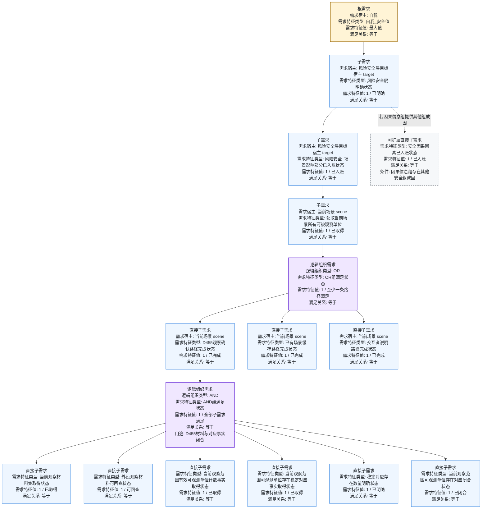

# 当前代码状态：安全需求树（需求节点口径） v0.2

更新时间：2026-06-05

## 口径修正

本图只画“需求树”。也就是说，主树中的每个实线节点都必须能回答：

```text
为了满足父需求，下一层需要满足哪些需求？
```

节点只允许是：

```text
1. 直接需求节点：需求特征类型 + 需求特征值 + 满足关系。
2. 逻辑组织需求节点：AND / OR 也是需求节点，目标特征类型分别是 AND组满足状态 / OR组满足状态，目标值为 1。
```

方法、提交入口、自我线程维护、扫描、跟踪、安全评估，只能作为生产者 / 承接方式写入备注，不作为安全需求树主干子节点。

> 备注：用户口径中的 `NAD` 在本图按 `AND` 逻辑组织节点理解。

## 需求树总图



## 树形摘要

```text
安全根需求
└── 需求特征类型: 自我_安全值
    需求特征值: 最大值
    └── 风险安全层明确
        需求特征类型: 风险安全层明确状态
        需求特征值: 1 / 已明确
        └── 场景影响部分入账
            需求特征类型: 风险安全_场景影响部分已入账状态
            需求特征值: 1 / 已入账
            └── 当前场景可观测单位取得
                需求特征类型: 获取当前场景所有可被观测单位
                需求特征值: 1 / 已取得
                └── OR逻辑需求
                    需求特征类型: OR组满足状态
                    需求特征值: 1
                    ├── D455观察确认路径完成
                    │   需求特征类型: D455观察确认路径完成状态
                    │   需求特征值: 1
                    │   └── AND逻辑需求：D455材料与对应事实闭合
                    │       需求特征类型: AND组满足状态
                    │       需求特征值: 1
                    │       ├── 当前观察材料集取得状态 = 1
                    │       ├── 外设观察材料可回查状态 = 1
                    │       ├── 当前观察范围有效可观测单位计数事实取得状态 = 1
                    │       ├── 当前观察范围可观测单位存在稳定对应事实取得状态 = 1
                    │       ├── 稳定对应存在数量明确状态 = 1
                    │       └── 当前观察范围可观测单位存在对应闭合状态 = 1
                    ├── 已有场景缓存路径完成状态 = 1
                    └── 交互者说明路径完成状态 = 1
```

## 需求节点明细

| 节点 | 父需求要被满足时需要的子需求 | 需求特征类型 | 需求特征值 | 满足关系 | 当前代码 / 模板依据 |
| --- | --- | --- | --- | --- | --- |
| 安全根需求 | 需要风险安全层明确 | `自我_安全值` | `最大值` | `等于` | 根安全目标口径。 |
| 风险安全层明确 | 需要场景影响部分入账；如因果信息组有其他安全组成因，还需要对应组成因入账 | `风险安全层明确状态` | `1 / 已明确` | `等于` | 安全风险树来源因果。 |
| 场景影响部分入账 | 需要当前场景所有可被观测单位已取得 | `风险安全_场景影响部分已入账状态` | `1 / 已入账` | `等于` | `initial_causal_templates.tsv` 第 2 层。 |
| 当前场景可观测单位取得 | 需要 D455、已有缓存、交互者说明三条路径之一满足 | `获取当前场景所有可被观测单位` | `1 / 已取得` | `等于` | `initial_causal_templates.tsv` 第 3-5 行路径。 |
| OR逻辑需求 | 三条替代路径至少一条满足 | `OR组满足状态` | `1 / 至少一条路径满足` | `等于` | `需求类::逻辑组织目标特征类型(OR组)`。 |
| D455路径完成 | 需要 D455材料与对应事实闭合 | `D455观察确认路径完成状态` | `1 / 已完成` | `等于` | `initial_causal_templates.tsv` 的 D455 路径。 |
| 已有缓存路径完成 | 当前比较链只登记为可替代直接需求，内部子需求未在本次图中展开 | `已有场景缓存路径完成状态` | `1 / 已完成` | `等于` | `initial_causal_templates.tsv` 的缓存路径。 |
| 交互者说明路径完成 | 当前比较链只登记为可替代直接需求，内部子需求未在本次图中展开 | `交互者说明路径完成状态` | `1 / 已完成` | `等于` | `initial_causal_templates.tsv` 的交互说明路径。 |
| D455闭合AND逻辑需求 | 六个材料 / 对应事实需求全部满足 | `AND组满足状态` | `1 / 全部子需求满足` | `等于` | `需求类::逻辑组织目标特征类型(AND组)`。 |
| D455材料叶子 | 外设材料包可作为后续识别材料 | `当前观察材料集取得状态` | `1 / 已取得` | `等于` | D455观察确认路径内部因特征。 |
| D455材料可回查 | 自我可回查外设观察材料 | `外设观察材料可回查状态` | `1 / 可回查` | `等于` | D455观察确认路径内部因特征。 |
| 可观测单位计数事实 | 当前观察范围内有效可观测单位数量已形成事实 | `当前观察范围有效可观测单位计数事实取得状态` | `1 / 已取得` | `等于` | D455观察确认路径内部因特征。 |
| 稳定对应事实 | 可观测单位与存在之间的稳定对应事实已取得 | `当前观察范围可观测单位存在稳定对应事实取得状态` | `1 / 已取得` | `等于` | D455观察确认路径内部因特征。 |
| 稳定数量明确 | 稳定对应到存在的数量已明确 | `稳定对应存在数量明确状态` | `1 / 已明确` | `等于` | D455观察确认路径内部因特征。 |
| 对应闭合 | 当前观察范围的可观测单位已闭合归属到存在 | `当前观察范围可观测单位存在对应闭合状态` | `1 / 已闭合` | `等于` | D455观察确认路径内部因特征。 |

## 不进入需求树主干的内容

| 内容 | 在本图中的位置 | 原因 |
| --- | --- | --- |
| `私有_维护安全因果风险树_线程侧` | 备注 / 生产者 | 这是安全需求树生成和维护方法，不是为了满足父需求而需要满足的子需求。 |
| `提交_生成缺口子需求` | 备注 / 入树提交入口 | 这是把派生需求消息正式入树的承接入口，不是需求节点。 |
| `自我_识别外设观察材料` | D455叶子需求的生产者 | 识别的目标是把外设特征值归入存在，产生稳定对应事实；它不是安全树里的子需求名称。 |
| `自我_扫描已识别区域` | 后续动态取得生产者 | 扫描用于发现动态；不是“获取当前场景所有可被观测单位”的完成子需求。 |
| `自我_跟踪指定存在` | 后续指定目标动态取得生产者 | 跟踪只盯一个存在，不能替代全场扫描或全场安全结论。 |
| `安全_评估当前场景安全性` | 场景影响部分入账的生产者 / 评估方法 | 它生成候选和提交材料，不直接作为需求树子节点，也不得直接写自我安全值。 |

## 代码与规范锚点

```text
需求类.cpp
    逻辑组织目标特征类型
        AND组 -> AND组满足状态
        OR组 -> OR组满足状态
        方法路径组 -> 方法路径完成状态
    构造逻辑组织需求更新指令
        指令.需求类型 / 需求名称 / 目标特征类型缓存 = 逻辑组织目标特征

规范/需求树生长机制规范20260512.md
    需求目标必须包含目标宿主、目标特征类型、目标比较符、目标值。
    AND / OR / 方法路径语义继续由目标特征类型表达。

规范/需求临时因果视图展开规范20260526.md
    获取途径只用于生成规则和校验上下文，不进入需求主信息。
    扫描 / 跟踪不是当前观察范围有效可观测单位明确状态的完成子需求。

data/initial_causal_templates.tsv
    风险安全层明确状态 <- 风险安全_场景影响部分已入账状态
    风险安全_场景影响部分已入账状态 <- 获取当前场景所有可被观测单位
    获取当前场景所有可被观测单位 <- D455 / 已有缓存 / 交互者说明路径
    D455观察确认路径完成状态 <- 六个材料与对应事实闭合特征
```
