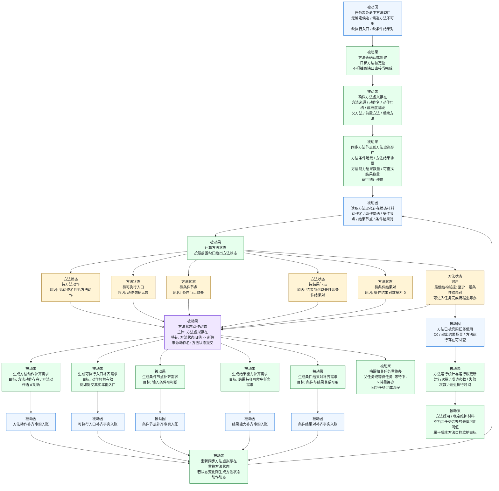

# 当前代码状态：方法完善被动因果流程图 v0.1

更新时间：2026-06-05

## 口径

本图是“方法从不可用 / 不够完善，到可用 / 后续可维护”的方法完善流程图。

它仍然按被动因果表达：任务筹办、方法状态同步、方法状态动作动态、方法补齐事实、运行账事实都是已经入账或可回查的被动因；方法结构补齐需求、方法状态更新、任务重筹办是被动果。

任务完成流程遇到方法缺口时，应转入本图；本图达到 `方法状态 = 可用` 后，再回到任务完成流程重筹办。

## 总图



## 方法状态判定顺序

| 顺序 | 被动因 | 方法状态 | 被动果 |
| --- | --- | --- | --- |
| 1 | 方法无动作名且无方法动作 | `待方法动作` | 生成方法动作补齐需求。 |
| 2 | 有动作语义但动作句柄无效 | `待可执行入口` | 生成可执行入口补齐需求。 |
| 3 | 动作入口存在但条件节点缺失 | `待条件节点` | 生成条件节点补齐需求。 |
| 4 | 条件节点存在但结果节点缺失，且无条件结果对 | `待结果节点` | 生成结果能力补齐需求。 |
| 5 | 结果能力或结果节点存在，但条件结果对数量为 0 | `待条件结果对` | 生成条件结果对补齐需求。 |
| 6 | 至少存在一组条件结果对 | `可用` | 唤醒相关任务重筹办，回到任务完成流程。 |

## 方法完善输出

```text
方法完善流程的关键输出：
1. 方法虚拟存在。
2. 方法状态特征。
3. 方法状态动作动态。
4. 具体方法结构补齐需求。
5. 条件节点 / 结果节点 / 条件结果对 / 可执行入口等补齐事实。
6. 相关任务待重筹办事实。
7. 方法运行统计和后续好用 / 稳定维护材料。
```

## 与任务完成流程的接口

```text
任务完成流程 -> 方法完善流程：
    任务筹办发现当前方法不可用、缺执行入口、缺条件结果对或无确定候选。

方法完善流程 -> 任务完成流程：
    方法状态达到可用，方法状态动作动态入账，等待任务或父任务被唤醒为待重筹办。
```

## 不应误画

```text
1. 不把方法完善画成任务执行的一部分。
2. 不把方法状态 = 可用 之后的好用 / 稳定维护强行作为任务完成前置。
3. 不把任务虚拟存在当作方法运行账承载位置。
4. 不用动作动态反向生成下一步动作；下一步仍由方法状态、任务状态、需求状态和因果信息驱动。
5. 不用泛化的“方法状态=可用”掩盖已明确的具体结构缺口。
```
