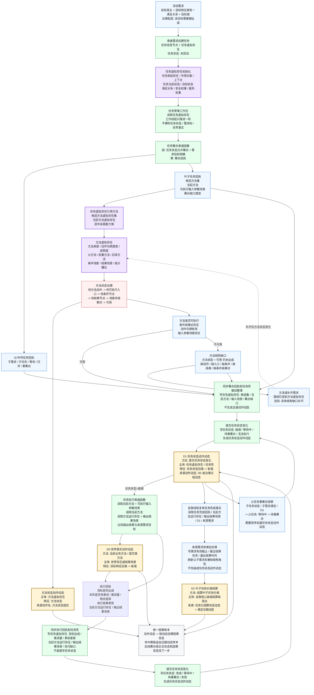

# 当前代码状态：自我内部治理因果树（任务 / 方法虚拟存在） v0.1

更新时间：2026-06-05

## 口径

本图不是安全需求树，也不是外部现实事实链。它画的是自我内部治理层怎样用任务虚拟存在和方法虚拟存在承载因果关系：

```text
需求目标
-> 任务虚拟存在
-> 筹办 / 执行过程回执
-> 方法虚拟存在
-> 方法状态 / 方法动作
-> 任务状态动作动态
-> 需求收束 / 父任务重筹办 / 价值结算
```

硬边界：

```text
1. 任务筹办 / 任务执行是生命周期普通函数，只形成过程回执。
2. 任务状态变化必须由任务域提交本能方法写入任务虚拟存在，并生成任务状态动作动态。
3. 方法状态和方法运行账写在方法虚拟存在，不写进任务虚拟存在。
4. 任务虚拟存在可以引用当前方法虚拟存在、候选方法虚拟存在、输入场景和输出结果场景。
5. 动作动态之间通过来源动态串成因果账本，不另造一套因果记录结构。
```

## 总图



## 任务虚拟存在因果树

```text
活动需求
└── 承接需求创建任务
    └── 任务虚拟存在
        ├── 来源需求镜像
        │   ├── 任务发起存在
        │   ├── 任务作用对象
        │   ├── 任务当前状态
        │   ├── 任务目标状态
        │   ├── 任务满足关系
        │   ├── 任务安全权重
        │   └── 任务服务权重
        ├── 筹办回执镜像
        │   ├── 候选方法虚拟存在集
        │   ├── 当前方法虚拟存在
        │   ├── 可执行输入参数场景
        │   └── 筹办缺口类型
        ├── 执行回执镜像
        │   ├── 目标是否达成
        │   ├── 本轮是否有推进
        │   ├── 本轮推进量
        │   ├── 剩余差距
        │   ├── 当前方法运行存在
        │   ├── 输出结果场景
        │   └── 执行缺口类型
        └── 任务状态动作动态
            ├── 就绪 / 等待中 / 待重筹办 / 完成 / 已结算
            └── 作为父任务回流、需求收束、结算、因果抽象的治理证据
```

## 方法虚拟存在因果树

```text
方法头 / 当前方法
└── 方法虚拟存在
    ├── 方法身份
    │   ├── 方法来源
    │   ├── 动作句柄类型
    │   ├── 动作名
    │   └── 成熟度阶段
    ├── 方法结构
    │   ├── 父方法
    │   ├── 前置方法
    │   ├── 后续方法
    │   ├── 方法条件场景
    │   ├── 方法结果场景
    │   ├── 方法能力结果数量
    │   └── 方法可查找结果数量
    ├── 方法状态
    │   ├── 待方法动作
    │   ├── 待可执行入口
    │   ├── 待条件节点
    │   ├── 待结果节点
    │   ├── 待条件结果对
    │   └── 可用
    ├── 方法运行统计
    │   ├── 运行次数
    │   ├── 成功次数
    │   ├── 失败次数
    │   └── 最近执行时间
    └── 方法状态动作动态
        ├── 方法状态旧值 -> 新值
        └── 作为方法可用性、学习补齐、任务重筹办的治理证据
```

## 因果节点说明

| 因果节点 | 因 | 果 | 写入位置 | 动作动态归属 |
| --- | --- | --- | --- | --- |
| 承接需求创建任务 | 活动需求需要过程承接 | 任务信息节点 + 任务虚拟存在，任务状态为未启动 | 任务域 / 任务虚拟存在 | 任务创建动态归属任务域提交链 |
| 任务筹办 | 任务状态允许筹办，需求目标可解析 | 筹办回执：候选方法、当前方法、输入场景、缺口或就绪建议 | 先落运行回执，再由界面线程同步到任务虚拟存在 | 任务筹办本身不生成方法动作动态 |
| 方法虚拟存在同步 | 方法头被召回或选中 | 方法身份、结构、状态、统计槽位被投影到方法虚拟存在 | 方法虚拟存在 | 方法状态变化可生成方法状态动作动态 |
| 同步筹办回执 | 筹办回执出现 | 候选方法虚拟存在集、当前方法虚拟存在、输入场景、筹办缺口进入任务账 | 任务虚拟存在 | 被动整理，不是主链动作动态 |
| 提交任务状态变化 | 建议任务状态需要入账 | 任务状态写入并生成任务状态动作动态 | 任务虚拟存在 / 任务壳 | D1 任务状态动作动态 |
| 任务执行 | 任务就绪，当前方法和输入场景具备 | 方法运行存在、输出结果场景、世界事实动作动态、执行回执 | 世界事实 / 输出结果场景 / 运行存在 | D0 由当前业务方法或提交类方法负责 |
| 同步执行回执 | 执行回执出现 | 目标达成、推进量、剩余差距、输出结果场景等进入任务账 | 任务虚拟存在 | 被动整理，不是主链动作动态 |
| 需求收束 | 任务完成回执 + D1 + 输出结果满足来源需求 | 需求有效截止、最近结算任务、父子权重刷新 | 需求治理账 | 当前口径不生成独立需求状态动作动态 |
| 叶子任务价值结算 | 来源任务是可结算叶子任务，且满足证据合法 | 安全值 / 服务值 / 结算增量入账 | 结算账宿主 / 自我核心值 | D2 结算叶子任务价值动作动态 |
| 父任务重筹办 | 子任务完成、子需求满足或方法可用性变化 | 父任务从等待中回到待重筹办 | 父任务虚拟存在 / 任务壳 | 需要权威任务状态动作动态串因果 |

## 当前代码锚点

```text
任务主信息类.h
    任务主信息类::任务虚拟存在
    枚举_任务状态: 未启动 / 就绪 / 执行中 / 等待中 / 待重筹办 / 完成 / 已结算

方法主信息类.h
    结构_方法首节点信息::方法虚拟存在
    结构_方法首节点信息::动作名 / 动作句柄 / 来源
    枚举_方法状态: 待方法动作 / 待可执行入口 / 待条件节点 / 待结果节点 / 待条件结果对 / 可用 / 好用

任务模块.管理界面线程.impl.cpp
    私有_确保任务虚拟存在
    私有_用需求初始化任务虚拟存在
    私有_同步工作回执方法到任务壳
    私有_应用工作结果到任务壳
    提交任务状态变化 -> 读取任务状态动作动态 -> 放回治理结果

任务模块.管理工作线程.ixx
    工作线程只填写建议任务状态、候选 / 当前方法和工作结果。
    任务状态、阶段、候选方法集和镜像特征真实写入由管理界面线程统一提交。

任务模块.筹办.ixx
    候选方法按结果能力命中任务需求。
    方法虚拟存在用于方法状态可用性缺口、条件结果对缺口和学习补齐目标。

任务模块.执行.ixx
    读取任务可执行输入参数场景。
    创建方法调用动作动态。
    旧执行桥只保留回执计算，不提交任务账。

方法虚拟存在服务类.cpp
    确保方法虚拟存在
    同步方法节点到虚拟存在
    同步方法状态特征
    方法状态旧值 -> 新值时输出方法状态动作动态

因果类.cpp / 二次特征应用模块.ixx
    动作动态可沉淀因果信息。
    命中因果模板时追加证据动态样本。
```

## 不应误画的内容

```text
1. 不能把任务筹办 / 任务执行画成自我可选择的本能方法。
2. 不能把任务管理线程画成方法动作动态来源。
3. 不能把方法虚拟存在中的运行账写入任务虚拟存在。
4. 不能把任务完成直接等同于需求满足。
5. 不能用说明文本、原因摘要或日志文案作为机器因果判断依据。
6. 不能用动作动态反向生成下一步动作；下一步动作仍由正式需求状态、任务状态、方法状态和因果信息驱动。
```
