# 当前代码状态：自我内部治理被动因果树（任务 / 方法虚拟存在） v0.2

更新时间：2026-06-05

## 口径修正

本版修正 v0.1 的表达：自我内部治理这一段应当整体按“被动因果”画，而不是按主动方法调用链画。

这里的被动因果指：

```text
被动因：
    已正式入账的需求、任务状态、任务回执、方法状态、输出结果状态、动作动态、结算资格状态。

被动果：
    在被动因成立后，由生命周期提交链、后处理链或结算链必须自动出现的治理结果。
```

边界：

```text
1. 任务筹办 / 任务执行不是本能方法，也不是动作动态来源。
2. 任务筹办 / 任务执行产生的过程回执，可以成为后续被动因。
3. 任务虚拟存在和方法虚拟存在的状态变化，属于内部治理账的被动因果材料。
4. 业务方法造成的 D0 世界事实动作动态是上游证据；进入治理链后，它只作为被动因，不把治理链改写成主动因果。
5. 下一步动作不能由动作动态直接反推；仍由正式需求状态、任务状态、方法状态和因果信息驱动。
```

## 被动因果总图

```mermaid
flowchart TB
    ROOT["自我内部治理被动因果树<br/>根口径: 正式入账事实驱动治理果<br/>不是自我主动选择治理方法"]

    D0_IN["上游证据<br/>D0 世界事实动作动态<br/>方法: 当前业务方法 / 提交类方法<br/>说明: 只作为治理被动因输入"]

    DEMAND_IN["被动因<br/>活动需求正式入树<br/>目标宿主 / 目标特征类型 / 满足关系 / 目标值完整"]
    TASK_CREATE["被动果<br/>承接需求创建任务<br/>任务信息节点创建<br/>任务虚拟存在创建<br/>任务状态 = 未启动"]
    TASK_MIRROR["被动果<br/>任务语义镜像入任务虚拟存在<br/>发起存在 / 作用对象 / 上下文<br/>当前状态 / 目标状态 / 满足关系 / 权重"]

    PREP_FACT["被动因<br/>任务筹办普通函数形成筹办回执<br/>候选方法集 / 当前方法 / 输入场景 / 筹办缺口 / 建议任务状态<br/>普通函数事实, 不生成动作动态"]
    PREP_MIRROR["被动果<br/>筹办回执镜像入任务虚拟存在<br/>候选方法虚拟存在集<br/>当前方法虚拟存在<br/>可执行输入参数场景<br/>筹办缺口类型"]
    PREP_STATE["被动果<br/>提交任务状态变化<br/>任务状态动作动态 D1<br/>未启动/筹办中 -> 就绪/等待中/待重筹办/无法执行"]

    METHOD_REF["被动因<br/>任务虚拟存在已引用方法虚拟存在<br/>当前方法虚拟存在 / 候选方法虚拟存在集 / 选中自我能力值"]
    METHOD_STATE_IN["被动因<br/>方法虚拟存在状态事实<br/>方法状态: 待方法动作 / 待入口 / 待条件 / 待结果 / 待条件结果对 / 可用"]
    METHOD_STATE_DYN["被动果<br/>方法状态动作动态<br/>主体: 方法虚拟存在<br/>特征: 方法状态旧值 -> 新值<br/>来源动作名: 方法状态提交"]
    METHOD_GAP["被动果<br/>方法结构补齐需求或重筹办事实<br/>原因: 方法状态未达可用 / 条件结果对缺失 / 执行入口缺失<br/>围绕目标方法虚拟存在生成"]

    EXEC_FACT["被动因<br/>任务执行普通函数形成执行回执<br/>输入: 当前方法 + 可执行输入参数场景 + D0/输出结果场景<br/>回执: 目标是否达成 / 推进量 / 剩余差距 / 执行缺口<br/>普通函数事实, 不直接写任务状态"]
    EXEC_MIRROR["被动果<br/>执行回执镜像入任务虚拟存在<br/>目标是否达成 / 本轮是否推进 / 推进量 / 剩余差距<br/>当前方法运行存在 / 输出结果场景 / 执行缺口"]
    EXEC_STATE["被动果<br/>提交任务状态变化<br/>任务状态动作动态 D1<br/>执行中 -> 完成/等待中/待重筹办/失败"]

    TASK_DONE["被动因<br/>任务状态动作动态 D1 已入账<br/>任务状态 = 完成 / 已结算<br/>并携带输出结果场景或满足证据"]
    DEMAND_CLOSE["被动果<br/>来源需求收束后处理<br/>写需求有效截止 / 最近结算任务 / 最近结算时间<br/>刷新父子需求权重和结构角色<br/>不生成独立需求状态方法动作动态"]

    SETTLE_IN["被动因<br/>叶子任务可结算<br/>任务完成事实 + 满足证据合法 + 未重复结算"]
    VALUE_D2["被动果<br/>D2 叶子任务价值结算动作动态<br/>方法: 结算叶子任务价值<br/>主体: 自我核心值或结算账宿主<br/>特征: 安全值 / 服务值 / 结算增量"]

    PARENT_IN["被动因<br/>子任务状态动作动态 / 子需求满足事实 / 方法状态可用变化<br/>父任务仍等待或父目标未达成"]
    PARENT_WAKE["被动果<br/>父任务重筹办<br/>父任务状态: 等待中 -> 待重筹办<br/>证据必须串到权威任务状态动作动态"]

    CAUSAL_IN["被动因<br/>D0 / D1 / D2 / 方法状态动作动态 已入账"]
    CAUSAL_OUT["被动果<br/>统一因果吸收<br/>按动态创建因果信息<br/>命中模板追加证据动态样本<br/>成为后续需求投影和筹办依据"]

    ROOT --> DEMAND_IN
    ROOT --> METHOD_STATE_IN
    ROOT --> D0_IN

    DEMAND_IN -->|"被动因 -> 被动果"| TASK_CREATE
    TASK_CREATE -->|"被动因 -> 被动果"| TASK_MIRROR
    TASK_MIRROR -->|"任务可筹办事实"| PREP_FACT

    PREP_FACT -->|"被动因 -> 被动果"| PREP_MIRROR
    PREP_FACT -->|"有建议任务状态"| PREP_STATE
    PREP_MIRROR -->|"当前方法引用入账"| METHOD_REF
    METHOD_REF -->|"被动因 -> 被动果"| METHOD_STATE_IN
    METHOD_STATE_IN -->|"方法状态旧值变化"| METHOD_STATE_DYN
    METHOD_STATE_IN -->|"方法未达可用"| METHOD_GAP
    METHOD_GAP -->|"补齐后触发"| METHOD_STATE_IN
    METHOD_GAP -->|"需要重新判断任务"| PARENT_IN

    PREP_STATE -->|"任务状态=就绪"| EXEC_FACT
    D0_IN -->|"作为执行回执证据"| EXEC_FACT
    EXEC_FACT -->|"被动因 -> 被动果"| EXEC_MIRROR
    EXEC_FACT -->|"有建议任务状态"| EXEC_STATE
    EXEC_STATE --> TASK_DONE
    PREP_STATE -->|"等待/重筹办状态也可上行"| PARENT_IN

    TASK_DONE -->|"被动因 -> 被动果"| DEMAND_CLOSE
    TASK_DONE -->|"叶子任务结算资格"| SETTLE_IN
    SETTLE_IN -->|"被动因 -> 被动果"| VALUE_D2

    DEMAND_CLOSE -->|"子需求满足事实"| PARENT_IN
    PARENT_IN -->|"被动因 -> 被动果"| PARENT_WAKE
    PARENT_WAKE -->|"提交任务状态变化"| PREP_STATE

    D0_IN --> CAUSAL_IN
    PREP_STATE --> CAUSAL_IN
    EXEC_STATE --> CAUSAL_IN
    VALUE_D2 --> CAUSAL_IN
    METHOD_STATE_DYN --> CAUSAL_IN
    CAUSAL_IN -->|"被动因 -> 被动果"| CAUSAL_OUT

    classDef root fill:#fff4d6,stroke:#9a6700,stroke-width:2px,color:#1f2328;
    classDef passiveIn fill:#eef6ff,stroke:#0969da,color:#1f2328;
    classDef passiveOut fill:#e6ffed,stroke:#1a7f37,color:#1f2328;
    classDef dyn fill:#f0e7ff,stroke:#8250df,stroke-width:2px,color:#1f2328;
    classDef external fill:#fff1f1,stroke:#cf222e,color:#1f2328;
    classDef ledger fill:#f6f8fa,stroke:#57606a,color:#1f2328;

    class ROOT root;
    class DEMAND_IN,PREP_FACT,METHOD_REF,METHOD_STATE_IN,EXEC_FACT,TASK_DONE,SETTLE_IN,PARENT_IN,CAUSAL_IN passiveIn;
    class TASK_CREATE,TASK_MIRROR,PREP_MIRROR,METHOD_GAP,EXEC_MIRROR,DEMAND_CLOSE,PARENT_WAKE,CAUSAL_OUT passiveOut;
    class PREP_STATE,METHOD_STATE_DYN,EXEC_STATE,VALUE_D2 dyn;
    class D0_IN external;
```



## 被动因果规则表

| 被动因 | 被动果 | 承载位置 | 动作动态口径 |
| --- | --- | --- | --- |
| 活动需求正式入树 | 创建任务信息节点和任务虚拟存在 | 任务域 / 任务虚拟存在 | 任务创建动态属于任务域提交链 |
| 任务虚拟存在已创建 | 初始化任务语义镜像 | 任务虚拟存在 | 可作为后续筹办事实，不是业务动作 |
| 筹办回执已形成 | 候选方法、当前方法、输入场景、筹办缺口入任务账 | 任务虚拟存在 | 被动整理，不生成主链动作动态 |
| 筹办回执给出建议任务状态 | 提交任务状态变化 | 任务虚拟存在 / 任务壳 | D1 任务状态动作动态 |
| 当前方法虚拟存在已入任务账 | 读取方法虚拟存在上的方法状态 | 方法虚拟存在 | 方法状态变化可生成方法状态动作动态 |
| 方法状态未达可用 | 生成方法结构补齐需求或父任务重筹办事实 | 方法虚拟存在 / 需求树 / 任务虚拟存在 | 不是普通任务选择方法，而是被动缺口治理 |
| 执行回执已形成 | 执行回执镜像入任务虚拟存在 | 任务虚拟存在 | 被动整理，不直接写任务状态 |
| 执行回执给出完成 / 等待 / 重筹办建议 | 提交任务状态变化 | 任务虚拟存在 / 任务壳 | D1 任务状态动作动态 |
| 任务状态完成且输出证据满足来源需求 | 来源需求收束 | 需求治理账 | 当前口径不生成独立需求状态方法动作动态 |
| 叶子任务完成且结算资格成立 | 结算叶子任务价值 | 自我核心值或结算账宿主 | D2 结算叶子任务价值动作动态 |
| 子任务状态动作动态、子需求满足、方法状态可用变化 | 父任务等待中转待重筹办 | 父任务虚拟存在 / 任务壳 | 必须串到权威任务状态动作动态 |
| D0 / D1 / D2 / 方法状态动作动态已入账 | 因果信息吸收和证据样本追加 | 因果账本 | 不另造独立因果记录结构 |

## 任务虚拟存在中的被动因果材料

```text
任务虚拟存在
├── 需求镜像材料
│   ├── 任务发起存在
│   ├── 任务作用对象
│   ├── 任务所属上下文
│   ├── 任务当前状态
│   ├── 任务目标状态
│   ├── 任务满足关系
│   ├── 安全权重
│   └── 服务权重
├── 筹办回执材料
│   ├── 候选方法虚拟存在集
│   ├── 当前方法虚拟存在
│   ├── 可执行输入参数场景
│   └── 筹办缺口类型
├── 执行回执材料
│   ├── 目标是否达成
│   ├── 本轮是否推进
│   ├── 本轮推进量
│   ├── 剩余差距
│   ├── 当前方法运行存在
│   ├── 输出结果场景
│   └── 执行缺口类型
└── 状态动作动态材料
    ├── 任务状态动作动态 D1
    ├── 父任务重筹办证据
    └── 结算资格证据
```

## 方法虚拟存在中的被动因果材料

```text
方法虚拟存在
├── 方法身份材料
│   ├── 方法来源
│   ├── 动作名
│   ├── 动作句柄类型
│   └── 成熟度阶段
├── 方法结构材料
│   ├── 父方法
│   ├── 前置方法
│   ├── 后续方法
│   ├── 条件场景
│   ├── 结果场景
│   ├── 方法能力结果数量
│   └── 方法可查找结果数量
├── 方法状态材料
│   ├── 待方法动作
│   ├── 待可执行入口
│   ├── 待条件节点
│   ├── 待结果节点
│   ├── 待条件结果对
│   └── 可用
└── 方法状态动作动态材料
    ├── 方法状态旧值
    ├── 方法状态新值
    └── 最近动作动态
```

## 与 v0.1 的差别

```text
1. v0.1 中“任务筹办 -> 同步 -> 提交”容易读成主动流程；v0.2 改为“筹办回执已形成 -> 被动镜像 / 被动提交”。
2. v0.1 中“当前业务方法 / D0”仍在主链中；v0.2 将 D0 标成上游证据，只作为内部治理被动因输入。
3. v0.1 中“方法结构缺口 -> 学习需求”像主动选择；v0.2 改为方法状态事实未达可用后的被动缺口治理。
4. v0.1 中“父任务重筹办”只是结果节点；v0.2 明确它的被动因是子任务 D1、子需求满足或方法状态可用变化。
```

## 代码与规范锚点

```text
规范/方法动作动态硬规则规范20260512.md
    被动因必须是已经正式入账、可回解、可去重的事实。
    被动果由生命周期提交链、后处理链或结算链自动出现。
    被动动作不进入普通任务筹办、候选方法选择、学习目标或练习目标。

规范/自我内部循环实现规范20260512.md
    任务筹办 / 任务执行是生命周期普通函数，只形成过程回执。
    同步回执 / 提交任务状态变化负责写任务账并生成任务状态动作动态。

任务主信息类.h
    任务主信息类::任务虚拟存在。

方法主信息类.h
    结构_方法首节点信息::方法虚拟存在 / 动作名 / 动作句柄 / 来源。

任务模块.管理界面线程.impl.cpp
    私有_同步工作回执方法到任务壳。
    私有_应用工作结果到任务壳。
    提交任务状态变化后读取任务状态动作动态并放回治理结果。

方法虚拟存在服务类.cpp
    同步方法状态特征。
    方法状态旧值 -> 新值时输出方法状态动作动态。

因果类.cpp / 二次特征应用模块.ixx
    动作动态沉淀因果信息，命中模板后追加证据动态样本。
```
