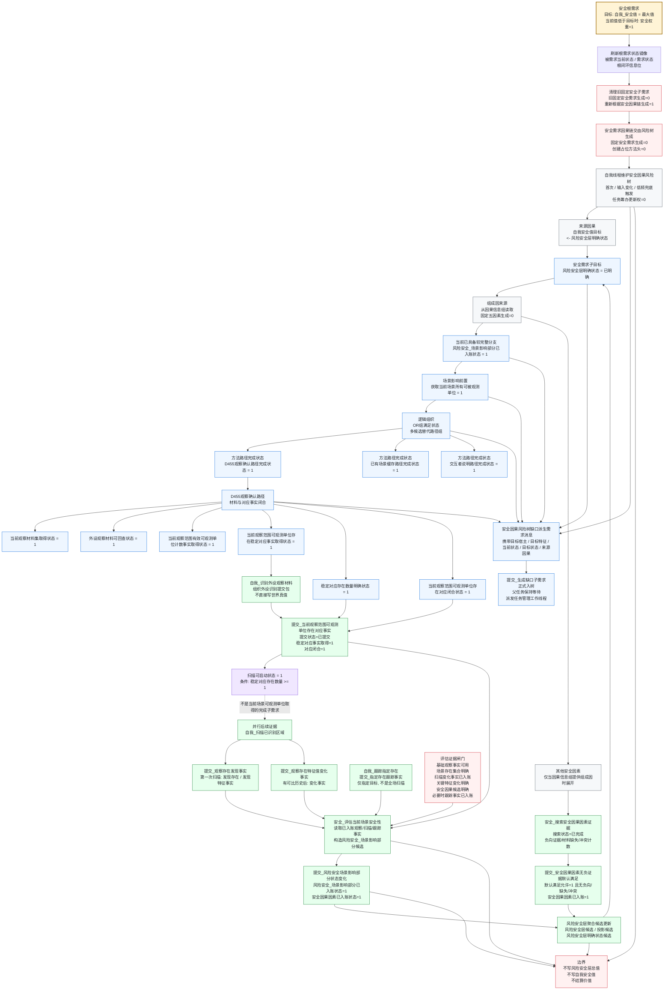

# 当前代码状态：较完整安全需求树 v0.1

更新时间：2026-06-05

## 口径

本图画的是“当前代码可生成 / 维护 / 承接的安全需求树结构”，不是声明当前真实运行中每个节点都已自然完成。

当前代码的安全需求树已经从旧的固定安全字段，改为：

```text
安全根需求
-> 安全因果风险树维护
-> 按世界树因果模板反推组成因
-> 生成缺口派生需求消息
-> 提交_生成缺口子需求
-> 正式需求入树和任务化
```

## 总图



## 当前较完整的安全需求树形态

```text
安全根需求
└── 自我_安全值 = 最大值
    └── 安全因果风险树
        └── 风险安全层明确状态 = 已明确
            └── 风险安全_场景影响部分已入账状态 = 1
                └── 获取当前场景所有可被观测单位 = 1
                    └── OR组满足状态
                        ├── D455观察确认路径完成状态 = 1
                        │   └── AND: 材料与对应事实闭合
                        │       ├── 当前观察材料集取得状态 = 1
                        │       ├── 外设观察材料可回查状态 = 1
                        │       ├── 当前观察范围有效可观测单位计数事实取得状态 = 1
                        │       ├── 当前观察范围可观测单位存在稳定对应事实取得状态 = 1
                        │       ├── 稳定对应存在数量明确状态 = 1
                        │       └── 当前观察范围可观测单位存在对应闭合状态 = 1
                        ├── 已有场景缓存路径完成状态 = 1
                        └── 交互者说明路径完成状态 = 1
```

## 运行承接链

| 层 | 当前代码口径 | 主要生产者 / 承接者 |
| --- | --- | --- |
| 安全根 | `自我_安全值` 低于目标时激活安全根权重。 | 自我线程刷新根需求状态镜像。 |
| 风险树 | 安全子需求不再由旧固定安全字段生成，交由安全因果风险树。 | `私有_维护安全因果风险树_线程侧`。 |
| 组成因 | 风险安全层组成因来自因果信息组，不从 C++ 固定五因素表生成。 | 初始因果模板 / 后天因果模板。 |
| 当前较完整分支 | 场景影响部分依赖当前场景可观测单位取得。 | `data/initial_causal_templates.tsv`。 |
| D455路径 | D455路径需要材料与对应事实闭合。 | 外设材料包、自我识别组织方法、对应事实提交入口。 |
| 后续安全证据 | 扫描、跟踪提供安全评估证据，但不是“当前场景可观测单位取得”的完成子需求。 | `提交_观察存在发现事实`、`提交_观察存在特征值变化事实`、`提交_指定存在跟踪事实`。 |
| 场景影响入账 | 安全评估只产出候选，提交入口裁决后才写场景影响部分入账。 | `安全_评估当前场景安全性`、`提交_风险安全场景影响部分状态变化`。 |
| 核心值 | 风险树、评估、提交都不得直接写自我安全值。 | 后续结算方法按证据裁决。 |

## 不能误画成已完成的部分

```text
1. 任务筹办不再展开固定风险树因素。
2. 自我线程不再生成固定 D455 / 缓存 / 交互说明 OR 子需求表。
3. 风险安全层不再由 C++ 固定五因素表生成。
4. D455材料、像素簇、报告、材料页、句柄都不是安全值证据本体。
5. 扫描 / 跟踪不是当前场景可观测单位取得的完成子需求，只是后续安全评估证据来源。
6. 安全评估只生成候选视图，不直接写风险安全层总值或自我安全值。
7. 缺自然日志样本时，只能说代码链路具备，不能说真实安全需求树已闭合。
```

## 代码锚点

```text
自我线程模块.impl.cpp
    私有_刷新根特征必要条件子需求_线程侧
    私有_确保安全因果风险树初始模板_线程侧
    私有_维护安全因果风险树_线程侧
    私有_收到派生需求消息时完善需求树
    自我线程/安全因果风险树缺口提交入树

任务模块.筹办.ixx
    筹办_展开安全因果风险树
        当前只记录跳过：任务筹办不再展开固定风险树因素。

需求类.cpp
    OR组满足状态
    方法路径完成状态
    构造获取途径逻辑组织需求更新指令

自我动作实现.外设模块.ixx
    提交_当前观察范围可观测单位存在对应事实
    提交_观察存在发现事实
    提交_观察存在特征值变化事实
    提交_指定存在跟踪事实
    安全_评估当前场景安全性
    提交_风险安全场景影响部分状态变化
    安全_搜索安全因果因素证据
    提交_安全因果因素无负证据默认满足

data/initial_causal_templates.tsv
    风险安全层明确依赖场景影响入账
    场景影响依赖当前场景可观测单位取得
    D455 / 缓存 / 交互说明三条取得路径
    D455观察确认路径材料与对应事实闭合
```
