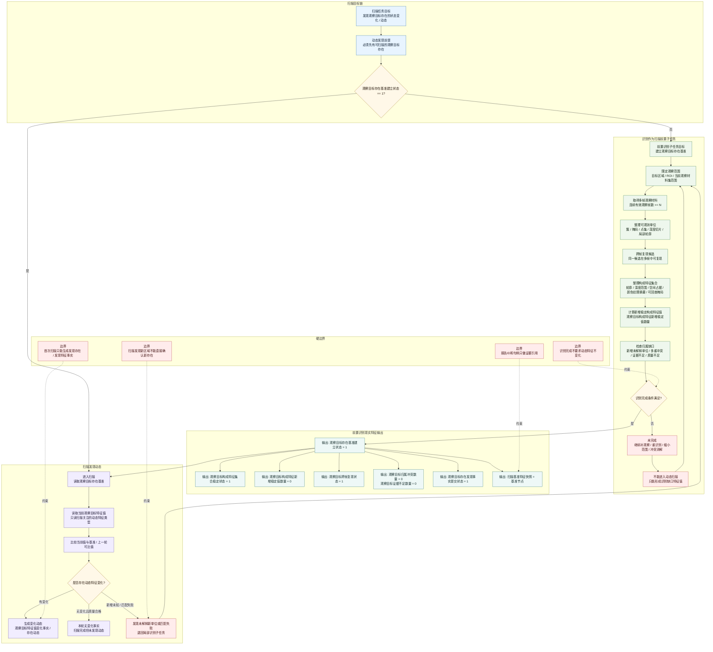

# 扫描前置识别多帧基准流程图 v0.1

更新时间：2026-06-05

## 用途

本图按照新的任务目标口径整理：

```text
扫描任务的目标是发现动态。
发现动态需要先有可扫描的观察目标存在。
因此，在扫描任务目标链内，识别是扫描的前置子任务。
```

这里的“识别”不再只表示单帧逐簇报告承接，而是：

```text
多帧观察后，观察目标存在的构成特征集合已经收敛，
不再产生新的稳定构成特征值，
并且没有归属冲突、证据不足或新增未解释可观测单位。
```

边界：

- 外设对外仍可按区域并行输出识别包、扫描包和跟踪包；本图只描述扫描目标链中的局部前置关系。
- `不再产生新的特征值` 只限定在“观察目标存在的构成特征集合”，不得扩展为目标位置、距离、姿态、遮挡、丢失等动态特征不变化。
- 自我现实层任务 / 方法的输入输出只能是现实特征类型和特征值；报告ID、帧ID、材料页、`d455://` 句柄、样本卡和日志只作为证据引用。

依据：

- `规范/规范目录.md`
- `规范/观察像素簇与存在候选分层规范20260527.md`
- `规范/当前场景特征值明确标准规范20260602.md`
- `规范/双目相机外设独占观察线程规范20260527.md`
- `规范/双目相机外设功能能力与实现途径总结20260527.md`

## 流程图



## 现实层特征口径

### 目标链

| 层级 | 目标宿主 | 目标特征类型 | 目标特征值 | 说明 |
| --- | --- | --- | --- | --- |
| 扫描任务主目标 | 当前观察目标存在 / 已识别区域 | 观察目标动态发现状态 | `已明确` 或 `已完成` | 目标是让动态是否存在变得明确；有动态则生成变化动态，无动态则生成本轮无变化事实。 |
| 前置识别子目标 | 当前观察目标候选 | 观察目标存在基准建立状态 | `1` | 扫描前必须先建立可扫描的观察目标存在基准。 |
| 扫描启动条件 | 当前观察目标候选 | 观察目标扫描可启动状态 | `1` | 由存在基准建立、构成特征稳定、跨帧复现和缺口归零共同派生。 |

### 前置识别输入特征类型和值

| 输入阶段 | 目标宿主 | 输入特征类型 | 需要的特征值 |
| --- | --- | --- | --- |
| 多帧材料 | 当前观察材料集 | 连续有效观察帧数 | `>= N`，`N` 是方法参数或配置阈值。 |
| 材料质量 | 当前观察材料集 | 当前观察材料质量合格状态 | `1` |
| 材料回查 | 当前观察材料集 | 外设观察材料可回查状态 | `1` |
| 观察范围 | 当前观察材料集 / ROI | 观察范围明确状态 | `1` |
| 候选单位 | 当前观察材料集 | 有效可观测单位数量 | `> 0` |
| 候选复现 | 当前观察目标候选 | 观察目标跨帧复现状态 | 初始可为 `0`，识别过程中目标值为 `1` |

### 前置识别输出特征类型和值

| 输出特征类型 | 特征值类型 / 值域 | 完成值 | 未完成值 | 用途 |
| --- | --- | --- | --- | --- |
| 观察目标存在基准建立状态 | I64，`0/1` | `1` | `0` | 前置识别子任务主目标。 |
| 观察目标构成特征集合稳定状态 | I64，`0/1` | `1` | `0` | 表示构成目标存在的特征集合已收敛。 |
| 观察目标构成特征新增稳定值数量 | I64，`>= 0` | `0` | `> 0` | `0` 表示多帧后不再出现新的稳定构成特征值。 |
| 观察目标跨帧复现状态 | I64，`0/1` | `1` | `0` | 表示同一目标候选能跨帧稳定复现。 |
| 观察目标归属冲突数量 | I64，`>= 0` | `0` | `> 0` | 大于 `0` 时不能闭合识别。 |
| 观察目标证据不足数量 | I64，`>= 0` | `0` | `> 0` | 大于 `0` 时需要补观察或缩小范围。 |
| 新增未解释可观测单位数量 | I64，`>= 0` | `0` | `> 0` | 大于 `0` 时说明还有未纳入基准的构成材料。 |
| 观察目标存在发现事实提交状态 | I64 枚举 | `1` | `0/2/3` | 前置识别完成后提交发现事实；值域按提交状态枚举收束。 |
| 扫描基准特征快照 | 指针 / 引用型特征值 | 非空 | 空 | 扫描比较的基准，不是日志或说明字段。 |
| 观察目标扫描可启动状态 | I64，`0/1` | `1` | `0` | 扫描任务读取这个状态进入动态比较。 |

### 构成特征与动态特征的分离

| 特征组 | 例子 | 是否用于“识别完成” |
| --- | --- | --- |
| 构成特征 | 轮廓稳定特征、深度范围、空间占据范围、颜色 / 纹理摘要、可回查掩码、可观测单位归属 | 是，用于判断基准是否建立。 |
| 动态特征 | 位置变化、距离变化、姿态变化、速度趋势、遮挡、丢失、接近 / 远离 | 否，这些属于扫描或跟踪要发现的变化。 |
| 证据引用 | 报告ID、帧ID、材料页ID、`d455://` 句柄、样本卡、日志 | 否，只作为来源链和审计材料。 |

## 完成公式

```text
识别前置子任务完成 =
    连续有效观察帧数 >= N
    AND 当前观察材料质量合格状态 == 1
    AND 外设观察材料可回查状态 == 1
    AND 观察范围明确状态 == 1
    AND 有效可观测单位数量 > 0
    AND 观察目标构成特征集合稳定状态 == 1
    AND 观察目标构成特征新增稳定值数量 == 0
    AND 观察目标跨帧复现状态 == 1
    AND 观察目标归属冲突数量 == 0
    AND 观察目标证据不足数量 == 0
    AND 新增未解释可观测单位数量 == 0
    AND 观察目标存在发现事实提交状态 == 1
    AND 扫描基准特征快照 非空
    AND 观察目标存在基准建立状态 == 1
```

```text
扫描可启动 =
    观察目标存在基准建立状态 == 1
    AND 观察目标扫描可启动状态 == 1
    AND 扫描基准特征快照 非空
```

```text
动态发现 =
    扫描读取的当前动态特征值
    与 扫描基准特征快照 / 上一轮可比特征值
    在同一目标宿主、同一动态特征类型下形成可提交变化事实或存在动态
```

## 本图结论

1. 识别在扫描任务目标链中是前置子任务，作用是建立观察目标存在基准。
2. 识别完成依据不是“所有特征不变化”，而是“构成观察目标存在的特征集合不再新增稳定特征值”。
3. 动态特征变化不参与识别完成判断；它们是扫描和跟踪要发现的对象。
4. 扫描发现新区域、匹配失败或未解释变化时，只能退回局部识别，不能直接确认新存在。
5. 外设报告、材料页和句柄只供证据引用；现实层任务和方法的输入输出必须落在特征类型和特征值上。
