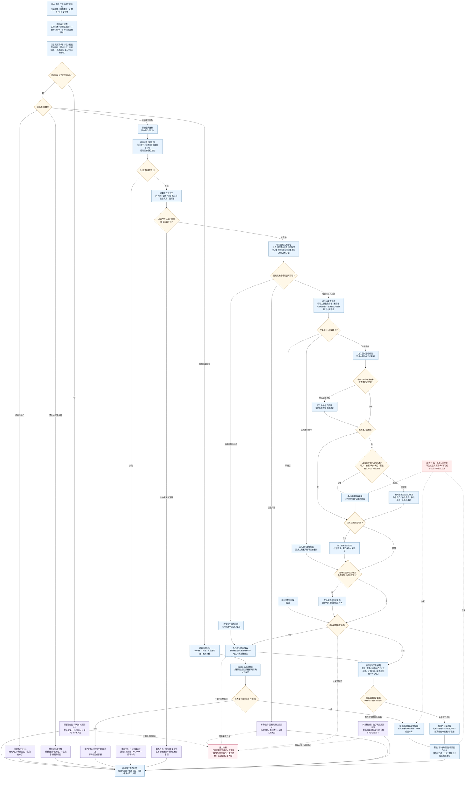

# 找下一步可选步骤目标语义因果视图读取逻辑图 v0.1

更新时间：2026-06-05

## 用途

本图是 `任务筹办普通函数状态机流程图 v0.2` 中：

```text
找下一步可选步骤
读取目标语义和因果视图
```

的细分判断图。

本图只负责读取来源需求目标语义、构造目标比较、读取世界树因果信息并生成本轮临时因果视图。它不直接创建需求、不直接写任务状态、不选择最终路径、不调用方法执行。

## 判断原则

```text
1. 先读目标语义，再读因果视图；不得用叶子 / 非叶子、控制面板摘要或临时推断代替目标语义。
2. 缺目标宿主、目标特征、目标比较关系或目标值时，不得生成临时因果视图。
3. 临时因果视图不是需求树、因果树、安全树、服务树，也不是方法候选集合的替代物。
4. 因果来源只能来自世界树因果主信息、遗传因果、需求侧条件、方法条件、动作动态证据链和已入树子需求。
5. 找到促成 / 避免 / 条件补齐 / 方法就绪 / 证据补齐 / 副作用约束 / 学习缺口后，只形成候选步骤视图。
6. 候选步骤视图必须带来源因果、目标比较、证据引用、生成类型、获取途径建议和幂等键，后续再交给归类、过滤、目标化和提交裁决。
7. 没有因果路径不是执行失败，先形成学习缺口候选；若因果数据结构损坏，才进入逻辑错误。
```

## 详细逻辑图



## 输出分类

| 分类 | 判定条件 | 下一步 |
| --- | --- | --- |
| 下一步候选步骤视图已生成 | 目标比较合法，因果视图已生成，候选项可目标化 | 进入候选归类、过滤、目标化和提交裁决 |
| 组织展开候选步骤视图 | 目标是 AND / OR / 方法路径组 / 因果子链，且能形成组织展开种子 | 生成组织子路径草案材料，后续提交裁决 |
| 学习缺口候选 | 无可命中因果路径，或路径来源不足但不是结构错误 | 进入学习缺口候选，后续目标化和提交裁决 |
| 目标不可解析 | 缺目标宿主、目标特征、比较关系或目标值 | 进入不可解析来源分类 |
| 目标比较非法 | 比较关系非法、值域冲突、I64_MAX 进入真实目标 | 逻辑错误或维护回执 |
| 重复或环路 | 祖先链或已有路径已覆盖本轮目标 | 复用已有路径或等待已有子路径 |
| 因果来源异常 | 世界树因果、遗传因果或证据链结构损坏 | 逻辑错误中止或诊断等待 |
| 候选不可目标化 | 候选仍是抽象口号，如只写“避免”而无明确特征比较 | 进入缺口草案来源分类 |

## 接入建议

```text
1. 在 v0.2 的 `PATH_START` 位置调用本判断。
2. `STEP_VIEW_READY` 后再进入 `PATH_VIEW / PATH_CLASSIFY / PATH_FILTER / PATH_TRANSLATE`。
3. 本图生成的是临时因果视图和候选步骤视图，不是正式需求节点。
4. 方法模板完整时只生成方法候选依据，不直接指定唯一执行方法。
5. 方法模板不完整时生成方法就绪缺口候选，后续仍需提交入口裁决。
6. 避免类和副作用类候选必须收束成明确目标特征比较，不能只保留抽象词。
7. 空视图默认转为学习缺口候选；只有因果来源结构损坏才走逻辑错误。
```
