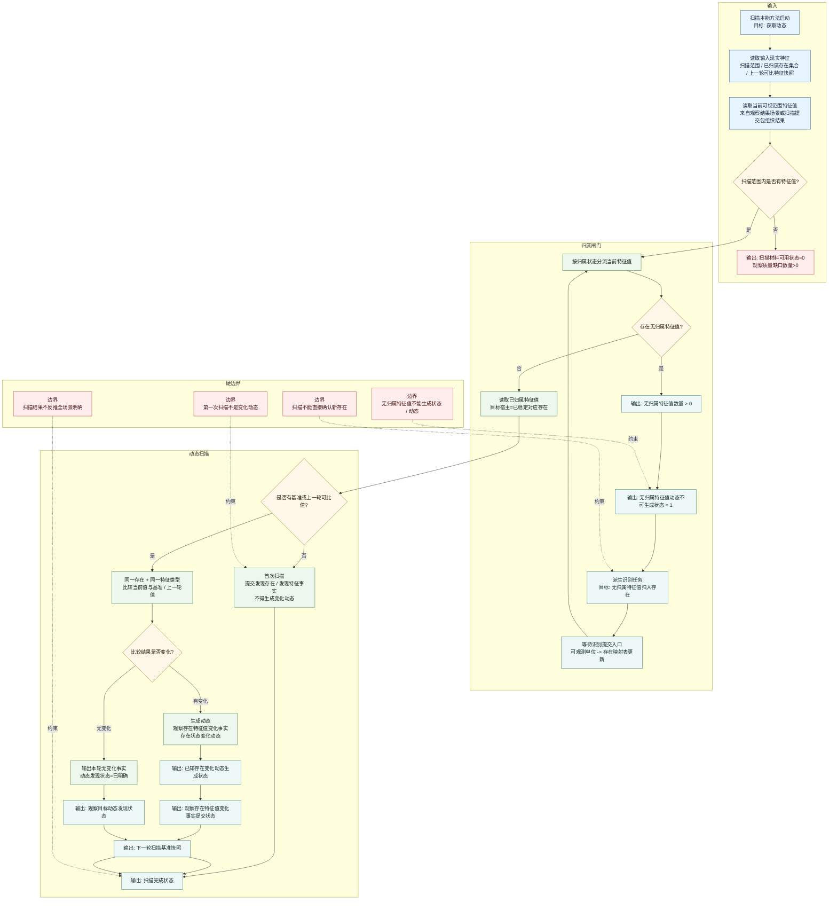

# 本能方法：扫描内部实现逻辑流程图 v0.1

更新时间：2026-06-05

## 用途

本图描述自我侧“扫描”本能方法的内部实现逻辑。对于自我来说，扫描的目标是获取动态。

扫描的关键派生需求之一是：

```text
可视范围内没有无归属的特征值。
```

原因：

```text
如果某个特征值没有归属到存在，
当这个特征值发生变化时，自我无法生成状态或动态，
因为没有可比较的目标宿主。
```

因此扫描遇到无归属特征值时，必须派生识别任务；识别任务的目标是把该特征值归入存在。

## 流程图



## 现实层特征口径

| 位置 | 目标宿主 | 特征类型 | 特征值 |
| --- | --- | --- | --- |
| 输入 | 当前扫描范围 | 扫描范围明确状态 | `1` |
| 输入 | 当前扫描范围 | 已归属可扫描存在数量 | `>0` |
| 输入 | 当前扫描范围 | 可视范围特征归属分区状态 | `1` |
| 输入 | 当前扫描范围 / 已归属存在 | 上一轮可比特征快照 | 非空时可生成变化动态 |
| 闸门 | 当前扫描范围 | 无归属特征值数量 | `0` 才允许全部进入动态比较 |
| 输出 | 当前扫描范围 | 无归属特征值动态不可生成状态 | `1` 表示必须先识别 |
| 输出 | 当前扫描范围 | 无归属特征值归入存在需求派生状态 | `1/0` |
| 输出 | 当前扫描范围 / 已归属存在 | 观察目标动态发现状态 | `已明确 / 未明确` |
| 输出 | 已归属存在 | 已知存在变化动态生成状态 | `1/0` |
| 输出 | 已归属存在 | 观察存在特征值变化事实提交状态 | `1/0/2/3` |
| 输出 | 当前扫描范围 | 下一轮扫描基准快照 | 指针 / 引用型特征值 |

## 完成公式

```text
扫描动态取得可完成 =
    扫描范围明确状态 == 1
    AND 已归属可扫描存在数量 > 0
    AND 可视范围特征归属分区状态 == 1
    AND 无归属特征值数量 == 0
    AND 当前特征值与目标宿主绑定
    AND 当前特征值与基准 / 上一轮值可比较
```

```text
发现无归属特征值 =
    无归属特征值数量 > 0
    -> 无归属特征值动态不可生成状态 = 1
    -> 派生识别任务
    -> 识别任务目标: 无归属特征值归入存在
```

## 结论

扫描不是为了“看见东西”，而是为了让已归属存在的特征值变化能够生成状态和动态。无归属特征值没有比较对象，不能进入动态生成链，只能先派生识别任务归入存在。
