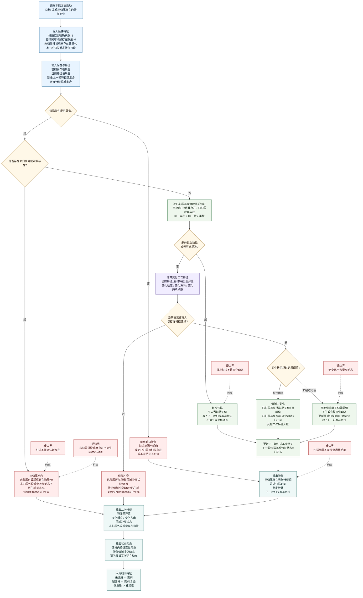

# 本能方法：扫描内部实现逻辑流程图 v0.2

更新时间：2026-06-05

## 定位

```text
扫描记变化。

扫描只处理已归属、已有比较对象的存在；
扫描发现已归属存在的特征值变化；
未归属外设观察存在和超值域特征不能进入正常动态生成链。
```

正式输入输出只能承接：

```text
存在
特征
二次特征
状态动态
```

## 流程图



## 条件与结果

| 类别 | 宿主 | 特征类型 | 目标/结果特征值 |
| --- | --- | --- | --- |
| 条件 | 当前扫描范围 | 扫描范围明确状态 | `1` |
| 条件 | 当前扫描范围 | 已归属可扫描存在数量 | `>0` |
| 条件 | 当前扫描范围 | 未归属外设观察存在数量 | `0` |
| 条件 | 已归属存在 | 上一轮扫描基准特征可读状态 | `1`，首次扫描除外 |
| 条件 | 已归属存在 | 存在特征值域可读状态 | `1` |
| 结果特征 | 已归属存在 | 当前特征值 | 当前观测值 |
| 结果特征 | 已归属存在 | 下一轮扫描基准特征状态 | `已更新` |
| 二次特征 | 已归属存在.当前特征_基准特征 | 特征差异值 / 变化幅度 / 变化方向 | 值域内可入账 |
| 二次特征 | 已归属存在 | 特征值域冲突状态 | `存在 / 不存在` |
| 状态动态 | 已归属存在 | 特征变化动态 | 值域内变化超过阈值时生成 |
| 状态动态 | 已归属存在 | 特征值域冲突动态 | 超值域时生成 |

## 扫描完成公式

```text
扫描动态可取得 =
    扫描范围明确状态 == 1
    AND 已归属可扫描存在数量 > 0
    AND 未归属外设观察存在数量 == 0
    AND 当前特征值与目标宿主绑定
    AND 当前特征值与基准/上一轮值可比较
    AND 当前特征值落入该存在特征值域
```

```text
值域内变化 =
    当前特征值落入该存在特征值域
    AND 当前特征_基准特征.差异值 > 最小记录阈值
        -> 已归属存在.特征变化动态 == 已生成
```

```text
超值域 =
    当前特征值不在该存在特征值域内
        -> 已归属存在.特征值域冲突状态 == 存在
        -> 回识别 / 复验
```

一句话：

```text
扫描解决“我的已归属存在有没有变”。
```
