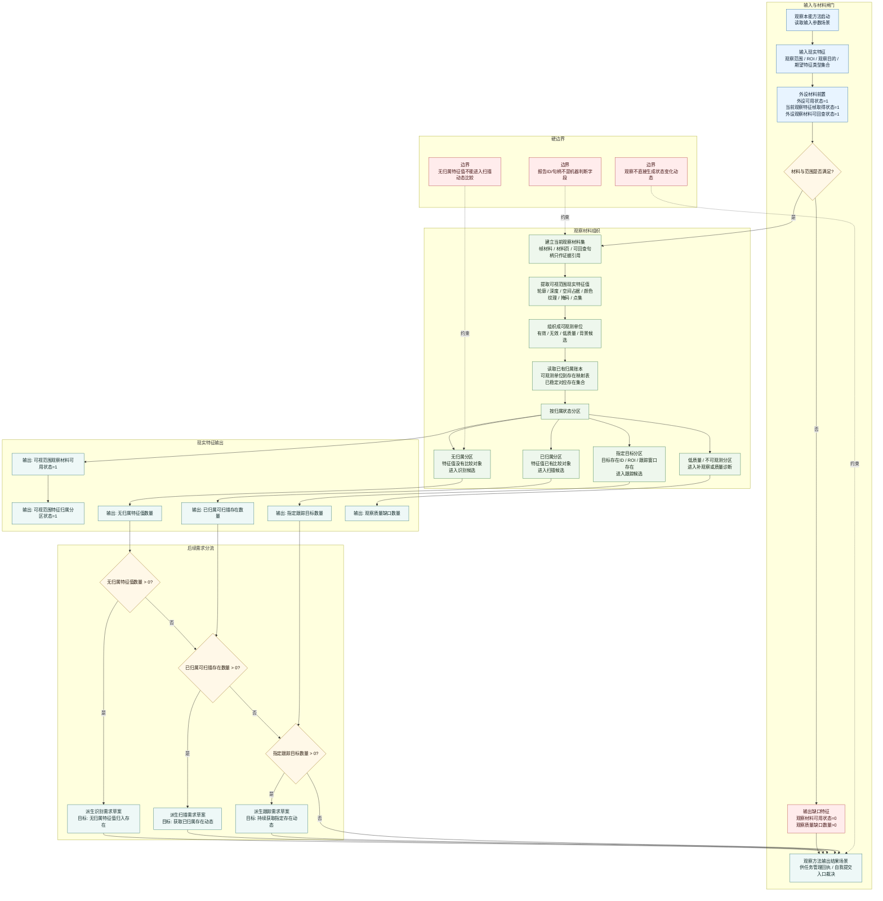

# 本能方法：观察内部实现逻辑流程图 v0.1

更新时间：2026-06-05

## 用途

本图描述自我侧“观察”本能方法的内部实现逻辑。这里的观察不是相机内部采集算法，而是自我把外设提供的当前可视范围材料组织成现实特征值分区，并决定后续进入扫描、识别或跟踪。

观察方法的目标：

```text
取得当前可视范围内的观察材料，
把可视范围内的特征值按归属状态分区，
为扫描获取动态、识别归入存在、跟踪指定存在提供现实特征输入。
```

## 流程图



## 现实层特征口径

| 位置 | 目标宿主 | 特征类型 | 特征值 |
| --- | --- | --- | --- |
| 输入 | 当前外设 / 当前观察材料集 | 外设可用状态 | `1` |
| 输入 | 当前观察材料集 | 当前观察特征帧取得状态 | `1` |
| 输入 | 当前观察材料集 | 外设观察材料可回查状态 | `1` |
| 输入 | 当前观察材料集 / ROI | 观察范围明确状态 | `1` |
| 输出 | 当前可视范围 | 可视范围观察材料可用状态 | `1/0` |
| 输出 | 当前可视范围 | 可视范围特征归属分区状态 | `1/0` |
| 输出 | 当前可视范围 | 已归属可扫描存在数量 | `>=0` |
| 输出 | 当前可视范围 | 无归属特征值数量 | `>=0` |
| 输出 | 当前可视范围 | 指定跟踪目标数量 | `>=0` |
| 输出 | 当前可视范围 | 观察质量缺口数量 | `>=0` |

## 结论

观察方法的核心不是直接判断安全、服务或动态，而是把可视范围内的特征值组织成“已归属 / 无归属 / 指定跟踪 / 低质量”四类现实特征分区。后续扫描、识别和跟踪都读取这些特征值分区，不读取报告说明文本。
