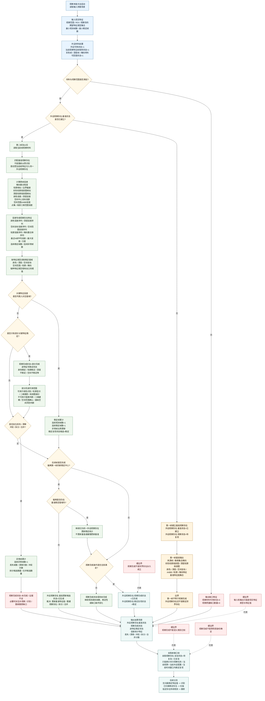

# 本能方法：观察内部实现逻辑流程图 v0.2

更新时间：2026-06-05

## 用途

本图按“多帧稳定复现”口径修正观察本能方法。观察不再把第一帧发现一个存在当作完成，而是把第一帧作为基准建立，后续多帧围绕同一个外设观察存在持续比较关键特征值是否稳定复现。

规范句：

```text
观察是多帧稳定复现过程。

第一帧根据像素集合、掩码、彩色轮廓局部图、深度轮廓局部图和稳定特征生成外设观察存在基准。
后续帧不重新从零识别，而是与该观察存在的基准特征比较。
每一帧都记录颜色、深度、空间、轮廓、掩码等特征误差。
当连续多帧中关键特征误差均落入对应特征值域，且丢失、漂移、拆分、合并、冲突均低于阈值时，才能判定该外设观察存在的观察完成状态 == 已完成。
```

一句话：

```text
看见第一帧只是立靶，多帧误差稳定才叫观察完成。
```

## 流程图



## 第一帧基准输出

| 宿主 | 特征类型 | 特征值 / 内容 | 用途 |
| --- | --- | --- | --- |
| 外设观察存在 | 来源帧 | 第一帧帧号 / 时间戳 / 外设配置 | 标记基准来自哪一次现实观察材料。 |
| 外设观察存在 | 像素集合掩码 | 目标像素集合 / 掩码区域 | 作为后续掩码重合率比较对象。 |
| 外设观察存在 | 彩色轮廓局部图 | 彩色局部图 / 轮廓裁剪图 | 作为颜色和轮廓复现比较对象。 |
| 外设观察存在 | 深度轮廓局部图 | 深度局部图 / 深度轮廓裁剪图 | 作为深度轮廓和局部三维范围比较对象。 |
| 外设观察存在 | 颜色特征 | 主颜色 / 均值 / 方差 / 局部纹理 | 作为颜色稳定值域判断依据。 |
| 外设观察存在 | 深度特征 | 深度中位数 / 深度方差 / 深度有效率 | 作为深度稳定值域判断依据。 |
| 外设观察存在 | 空间坐标特征 | 中心点 / 局部坐标 / 空间连续性 | 作为位置复现判断依据。 |
| 外设观察存在 | 空间范围AABB | 三维或二维包围范围 | 作为范围变化判断依据。 |
| 外设观察存在 | 轮廓特征 | 边界 / 面积 / 形状摘要 | 作为轮廓偏差判断依据。 |
| 外设观察存在 | 掩码特征 | 掩码面积 / 连通区域 / 未重合像素比例 | 作为掩码复现判断依据。 |
| 外设观察存在 | 基准特征值集合 | 上述关键特征的基准值集合 | 后续帧不从零识别，而是与该集合比较。 |
| 外设观察存在 | 基准状态 | `已建立` | 只表示基准已建立，不表示观察完成。 |
| 外设观察存在 | 观察状态 | `待复现` | 表示需要后续多帧复现。 |

## 多帧比较特征类型和值域

| 特征类型 | 误差 / 稳定特征 | 三比较表达 | 说明 |
| --- | --- | --- | --- |
| 颜色特征 | 颜色均值误差 / 主颜色一致度 / 颜色方差 | `颜色特征误差 < 最大允许颜色误差` | 允许光照小幅变化，不要求完全相等。 |
| 深度特征 | 深度中位数误差 / 深度方差 / 深度有效率 | `深度中位数误差 < 最大允许深度误差` | 深度有效率不足时即使颜色稳定也不能确认空间距离。 |
| 空间坐标特征 | 中心坐标误差 / 空间连续性 | `空间中心坐标误差 < 最大允许坐标误差` | 用于判断同一观察存在是否仍处在可解释位置。 |
| 空间范围AABB | AABB范围变化 / 局部三维范围误差 | `空间范围变化值 < 最大允许范围变化` | 范围突变可能意味着拆分、合并、遮挡或漂移。 |
| 轮廓特征 | 边界偏差 / 轮廓重合率 / 轮廓面积变化 | `轮廓边界偏差 < 最大允许轮廓偏差` | 轮廓稳定可支撑显示、细分和二维跟踪。 |
| 掩码特征 | 掩码重合率 / 掩码面积变化 / 未重合像素比例 | `掩码重合率 > 最低掩码重合率` | 掩码是跨帧归属和局部图复现的重要依据。 |
| 帧序列稳定性 | 连续稳定帧数 / 异常帧比例 | `连续稳定帧数 > 最小稳定帧数`；`异常帧比例 < 最大允许异常比例` | 观察完成必须来自序列统计，不来自单帧判断。 |

## 误差特征落账

误差不只是日志，应作为外设观察存在的稳定性特征。可保存完整序列，也可保存最近 N 帧摘要。

| 宿主 | 特征类型 | 特征值 |
| --- | --- | --- |
| 外设观察存在 | 颜色误差序列 | 最近 N 帧颜色误差集合 |
| 外设观察存在 | 深度误差序列 | 最近 N 帧深度误差集合 |
| 外设观察存在 | 空间坐标误差序列 | 最近 N 帧中心坐标误差集合 |
| 外设观察存在 | 空间范围误差序列 | 最近 N 帧 AABB / 局部三维范围变化集合 |
| 外设观察存在 | 轮廓误差序列 | 最近 N 帧边界偏差 / 轮廓重合统计 |
| 外设观察存在 | 掩码重合率序列 | 最近 N 帧掩码重合率集合 |
| 外设观察存在 | 平均误差 | 最近 N 帧或全窗口关键误差均值 |
| 外设观察存在 | 最大误差 | 观察窗口内关键误差最大值 |
| 外设观察存在 | 误差方差 | 观察窗口内关键误差方差 |
| 外设观察存在 | 连续稳定帧数 | 连续满足稳定值域的帧数 |
| 外设观察存在 | 连续异常帧数 | 连续超限或丢失的帧数 |
| 外设观察存在 | 稳定复现状态 | `待复现 / 候选稳定 / 稳定 / 不稳定` |

## 观察完成标准

外设观察存在.观察完成状态 == `已完成` 当且仅当：

```text
外设观察存在.基准状态 == 已建立
外设观察存在.连续观测帧数 > 最小观测帧数
外设观察存在.连续稳定帧数 > 最小稳定帧数
外设观察存在.关键特征有效比例 > 最低关键特征有效比例
外设观察存在.关键特征误差超限次数 < 最大允许超限次数
外设观察存在.掩码重合率 > 最低掩码重合率
外设观察存在.轮廓偏差 < 最大允许轮廓偏差
外设观察存在.空间范围变化值 < 最大允许范围变化
外设观察存在.丢失帧数 < 最大允许丢失帧数
外设观察存在.漂移次数 < 最大允许漂移次数
外设观察存在.冲突次数 < 最大允许冲突次数
外设观察存在.拆分候选数量 == 0
外设观察存在.合并候选数量 == 0
```

压缩成一句：

```text
多帧内，关键特征持续有效，误差持续在值域内，且没有丢失、漂移、冲突、拆分、合并。
```

## 部分完成与基准更新

| 情况 | 状态写入 | 后续处理 |
| --- | --- | --- |
| 部分特征稳定，部分特征不稳定 | `观察完成状态 == 部分完成`；逐特征写 `稳定 / 不稳定` | 稳定特征可被有限使用，不稳定特征不得支撑对应判断。 |
| 偏离第一帧但仍在基准值域内 | 继续归为同一外设观察存在；更新误差统计 | 不更新基准或缓慢更新基准。 |
| 偏离第一帧且后续形成新稳定中心 | `基准更新候选状态 == 已生成` | 裁决是否更新基准特征值、重建观察存在、拆分或合并。 |
| 丢失、漂移、冲突、拆分、合并超过阈值 | `观察完成状态 == 未完成 / 证据不足` | 派生补观察、识别或重新跟踪缺口。 |

## 边界

| 已完成能说明 | 不能说明 |
| --- | --- |
| 在本次观察任务内稳定复现 | 世界存在永久成立 |
| 在当前视野内稳定复现 | 语义类别已知 |
| 在当前外设配置内稳定复现 | 跨场景身份确定 |
| 在当前时间窗口内稳定复现 | 永远不会变化 |
| 可提交给自我承接复验 | 已完成多源验证或动作因果验证 |

观察完成后的承接：

```text
外设观察存在.观察完成状态 == 已完成
    -> 自我观察存在.复验状态 == 待复验 / 已复验
    -> 后续多次观察 / 多源验证 / 动作因果验证
    -> 才可能归并为世界存在
```

## 与识别、扫描、跟踪的关系

```text
观察:
    建立并复现外设观察存在，输出现实特征类型和特征值。

识别:
    接收无归属但稳定复现的特征值，把特征值归入存在。

扫描:
    接收已归属且有比较对象的存在，比较前后特征值以发现动态。

跟踪:
    持续专注某一个指定存在，在局部窗口内连续获得动态信息。
```

因此，观察是扫描和跟踪的现实材料基础，但观察完成本身不直接等于动态发现、安全判断、服务判断或世界存在确认。
