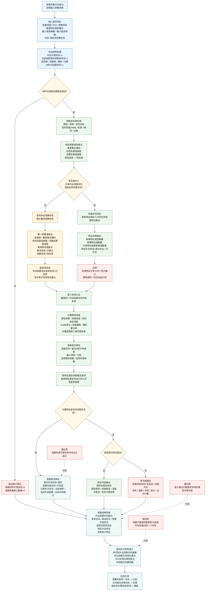

# 本能方法：观察内部实现逻辑流程图 v0.3

更新时间：2026-06-05

## 用途

本图在 v0.2 的多帧稳定复现口径上，补充观察与识别的职责边界。

观察的目标不是直接判断“是不是自我所在场景中的同一个存在”，而是：

```text
根据外设取得的现实特征值发现外设观察存在；
或者根据新取得的现实特征值完善已经存在的外设观察存在 / 待复验存在的特征集合。
```

识别的目标另行处理：

```text
用自我所在场景中的存在特征，
与外设观察存在的特征信息比较，
判断是否为同一个存在。
```

因此：

```text
观察 = 发现存在或完善存在特征。
识别 = 判断外设观察存在是否与自我所在场景中的某个存在相同。
```

## 流程图



## 观察输出的现实特征口径

| 宿主 | 特征类型 | 特征值 | 说明 |
| --- | --- | --- | --- |
| 外设观察存在 | 外设观察存在发现状态 | `已发现 / 未发现` | 表示外设特征已经组织出一个观察层面的存在。 |
| 外设观察存在 | 基准状态 | `未建立 / 已建立` | 第一帧只建立基准，不代表观察完成。 |
| 外设观察存在 | 观察完成状态 | `未完成 / 部分完成 / 已完成 / 证据不足` | 来自多帧稳定复现判断。 |
| 外设观察存在 | 特征补全状态 | `未补全 / 部分补全 / 已补全` | 表示本次观察是否完善了已有存在的特征集合。 |
| 外设观察存在 | 新增特征类型数量 | `>= 0` | 本次观察补入的新特征类型数量。 |
| 外设观察存在 | 新增特征值数量 | `>= 0` | 本次观察补入的新现实特征值数量。 |
| 外设观察存在 | 可比较特征类型集合 | 颜色 / 深度 / 空间 / 轮廓 / 掩码 / 点集等集合 | 供识别比较使用。 |
| 外设观察存在 | 多帧稳定证据帧数 | `>= 0` | 供识别判断是否证据足够。 |
| 外设观察存在 | 误差统计特征 | 平均误差 / 最大误差 / 方差 / 连续稳定帧数 | 误差是稳定性特征，不只是日志。 |

## 与识别的边界

观察能回答：

```text
外设当前看到了哪些可稳定复现的特征？
这些特征是否可以组织成一个外设观察存在？
这些特征是否可以补充到某个已存在的观察特征集合？
```

观察不能直接回答：

```text
它是不是自我所在场景中已经登记的同一个存在？
它是不是世界存在永久成立？
它的语义类别是什么？
它是否已经具备跨场景身份？
```

需要同一性判断时，观察输出进入识别：

```text
外设观察存在特征集合
    + 自我所在场景存在特征集合
    + 同一性比较值域
    -> 识别任务
```

## 结论

观察是现实特征组织方法：它根据外设特征发现外设观察存在，或者完善一个存在的特征集合。识别才是同一性比较方法：它用自我所在场景中的存在特征和外设获取的特征信息比较，判断是否为同一个存在，并且也可能需要多帧才能完整识别。
