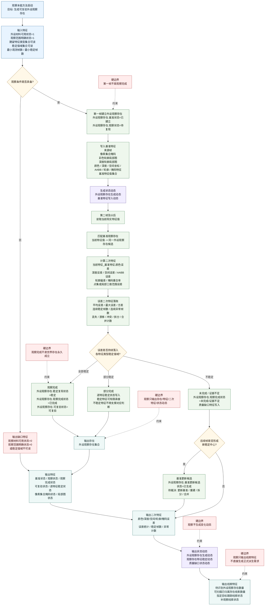

# 本能方法：观察内部实现逻辑流程图 v0.4

更新时间：2026-06-05

## 定位

```text
观察立存在。

观察生成外设观察存在：
    第一帧建立基准；
    后续多帧比较基准；
    误差落入各自特征值域后，形成可复验外设观察存在。
```

观察的正式输入和输出只能承接：

```text
存在
特征
二次特征
状态动态
```

线程通信层可以有传输容器，但观察方法的目标、结果、因果节点和需求目标不得承接传输容器。

## 流程图



## 条件与结果

| 类别 | 宿主 | 特征类型 | 目标/结果特征值 |
| --- | --- | --- | --- |
| 条件 | 当前外设材料 | 外设材料可用状态 | `1` |
| 条件 | 当前观察范围 | 观察范围明确状态 | `1` |
| 条件 | 观察方法参数 | 期望特征类型集合可读状态 | `1` |
| 条件 | 观察方法参数 | 稳定值域集合可读状态 | `1` |
| 条件 | 当前观察窗口 | 连续观测帧数 | `> 最小观测帧数` |
| 结果存在 | 当前观察窗口 | 外设观察存在集合状态 | `已生成 / 部分生成 / 未生成` |
| 结果特征 | 外设观察存在 | 基准状态 | `已建立` |
| 结果特征 | 外设观察存在 | 观察完成状态 | `已完成 / 部分完成 / 未完成 / 证据不足` |
| 结果特征 | 外设观察存在 | 可复验状态 | `可复验 / 待复验` |
| 结果二次特征 | 外设观察存在.当前特征_基准特征 | 误差统计特征 | 平均误差 / 最大误差 / 方差 / 稳定帧数 |
| 结果动态 | 外设观察存在 | 外设观察存在生成动态 | `已生成 / 未生成` |
| 结果动态 | 外设观察存在 | 特征稳定动态 | `已生成 / 未生成` |

## 去容器化边界

```text
观察正式输出 =
    外设观察存在
    + 外设观察存在的特征
    + 外设观察存在的误差二次特征
    + 外设观察存在生成/稳定/质量缺口状态动态

观察正式输出 != 线程传输容器
观察正式输出 != 世界存在确认
观察正式输出 != 变化动态
观察正式输出 != 正式派生需求
```

一句话：

```text
观察解决“有没有一个可复验的外设观察存在”。
```
