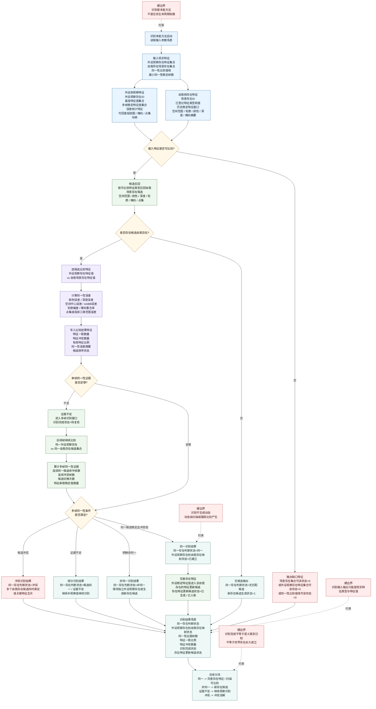

# 本能方法：识别内部实现逻辑流程图 v0.1

更新时间：2026-06-05

## 用途

本图把“识别”定义为自我现实层的本能方法，而不是任务流程本身。任务可以调用识别方法，但识别方法的内部目标是同一性比较：

```text
用自我所在场景中的存在特征，
与外设观察存在的特征信息比较，
判断二者是否为同一个存在。
```

识别和观察是两个不同本能方法：

```text
观察:
    根据外设特征发现外设观察存在，
    或完善外设观察存在 / 待复验存在的特征集合。

识别:
    比较自我所在场景存在特征与外设观察存在特征，
    判断是否为同一个存在。
```

识别也可能需要多帧才能完成：

```text
单帧比较只生成同一性候选；
多帧中同一性证据稳定，且冲突、漂移、拆分、合并低于阈值，
才生成识别完成结果。
```

## 流程图



## 输入现实特征

| 来源 | 宿主 | 特征类型 | 特征值 |
| --- | --- | --- | --- |
| 自我侧 | 自我所在场景 | 场景存在集合可读状态 | `1` |
| 自我侧 | 自我所在场景存在 | 已登记特征类型集合 | 颜色 / 深度 / 空间 / 轮廓 / 掩码 / 点集等集合 |
| 自我侧 | 自我所在场景存在 | 已登记特征值集合 | 各特征类型的当前值、稳定值或历史窗口摘要 |
| 自我侧 | 自我所在场景存在 | 历史稳定特征窗口可读状态 | `1/0` |
| 外设侧 | 外设观察存在 | 外设观察存在特征集合可读状态 | `1` |
| 外设侧 | 外设观察存在 | 基准特征值集合 | 第一帧基准特征值 |
| 外设侧 | 外设观察存在 | 多帧稳定特征值集合 | 多帧稳定复现后的特征值 |
| 外设侧 | 外设观察存在 | 误差统计特征 | 平均误差 / 最大误差 / 方差 / 连续稳定帧数 |
| 比较侧 | 同一性比较规则 | 同一性比较值域可读状态 | `1` |
| 比较侧 | 同一性比较规则 | 最小有效特征比例 | `> 0` |
| 比较侧 | 同一性比较规则 | 最小同一性稳定帧数 | `> 0` |

## 同一性比较特征和值域

| 特征类型 | 比较内容 | 通过条件 |
| --- | --- | --- |
| 颜色特征 | 主颜色一致度 / 均值误差 / 方差差异 | `颜色同一性误差 < 最大允许颜色同一性误差` |
| 深度特征 | 深度中位数误差 / 深度有效率 / 深度方差差异 | `深度同一性误差 < 最大允许深度同一性误差` |
| 空间坐标特征 | 中心坐标误差 / 空间连续性 | `空间中心同一性误差 < 最大允许空间同一性误差` |
| 空间范围AABB | 范围重合 / 尺寸差异 / 局部三维范围差异 | `空间范围同一性误差 < 最大允许范围同一性误差` |
| 轮廓特征 | 轮廓重合率 / 边界偏差 / 面积变化 | `轮廓同一性偏差 < 最大允许轮廓同一性偏差` |
| 掩码特征 | 掩码重合率 / 未重合像素比例 / 连通区变化 | `掩码同一性重合率 > 最低掩码同一性重合率` |
| 帧序列稳定性 | 同一候选连续命中帧数 / 候选切换次数 / 冲突帧比例 | `同一性证据帧数 > 最小同一性稳定帧数` 且 `候选切换次数 < 最大允许候选切换次数` |

## 输出结果特征

| 宿主 | 结果特征类型 | 特征值 |
| --- | --- | --- |
| 识别结果场景 | 同一存在判断状态 | `同一 / 非同一 / 候选同一 / 证据不足 / 冲突 / 无匹配候选` |
| 识别结果场景 | 外设观察存在到自我存在映射状态 | `未建立 / 候选 / 已建立 / 冲突` |
| 识别结果场景 | 外设观察存在ID | 外设观察存在引用 |
| 识别结果场景 | 自我场景存在ID | 自我所在场景存在引用；无匹配时为空 |
| 识别结果场景 | 同一性证据帧数 | `>= 0` |
| 识别结果场景 | 特征一致比例 | `0..1` |
| 识别结果场景 | 特征冲突数量 | `>= 0` |
| 识别结果场景 | 候选切换次数 | `>= 0` |
| 识别结果场景 | 识别完成状态 | `未完成 / 部分完成 / 已完成 / 证据不足 / 冲突` |
| 自我所在场景存在 | 存在特征更新候选状态 | `未生成 / 已生成 / 已入账 / 已拒绝` |
| 自我所在场景存在 | 新增可入账特征值数量 | `>= 0` |
| 自我所在场景 | 新存在候选生成状态 | `0/1` |

## 识别完成标准

```text
识别完成: 同一 =
    外设观察存在特征集合可读状态 == 1
    AND 自我所在场景存在集合可读状态 == 1
    AND 同一性比较值域可读状态 == 1
    AND 同一性证据帧数 > 最小同一性稳定帧数
    AND 特征一致比例 > 最低同一特征一致比例
    AND 特征冲突数量 <= 最大允许特征冲突数量
    AND 候选切换次数 <= 最大允许候选切换次数
    AND 外设观察存在到自我存在映射状态 == 已建立
    AND 同一存在判断状态 == 同一
```

```text
识别完成: 非同一 =
    有效候选存在数量 == 0
    OR 所有候选的特征一致比例 < 最低同一特征一致比例
    OR 关键必要特征冲突数量 > 最大允许关键冲突数量
```

证据不足或部分完成时：

```text
稳定的特征可以用于候选排序和局部特征补全；
不稳定或冲突的特征继续要求补观察、继续识别或冲突消解。
```

## 与观察、扫描、跟踪的边界

```text
观察:
    发现外设观察存在，或完善外设观察存在 / 待复验存在的特征集合。

识别:
    比较自我所在场景中的存在特征与外设观察存在特征，判断是否同一。

扫描:
    在已经有比较对象后，比较同一存在前后特征值以发现动态。

跟踪:
    在局部窗口持续专注一个指定存在，持续获得该存在的动态信息。
```

识别不能直接生成动态；动态必须由扫描或跟踪在同一存在的前后特征比较中生成。
