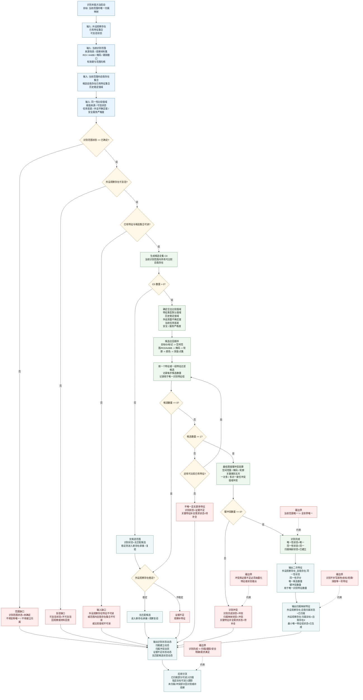

# 本能方法：识别内部实现逻辑流程图 v0.2

更新时间：2026-06-07

## 定位

本图按 `规范/识别本能方法唯一性收敛规范20260607.md` 更新。识别的核心目标不是把所有特征都比完，而是在当前识别范围内确定唯一存在，并建立外设观察存在到自我存在的归属映射。

```text
识别定归属。

识别 =
    用外设观察存在的已有特征值，
    在当前识别范围内的自我存在集合中筛选候选，
    当候选数量收敛为 1 且无硬冲突时，
    建立外设观察存在到自我存在的归属映射。
```

识别正式输出只能是：

```text
同一性二次特征
归属映射特征
识别状态动态
```

识别不输出：

```text
自我存在的一阶特征更新
被观察存在状态或变化动态
扫描结果
跟踪结果
安全 / 服务值结算
需求满足结论
```

## 流程图



## 条件与结果

| 类别 | 宿主 | 特征类型 | 目标/结果特征值 |
| --- | --- | --- | --- |
| 条件 | 识别范围 | 识别范围状态 | `已确定` |
| 条件 | 识别范围 | 识别范围来源句柄 | 来源场景 / 观察材料集 / ROI / AABB / 掩码 / 跟踪窗口 |
| 条件 | 外设观察存在 | 可复验状态 | `可复验` |
| 条件 | 外设观察存在 | 已有特征集合可读状态 | `1` |
| 条件 | 当前识别范围 | 自我存在集合可读状态 | `1` |
| 条件 | 同一性比较规则 | 同一性比较值域可读状态 | `1` |
| 条件 | 同一性比较规则 | 比较值域来源可信状态 | `可信 / 降级可信` |
| 中间特征 | 外设观察存在 | 候选召回状态 | `已完成 / 条件不足` |
| 中间特征 | 外设观察存在 | 唯一候选数量 | `0 / 1 / >1` |
| 中间特征 | 外设观察存在 | 用于唯一识别特征数量 | `>0` |
| 中间特征 | 外设观察存在 | 硬冲突数量 | `>=0` |
| 二次特征 | 外设观察存在_自我存在 | 同一性状态 | `同一 / 非同一 / 候选同一 / 证据不足 / 冲突 / 无匹配候选` |
| 二次特征 | 外设观察存在_自我存在 | 同一性评分 | `0..1` |
| 结果特征 | 外设观察存在 | 自我归属状态 | `未归属 / 候选 / 已归属 / 冲突` |
| 结果特征 | 外设观察存在 | 归属目标 | 自我存在引用；无匹配时为空 |
| 结果特征 | 外设观察存在 | 最小唯一特征组状态 | `未生成 / 已生成` |
| 状态动态 | 外设观察存在 | 归属建立动态 | `已生成 / 未生成` |
| 状态动态 | 外设观察存在 | 归属冲突动态 | `已生成 / 未生成` |
| 状态动态 | 外设观察存在 | 证据不足状态动态 | `已生成 / 未生成` |
| 状态动态 | 外设观察存在 | 无匹配候选状态动态 | `已生成 / 未生成` |

## 完成标准

```text
识别完成: 同一 =
    识别范围状态 == 已确定
    AND 外设观察存在.可复验状态 == 可复验
    AND 外设观察存在.已有特征集合可读状态 == 1
    AND 当前识别范围.自我存在集合可读状态 == 1
    AND 同一性比较值域可读状态 == 1
    AND 外设观察存在.候选召回状态 == 已完成
    AND 外设观察存在.唯一候选数量 == 1
    AND 外设观察存在.硬冲突数量 == 0
    AND 外设观察存在.用于唯一识别特征数量 > 0
    AND 外设观察存在.自我归属状态 == 已归属
    AND 外设观察存在.归属目标 == 自我存在X
    AND 外设观察存在_自我存在X.同一性状态 == 同一
```

可选加强：

```text
外设观察存在_自我存在X.同一性评分 > 最低同一性评分
外设观察存在_自我存在X.同一性证据帧数 > 最小证据帧数
```

但若某个特征本身强唯一，例如标记 ID 或空间范围强绑定，不要求把颜色、轮廓、深度、点集等所有特征都比完。

## 分支标准

```text
无匹配候选 =
    当前识别范围.自我存在集合可读状态 == 1
    AND 候选召回状态 == 已完成
    AND 唯一候选数量 == 0
```

若外设观察存在稳定且可复验，进入新存在承接 / 观察复验；否则进入观察补特征。

```text
证据不足 =
    候选数量 > 1
    AND 无更多可比较已有特征
```

输出：

```text
外设观察存在.识别状态 == 证据不足
外设观察存在.关键特征补全需求状态 == 待补全
```

```text
识别冲突 =
    候选数量 == 1
    AND 硬冲突数量 > 0
```

输出：

```text
外设观察存在.识别完成状态 == 冲突
外设观察存在.归属映射状态 == 冲突
外设观察存在.关键特征补全需求状态 == 待补全
```

## 比较值域来源

识别使用的阈值必须有来源。推荐统一由 `自我_确定识别比较值域` 或等价规则生成。

| 来源 | 用途 |
| --- | --- |
| 特征类型默认比较值域 | 没有目标历史时的最低合法范围 |
| 当前自我存在历史稳定值域 | 判断候选存在的稳定可接受波动 |
| 当前外设测量不确定度 | 处理 D455 材料质量、深度误差、点集误差 |
| 当前任务容差 | 处理任务对识别严格度的要求 |
| 外设学习模块稳定获取误差 | 处理外设长期误差模型 |
| 安全 / 服务需求严格度 | 安全关注区、服务目标区等需要更严格阈值 |

识别方法只消费合法产生的阈值，不在内部临时编造比较值域。

## 硬冲突验算

唯一后不需要把所有特征都比完，但必须用已有特征做最低限度反证检查。

| 冲突类型 | 判定口径 |
| --- | --- |
| 空间冲突 | 空间中心误差 > 最大允许空间误差，或空间范围重合率 < 最低空间范围重合率 |
| 掩码冲突 | 掩码重合率 < 最低硬掩码重合率 |
| 轮廓冲突 | 轮廓偏差 > 最大允许硬轮廓偏差 |
| 身份冲突 | 一个外设观察存在强匹配多个自我存在，或一个自我存在被多个互斥外设观察存在强匹配 |
| 值域冲突 | 当前特征值超出目标存在该特征的合法值域 |

这些冲突必须由量化特征、二次特征或冲突掩码推出，不得只用文字说明。

## 去容器化边界

```text
识别正式输出 =
    外设观察存在_自我存在.同一性二次特征
    + 外设观察存在.自我归属特征
    + 外设观察存在.归属目标
    + 归属建立 / 冲突 / 证据不足 / 无匹配候选状态动态

识别正式输出 != 自我存在一阶特征更新
识别正式输出 != 被观察存在变化动态
识别正式输出 != 线程传输容器
识别正式输出 != 安全值 / 服务值 / 需求满足
```

## 与观察、扫描、跟踪的边界

```text
观察:
    发现外设观察存在，或完善外设观察存在 / 待复验存在的特征集合。

识别:
    在当前识别范围内，用已有合法特征把候选集合收敛为唯一自我存在，
    并建立外设观察存在到自我存在的归属映射。

扫描:
    在已经归属的存在上，首次生成发现存在或发现特征事实；
    有可比历史后，才生成变化动态。

跟踪:
    在指定已归属存在或可复验目标种子上，持续获得该目标状态和动态。
```

扫描和跟踪前置：

```text
外设观察存在.归属映射状态 == 已建立
```

或等价读取到：

```text
当前观察范围可观测单位到存在映射表状态 == 已建立
```

## 禁止项

```text
1. 不得把识别写成全特征比对完成。
2. 不得在识别范围未确定时宣称唯一。
3. 不得把当前范围唯一扩大成全世界唯一。
4. 不得由识别方法直接补写颜色、空间坐标、轮廓、深度等一阶特征值。
5. 不得把候选唯一但硬冲突的结果写成已归属。
6. 不得把候选不唯一写成弱归属或默认归属。
7. 不得把外设报告、ROI、掩码、点集或材料页直接当成自我世界存在真值。
8. 不得把识别完成状态反推成扫描完成、跟踪完成、全场景明确、安全明确、需求满足或安全 / 服务值可结算。
9. 不得只用说明性文字表达冲突、证据不足、阈值来源或候选收敛过程。
10. 不得让控制面板显示结果反写识别结论。
```

一句话：

```text
识别解决“这个外设观察存在在当前范围内唯一归属于哪个自我存在”；
压不唯一就补观察，压成唯一但冲突就复验。
```
