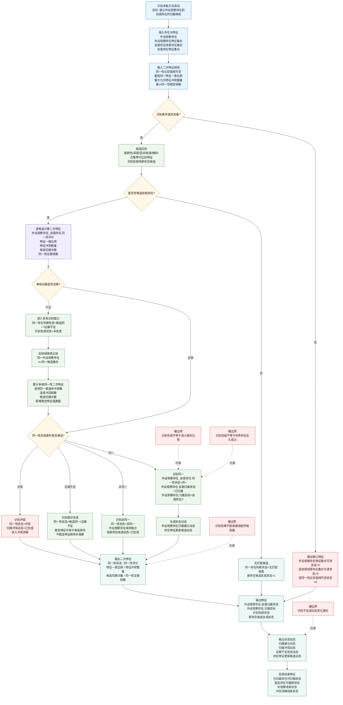

# 本能方法：识别内部实现逻辑流程图 v0.2

更新时间：2026-06-05

## 定位

```text
识别定归属。

识别判断外设观察存在是否与自我场景中的某个存在同一；
识别输出同一性二次特征、归属映射特征和归属状态动态；
识别不生成特征变化动态。
```

正式输入输出只能承接：

```text
存在
特征
二次特征
状态动态
```

## 流程图



## 条件与结果

| 类别 | 宿主 | 特征类型 | 目标/结果特征值 |
| --- | --- | --- | --- |
| 条件 | 外设观察存在 | 外设观察存在特征集合可读状态 | `1` |
| 条件 | 自我所在场景 | 自我所在场景存在集合可读状态 | `1` |
| 条件 | 同一性比较规则 | 同一性比较值域可读状态 | `1` |
| 条件 | 同一性比较规则 | 最小同一性稳定帧数 | `>0` |
| 二次特征 | 外设观察存在_自我存在 | 同一性状态 | `同一 / 非同一 / 候选同一 / 证据不足 / 冲突 / 无匹配候选` |
| 二次特征 | 外设观察存在_自我存在 | 同一性评分 | `0..1` |
| 二次特征 | 外设观察存在_自我存在 | 特征一致比例 | `0..1` |
| 二次特征 | 外设观察存在_自我存在 | 特征冲突数量 | `>=0` |
| 结果特征 | 外设观察存在 | 自我归属状态 | `未归属 / 候选 / 已归属 / 冲突` |
| 结果特征 | 外设观察存在 | 归属目标 | 自我存在引用；无匹配时为空 |
| 状态动态 | 外设观察存在 | 归属建立动态 | `已生成 / 未生成` |
| 状态动态 | 外设观察存在 | 归属冲突动态 | `已生成 / 未生成` |

## 完成标准

```text
识别完成: 同一 =
    外设观察存在特征集合可读状态 == 1
    AND 自我所在场景存在集合可读状态 == 1
    AND 同一性比较值域可读状态 == 1
    AND 同一性证据帧数 > 最小同一性稳定帧数
    AND 特征一致比例 > 最低同一特征一致比例
    AND 特征冲突数量 <= 最大允许特征冲突数量
    AND 候选切换次数 <= 最大允许候选切换次数
    AND 外设观察存在.自我归属状态 == 已归属
    AND 外设观察存在_自我存在.同一性状态 == 同一
```

## 去容器化边界

```text
识别正式输出 =
    外设观察存在_自我存在.同一性二次特征
    + 外设观察存在.自我归属特征
    + 归属建立 / 冲突 / 证据不足状态动态

识别正式输出 != 变化动态
识别正式输出 != 线程传输容器
```

一句话：

```text
识别解决“这个外设观察存在是不是我的某个存在”。
```
