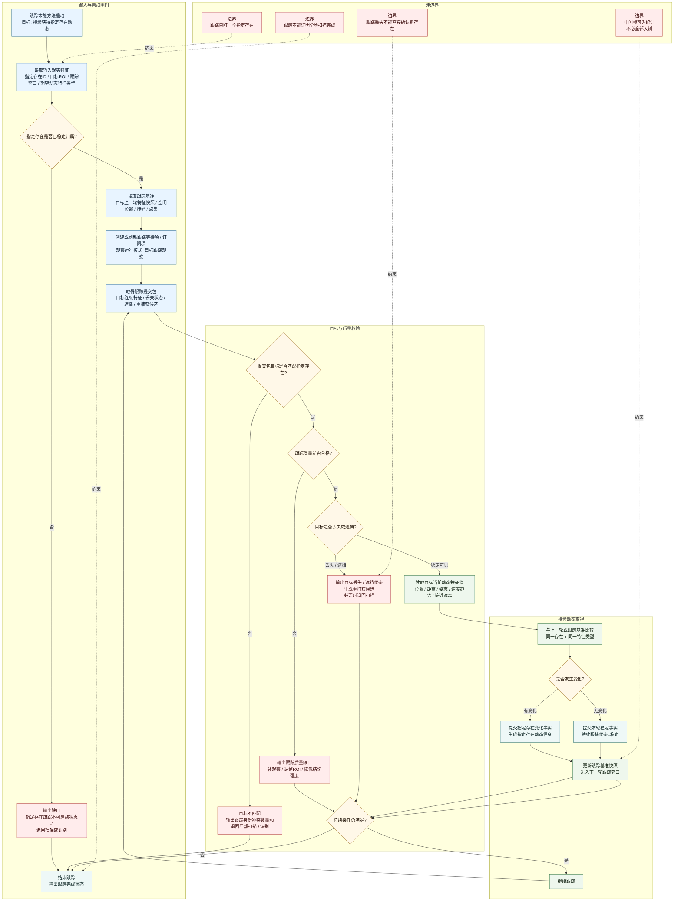

# 本能方法：跟踪内部实现逻辑流程图 v0.1

更新时间：2026-06-05

## 用途

本图描述自我侧“跟踪”本能方法的内部实现逻辑。跟踪的目的不是看全场，而是持续专注扫描某一个存在，并持续获得该存在的动态信息。

跟踪方法的目标：

```text
在指定存在、指定窗口、指定持续条件下，
连续读取目标存在的当前特征值，
与上一轮或跟踪基准比较，
持续生成目标状态和动态信息。
```

## 流程图



## 现实层特征口径

| 位置 | 目标宿主 | 特征类型 | 特征值 |
| --- | --- | --- | --- |
| 输入 | 指定观察目标 | 指定存在稳定归属状态 | `1` |
| 输入 | 指定观察目标 | 指定存在ID | 存在指针 / ID |
| 输入 | 指定观察目标 | 跟踪窗口明确状态 | `1` |
| 输入 | 指定观察目标 | 跟踪基准特征快照 | 非空 |
| 输出 | 指定观察目标 | 指定存在跟踪状态 | `稳定 / 遮挡 / 丢失 / 冲突 / 质量不足` |
| 输出 | 指定观察目标 | 指定存在动态信息取得状态 | `1/0` |
| 输出 | 指定观察目标 | 指定存在特征值变化事实提交状态 | `1/0/2/3` |
| 输出 | 指定观察目标 | 指定存在跟踪事实提交状态 | `1/0/2/3` |
| 输出 | 指定观察目标 | 跟踪身份冲突数量 | `>=0` |
| 输出 | 指定观察目标 | 重捕获候选数量 | `>=0` |
| 输出 | 指定观察目标 | 下一轮跟踪基准快照 | 指针 / 引用型特征值 |

## 完成公式

```text
跟踪可启动 =
    指定存在稳定归属状态 == 1
    AND 跟踪窗口明确状态 == 1
    AND 跟踪基准特征快照 非空
```

```text
持续获得动态 =
    跟踪提交包目标匹配指定存在
    AND 跟踪质量合格
    AND 指定存在跟踪状态 != 丢失
    AND 当前动态特征值与上一轮 / 跟踪基准可比较
    AND 指定存在动态信息取得状态 == 1
```

## 结论

跟踪是对一个指定存在的持续扫描。它可以持续生成目标动态信息，但不能替代全场扫描，也不能把跟踪丢失或重捕获候选直接写成新存在确认。
