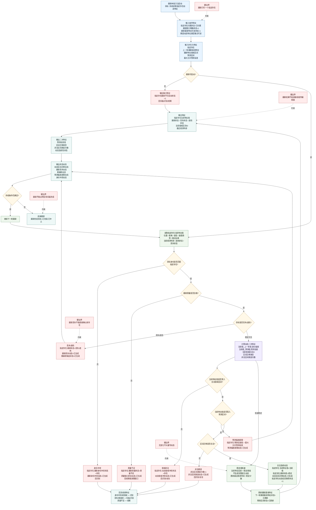

# 本能方法：跟踪内部实现逻辑流程图 v0.2

更新时间：2026-06-05

## 定位

```text
跟踪守动态。

跟踪对指定已归属存在持续取值，
判断其动态特征是否连续、合法、稳定。
```

跟踪不是全场扫描。动态目标的关键问题不是“是否变化”，而是：

```text
当前特征值是否落入合法值域？
当前特征值是否落入预测区间？
当前特征值是否发生合法区间迁移？
是否存在非法跳变？
预测误差是否超限？
```

## 流程图



## 条件与结果

| 类别 | 宿主 | 特征类型 | 目标/结果特征值 |
| --- | --- | --- | --- |
| 条件 | 指定存在 | 归属状态 | `已归属` |
| 条件 | 指定存在 | 跟踪窗口明确状态 | `1` |
| 条件 | 指定存在 | 跟踪基准特征可读状态 | `1` |
| 条件 | 指定存在 | 跟踪特征值域区间状态 | `已建立` |
| 条件 | 指定存在 | 预测区间状态 | `已生成` |
| 结果特征 | 指定存在 | 跟踪状态 | `稳定 / 遮挡 / 丢失 / 冲突 / 质量不足` |
| 结果特征 | 指定存在 | 当前特征值 | 当前观测值 |
| 结果特征 | 指定存在 | 当前值域区间ID | 区间引用 |
| 二次特征 | 指定存在.当前值_预测值 | 预测误差值 | `< 最大允许预测误差` 才正常 |
| 二次特征 | 指定存在 | 动态连续性状态 | `连续 / 不连续 / 证据不足` |
| 二次特征 | 指定存在 | 非法区间跳变次数 | `>=0` |
| 状态动态 | 指定存在 | 动态区间迁移动态 | 合法迁移时生成 |
| 状态动态 | 指定存在 | 跟踪丢失动态 | 丢失时生成 |
| 状态动态 | 指定存在 | 预测偏差超限动态 | 预测误差超限时生成 |

## 完成公式

```text
跟踪可启动 =
    指定存在.归属状态 == 已归属
    AND 跟踪窗口明确状态 == 1
    AND 跟踪基准特征可读状态 == 1
```

```text
持续获得动态 =
    目标身份匹配指定存在
    AND 跟踪质量合格
    AND 指定存在.跟踪状态 != 丢失
    AND 当前特征值与上一轮/跟踪基准可比较
    AND 当前特征值落入合法值域区间
    AND 当前特征值落入预测区间
    AND 区间迁移合法
    AND 预测误差值 < 最大允许预测误差
```

一句话：

```text
跟踪解决“这个指定存在正在怎样连续变化”。
```
