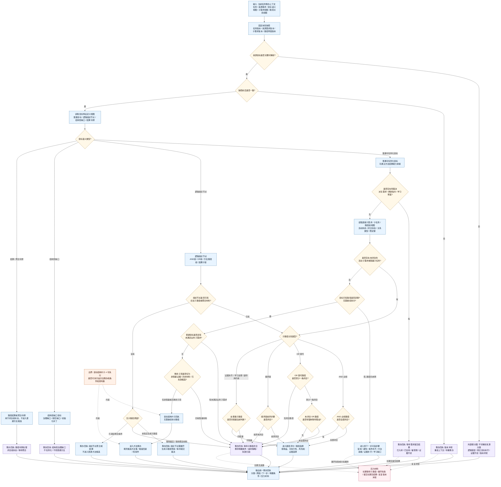

# 目标结构叶子判断逻辑图 v0.1

更新时间：2026-06-05

## 用途

本图是 `任务筹办普通函数状态机流程图 v0.2` 中：

```text
是否已是目标结构叶子?
无需继续拆分路径
```

的细分判断图。

本图只判断当前任务目标在结构上是否已经不需要继续拆路径，不判断方法是否已经可执行。若输出 `ENTER_METHOD_PREP`，也只表示可以进入找方法 / 找条件阶段。

## 判断原则

```text
1. 叶子只是结构前提，不是语义前提。
2. 目标结构叶子必须同时满足：目标可解析、目标语义允许普通任务化、没有未闭合的必经子路径、没有待裁决派生需求、没有仍需展开的路径缺口。
3. AND组 / OR组 / 方法路径组 / 因果子链组织节点，即使当前没有子节点，也不能直接当作普通叶子任务进入方法候选。
4. 证据补齐 / 学习支撑 / 副作用约束等非直接执行材料，不应误判为当前目标已经可执行。
5. OR 替代路径不要求所有分支都闭合；至少一条路径闭合且无强制等待理由时，可以进入路径评价或路径选择。
6. AND 必经路径必须全部闭合；顺序链必须确认前序步骤闭合。
7. 判断结果必须返回结构化回执，由任务管理界面线程消费，筹办普通函数不直接写任务状态。
```

## 判断逻辑图



## 输出分类

| 分类 | 判定条件 | 下一步 |
| --- | --- | --- |
| 目标结构叶子 | 普通可任务化目标、没有待裁决草案、没有未闭合阻塞子路径、路径已经足够 | 进入方法筹办 |
| 仍需路径展开 | 普通目标路径未明，或组织节点没有合法子路径 | 进入找下一步可选步骤，生成草案后等待提交结果 |
| 等待子路径闭合 | AND 未全闭合、OR 无闭合路径或有强制等待、顺序链前序未闭合、支撑类材料仍阻塞 | 返回等待回执 |
| 进入路径评价 | AND 全闭合、OR 至少一条闭合且无强制等待、顺序链前序闭合 | 按收益、可执行性、风险和证据选择路径 |
| 组织节点处理 | 目标是 AND组 / OR组 / 方法路径组 / 因果子链 / 结算令牌 | 展开、聚合、结算或等待，不进入普通方法候选 |
| 结构性治理缺口 | 目标是结构性缺口，不是业务执行目标 | 返回治理缺口回执 |
| 版本冲突或目标不可解析 | 快照漂移或目标不可解析 | 进入外部细分分类或重筹办 |

## 接入建议

```text
1. 在 v0.2 的 `STRUCT_LEAF_GATE` 位置调用本判断。
2. 判断函数只返回结构化回执，不直接写需求树和任务状态。
3. `ENTER_METHOD_PREP` 只能说明可以进入找方法，不说明任务已就绪。
4. 组织节点必须先走目标语义视图，不得因为当前没有子节点就当作普通叶子。
5. 等待回执必须携带唤醒条件、超时条件、等待失效归因和压力材料。
```
