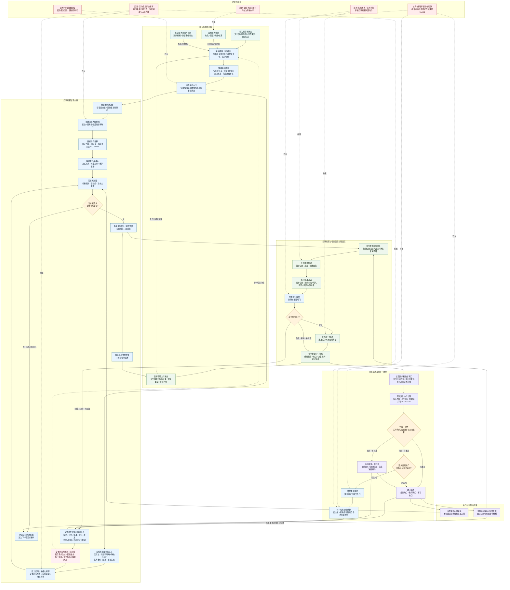

# 自我线程总流程图 v0.1

更新时间：2026-06-05

## 用途

本图用于单独梳理自我线程在鱼巢内部循环中的职责边界。重点区分：

- 自我线程负责需求治理、方向计算、任务发起意图、执行前批准、回执裁决、需求回写和价值结算。
- 任务管理线程负责任务创建、任务状态推进、任务筹办、批准后任务执行和任务回执同步。
- 自检、外设、外部事件都是旁路材料源，只有入账 / 准入后才影响自我线程主链。

依据：

- `规范/自我内部循环实现规范20260512.md`
- `规范/自我线程与任务管理线程权责边界规范20260512.md`
- `规范/特征值三态比较底层逻辑规范20260518.md`
- `规范/需求主信息类规范20260507.md`
- `计划/计划索引.md`

## 自我线程总图



## 本图暂定结论

1. 特征归类压缩不作为本总图里的独立入口模块展开；它属于细分流程中的 `随遇即执行` 机制。
2. 细分流程中再展开：任一事实、材料、回执、失败退出或压力值入账时，都按 `特征类型 + 特征值` 立即归类。
3. 压缩不是简单裁剪数据，也不是自由文本概括；压缩就是归类，通过特征结构把低层具体事实归到高层分类。
4. 例如：整个现实世界可通过高层特征归到 `宇宙`；多种可吃的果实可按特征值归到 `水果`、`干果` 等类别。
5. 底层保留完整事实、日志、动作动态和证据链；高层保留对象类、能力类、需求类、压力类、方向和证据指针。
6. 本总图只表现主循环顺序，不把归类压缩画成每轮开始的集中步骤。
7. 情绪基础数据不是需求、不是价值结算事实，也不能直接改写安全值 / 服务值；它只作为后续需求重判、估权和调度倾向的输入。
8. 自我线程的主入口不是自检，而是 `情绪基础数据 + 已入账状态 + 治理消息`。
9. 自我线程必须计算目标方向：`目标值 - 当前值`，方向只取 `>0 / =0 / <0`。
10. 缺口只说明目标未满足，不等于压力。
11. 压力值不是自我线程局部产物，而是贯穿整个大循环的全循环压力账本。
12. 自我线程负责读取、解释和使用压力值；压力来源可以来自需求生成、任务生成、执行批准、任务执行、需求满足等任一模块。
13. 压力是综合信息的情绪化反馈，主要来自全循环失败退出事实、自检异常和治理负荷；压力值入账时也会立即进入特征归类机制。
14. 任何失败退出逻辑的生成都是压力来源：拒绝入树、拒绝任务化、筹办失败退出、执行批准拒绝 / 暂缓、执行失败退出、不可比、无推进、阻断、等待失效、反复重筹办、拒绝结算等。
15. 任务执行后的回执裁决必须计算实际变化方向：`结果值 - 初始值`。
16. 需求回写前必须经过方向一致性闸门：同向才可能进入满足判断；零推进进入缺口；反向或不可比进入冲突 / 拒绝 / 重筹办。
17. 任务筹办就绪后不能直接执行；必须先提交执行批准申请，经过批准执行模块裁决。
18. 批准执行模块是执行前治理闸门，不是方法动作来源；批准后任务管理线程才进入任务执行推进。
19. 执行批准被暂缓、拒绝或要求补证据时，必须形成任务回执，并写入全循环压力账。
20. 自我线程只生成任务发起、调度、重筹办、执行批准等治理意图；任务状态推进、筹办和执行属于任务管理线程。
21. 任务完成不等于需求满足；需求满足必须由自我线程通过正式需求回写入口登记。
22. 安全值 / 服务值真实变化只能来自叶子任务完成后的合法价值结算链，不能由根缺口、压力反馈、情绪基础数据、分类结构或原始材料直接结算。
23. 自检、外设、外部事件都是旁路材料源，必须先提交、准入或入账，才能影响需求树。

## 下一张图建议

下一张建议拆 `自我线程方向一致性裁决流程图`：

```text
来源需求目标状态
-> 当前值回查
-> 目标方向 = 目标值 - 当前值
-> 任务输出事实
-> 实际方向 = 结果值 - 初始值
-> 同向 / 零推进 / 反向 / 不可比
-> 需求回写 / 缺口 / 冲突 / 重筹办
```
