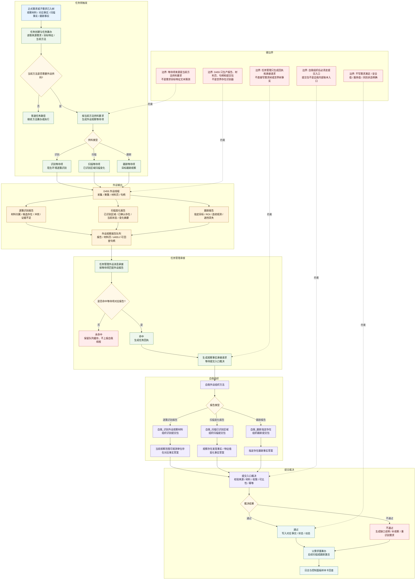
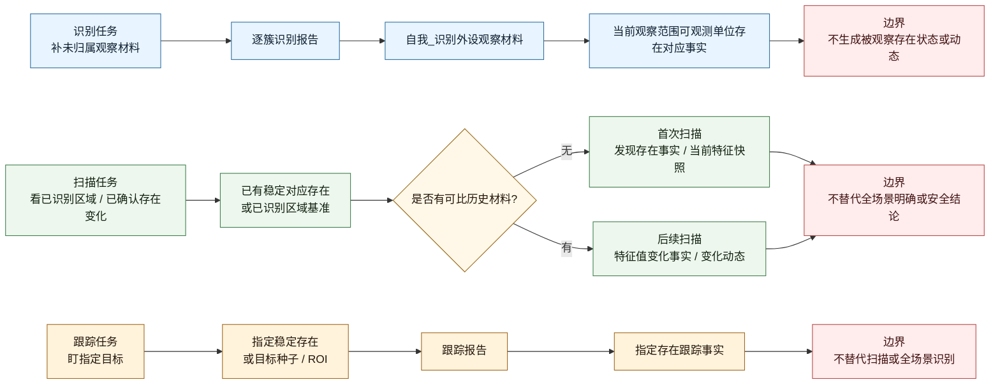

# 观察任务接口层流程图 v0.1

更新时间：2026-06-05

## 用途

本图用于梳理观察任务中：

```text
外设输出
-> 任务接收
-> 自我组织
-> 提交入口裁决
```

的接口层关系。

本图不把 D455 报告、材料页、像素簇、扫描包或跟踪包直接写成需求满足、安全结论、服务结论或全场景明确。外设只供材料，任务管理只承接报告并上报请求，自我组织后交提交入口裁决，裁决通过后才成为事实、状态、动态或缺口。

依据：

- `计划/20260604_外设三分法真实D455样本实施切片计划_v0.1.md`
- `规范/当前场景特征值明确标准规范20260602.md`
- `规范/双目相机外设功能能力与实现途径总结20260527.md`
- `实施记录/20260604_S6_N2a_P10_外设等待项改读方法供料要求实施记录.md`
- `任务模块.管理工作线程.ixx`
- `外设观察报告队列.ixx`
- `自我动作实现.外设模块.ixx`

## 观察任务总流程



## 三类观察任务分支



## 本图暂定结论

1. 观察任务的接口层目标是让外设输出被任务系统接收，并被自我组织成可裁决的事实草案，不是让外设报告直接成为自我结论。
2. 外设观察等待项的来源是当前方法供料要求；工作项入队阶段不得按需求目标特征文本猜识别、扫描或跟踪。
3. D455 外设线程只生产报告、材料页、句柄和识别 / 扫描 / 跟踪提交包。
4. 任务管理外设消息承接只按等待项匹配报告，命中后生成任务回执和观察事实承接请求。
5. 自我组织方法负责把外设提交包整理成候选事实、特征值视图或缺口说明。
6. 提交入口负责裁决并写入对应事实、扫描变化事实或跟踪事实。
7. 识别只产出可观测单位到存在的对应事实；扫描和跟踪才产出状态与动态。
8. 扫描可由局部已识别区域启动，不要求全场景已明确；但扫描结果不得反推全场景明确。
9. 跟踪只盯指定目标，不替代扫描，也不证明全场景安全。
10. 本流程不得写需求满足、安全值、服务值或风险状态明确。

## 验证锚点

```text
任务侧：
    外设观察等待项创建延后
    按当前方法供料要求创建外设观察等待项

外设侧：
    D455材料包证据卡
    D455逐簇识别样本卡
    扫描变化报告
    跟踪报告

任务管理承接：
    任务管理外设消息承接/处理一次
    任务管理外设消息承接/生成观察事实承接请求

提交入口：
    提交_当前观察范围可观测单位存在对应事实
    提交_观察存在发现事实
    提交_观察存在特征值变化事实
    提交_指定存在跟踪事实
```
