# 识别任务详细流程图 v0.1

更新时间：2026-06-05

## 用途

本图用于把观察任务总图中的“识别任务”单独展开。

识别任务的外设供料只允许是：

```text
逐簇识别报告 / 识别提交包
```

识别任务不消费扫描提交包，不消费跟踪提交包，也不生成被观察存在状态、变化动态、安全结论、服务结论或全场景明确。

依据：

- `流程图/20260605_观察任务接口层流程图_v0.1.md`
- `计划/20260604_外设三分法真实D455样本实施切片计划_v0.1.md`
- `规范/当前场景特征值明确标准规范20260602.md`
- `实施记录/20260604_S6_N2a_P10_外设等待项改读方法供料要求实施记录.md`
- `外设观察报告队列.ixx`
- `任务模块.管理工作线程.ixx`
- `自我动作实现.外设模块.ixx`

## 识别任务详细流程

```mermaid
flowchart TD
    %% 任务触发
    NEED["来源需求或子需求<br/>需要当前观察范围可观测单位存在对应事实"]
    TASK["任务创建 / 任务筹办<br/>读取来源需求、目标特征、当前方法"]
    METHOD_GATE{"当前方法是否为<br/>自我_识别外设观察材料<br/>或结果能力要求识别供料?"}
    NOT_IDENTIFY["不是识别供料<br/>退出识别任务流程<br/>交回观察任务总图其他分支"]

    %% 供料闸门
    HAVE_PACKAGE_GATE{"已有可用识别提交包<br/>或逐簇识别报告?"}
    BUILD_WAIT["生成外设观察等待项<br/>目标外设=D455<br/>观察模式=陌生环境逐簇识别<br/>期望报告=逐簇识别报告"]
    WAIT_QUEUE["外设观察等待项入队<br/>幂等键含任务/需求/方法/识别口径"]
    D455["D455 外设线程<br/>真实采集 / 聚簇 / 材料页 / d455://句柄"]
    REPORT["逐簇识别报告<br/>观察像素簇 / ROI / 掩码 / 点集 / 深度切片"]
    REPORT_QUEUE["外设观察报告队列<br/>缓存逐簇识别报告和材料页"]

    %% 任务管理承接
    RECEIVE["任务管理外设消息承接<br/>按等待项匹配逐簇识别报告"]
    MATCH_GATE{"是否命中逐簇识别报告?"}
    CACHE_ONLY["未命中<br/>只保留队列缓存<br/>不上报自我线程"]
    RECEIPT["命中<br/>生成任务回执"]
    REQUEST["生成观察事实承接请求<br/>请求承接观察报告=是<br/>请求承接观察像素簇集合=是<br/>请求生成存在候选=是<br/>请求统计当前帧识别情况=是"]

    %% 自我组织
    ORG["自我_识别外设观察材料"]
    TYPE_GATE{"报告/包类型是否为识别?"}
    WRONG_TYPE["拒绝<br/>扫描包/跟踪包不能作为识别任务输入"]
    PACKAGE["构造外设识别提交包<br/>构造外设识别提交包_由观察报告"]
    PACKAGE_GATE{"识别包材料是否足够?"}
    MATERIAL_GAP["材料不足或过期<br/>记录证据不足 / 补观察 / 重识别缺口"]

    %% 识别包内容
    HEADER["包头校验<br/>报告ID / 帧ID / 材料页ID / 来源外设 / 时间戳 / 有效截止 / 质量问题"]
    RANGE["观察范围校验<br/>有效观察区域 / 未识别区域 / 冲突区域 / 背景区域 / 无效区域"]
    CANDIDATE["候选归属校验<br/>新存在候选 / 已有存在匹配候选 / 像素归属账本"]
    MATERIAL["可回查材料校验<br/>ROI句柄 / 掩码句柄 / 点集句柄 / 深度切片句柄"]
    FEATURE["候选特征值与证据校验<br/>候选特征值 / 证据不足原因 / 置信度 / 质量分"]

    %% 事实草案
    DRAFT["生成当前观察范围可观测单位存在对应事实草案"]
    DRAFT_FIELDS["草案最小字段<br/>有效可观测单位数量<br/>已稳定对应数量<br/>未稳定对应数量<br/>冲突数量<br/>稳定对应存在数量<br/>映射表 / 稳定性 / 缺口原因"]
    CLOSE_GATE{"当前观察范围对应是否闭合?"}
    CLOSED["闭合候选<br/>全部有效可观测单位稳定对应存在"]
    UNCLOSED["未闭合候选<br/>保留未识别/冲突/证据不足/需补观察"]

    %% 提交入口
    SUBMIT["提交_当前观察范围可观测单位存在对应事实"]
    SUBMIT_GATE{"提交入口裁决是否通过?"}
    FACT["写入当前观察范围可观测单位存在对应事实<br/>写提交状态和事实引用"]
    REJECT["拒绝入账<br/>输出缺口说明或等待更多材料"]

    %% 后续
    REPLAN["父需求重筹办 / 上级状态重判"]
    SCAN_TRIGGER["若稳定对应存在数量 >= 1<br/>可并行激活扫描事实/动态取得需求"]
    NOT_DONE["未稳定对应部分<br/>继续补识别 / 补观察 / 冲突消解"]
    EVIDENCE["日志与控制面板回查<br/>D455逐簇识别样本卡<br/>观察事实承接请求<br/>对应事实提交日志"]

    %% 禁止边界
    RULE_PACKAGE["边界: 识别任务只消费识别包<br/>不读扫描包/跟踪包"]
    RULE_STATE["边界: 识别不生成被观察存在状态或动态"]
    RULE_VALUE["边界: 不写需求满足 / 安全值 / 服务值 / 风险明确"]
    RULE_SCENE["边界: D455报告或识别包<br/>不得直接等同当前场景特征值明确"]

    subgraph TRIGGER["任务触发"]
        NEED --> TASK --> METHOD_GATE
        METHOD_GATE -->|否| NOT_IDENTIFY
        METHOD_GATE -->|是| HAVE_PACKAGE_GATE
    end

    subgraph SUPPLY["识别供料取得"]
        HAVE_PACKAGE_GATE -->|无| BUILD_WAIT --> WAIT_QUEUE --> D455 --> REPORT --> REPORT_QUEUE
        HAVE_PACKAGE_GATE -->|有| REPORT_QUEUE
    end

    subgraph RECEIVE_SIDE["任务管理承接"]
        REPORT_QUEUE --> RECEIVE --> MATCH_GATE
        MATCH_GATE -->|否| CACHE_ONLY
        MATCH_GATE -->|是| RECEIPT --> REQUEST
    end

    subgraph SELF_ORG["自我识别组织"]
        REQUEST --> ORG --> TYPE_GATE
        TYPE_GATE -->|否| WRONG_TYPE
        TYPE_GATE -->|是| PACKAGE --> PACKAGE_GATE
        PACKAGE_GATE -->|否| MATERIAL_GAP
        PACKAGE_GATE -->|是| HEADER --> RANGE --> CANDIDATE --> MATERIAL --> FEATURE --> DRAFT
    end

    subgraph DRAFT_SIDE["对应事实草案"]
        DRAFT --> DRAFT_FIELDS --> CLOSE_GATE
        CLOSE_GATE -->|闭合| CLOSED --> SUBMIT
        CLOSE_GATE -->|未闭合| UNCLOSED --> SUBMIT
    end

    subgraph POSTING["提交入口"]
        SUBMIT --> SUBMIT_GATE
        SUBMIT_GATE -->|通过| FACT --> REPLAN --> EVIDENCE
        SUBMIT_GATE -->|不通过| REJECT --> REPLAN
    end

    subgraph FOLLOW_UP["后续分流"]
        FACT --> SCAN_TRIGGER
        FACT --> NOT_DONE
    end

    subgraph RULES["硬边界"]
        RULE_PACKAGE -.约束.-> TYPE_GATE
        RULE_STATE -.约束.-> DRAFT
        RULE_VALUE -.约束.-> FACT
        RULE_SCENE -.约束.-> CLOSED
    end

    classDef demand fill:#e8f4ff,stroke:#2f6f9f,color:#102030;
    classDef task fill:#eef7ed,stroke:#3f7f4f,color:#102010;
    classDef peripheral fill:#fff3dc,stroke:#a0671e,color:#24160a;
    classDef gate fill:#fff8e8,stroke:#9a6a1a,color:#24160a;
    classDef submit fill:#f1edff,stroke:#6c56a4,color:#1d1730;
    classDef warn fill:#ffecec,stroke:#b84a4a,color:#401111;
    classDef result fill:#eef8f7,stroke:#397b77,color:#102827;

    class NEED demand;
    class TASK,BUILD_WAIT,WAIT_QUEUE,RECEIVE,RECEIPT,REQUEST,ORG,PACKAGE task;
    class D455,REPORT,REPORT_QUEUE peripheral;
    class METHOD_GATE,HAVE_PACKAGE_GATE,MATCH_GATE,TYPE_GATE,PACKAGE_GATE,CLOSE_GATE,SUBMIT_GATE gate;
    class HEADER,RANGE,CANDIDATE,MATERIAL,FEATURE,DRAFT,DRAFT_FIELDS,SUBMIT submit;
    class NOT_IDENTIFY,CACHE_ONLY,WRONG_TYPE,MATERIAL_GAP,REJECT,UNCLOSED,RULE_PACKAGE,RULE_STATE,RULE_VALUE,RULE_SCENE warn;
    class CLOSED,FACT,REPLAN,SCAN_TRIGGER,NOT_DONE,EVIDENCE result;
```



## 本图暂定结论

1. 识别任务的唯一外设供料是逐簇识别报告 / 识别提交包。
2. 识别任务不得读取扫描提交包或跟踪提交包；如果输入包类型不是识别，应直接拒绝或退回总图其他分支。
3. 识别任务的组织方法是 `自我_识别外设观察材料`。
4. 识别任务的正式提交入口是 `提交_当前观察范围可观测单位存在对应事实`。
5. 识别任务只生成当前观察范围可观测单位到存在的对应事实或缺口说明。
6. 未识别、冲突、证据不足、需补观察都是识别过程缺口，不是最终归属。
7. 全部有效可观测单位稳定对应存在时，只能作为上级状态重判材料，不等于 D455 报告直接满足需求。
8. 稳定对应存在数量大于等于 1 时，可以并行激活扫描事实 / 动态取得需求；这属于后续分流，不是识别任务继续消费扫描包。
9. 识别任务不生成被观察存在状态、变化动态、跟踪事实、安全值、服务值或风险状态明确。

## 验证锚点

```text
外设侧：
    D455逐簇识别样本卡
    逐簇识别报告
    构造外设识别提交包_由观察报告

任务管理侧：
    任务管理外设消息承接/处理一次
    已匹配逐簇识别报告
    任务管理外设消息承接/生成观察事实承接请求

自我组织侧：
    自我_识别外设观察材料
    外设识别提交包组织失败:缺少D455逐簇识别报告

提交入口：
    提交_当前观察范围可观测单位存在对应事实
    当前观察范围可观测单位存在对应事实提交
```
