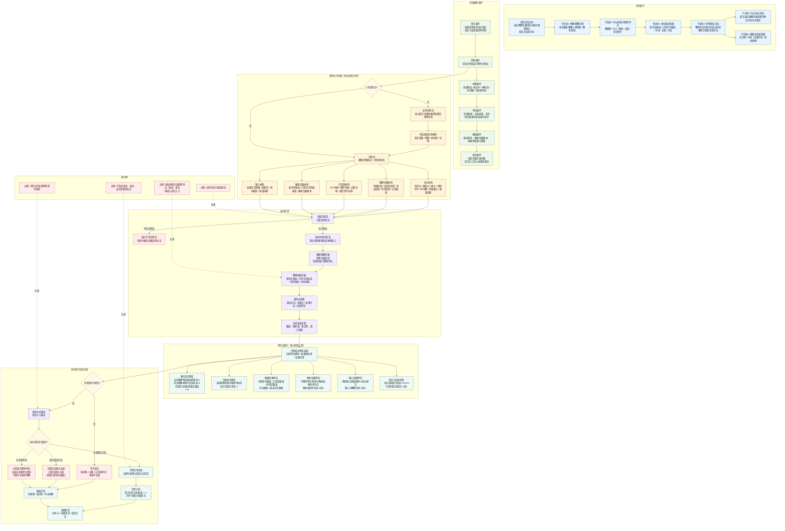

# 识别任务详细流程图 v0.2

更新时间：2026-06-05

## 用途

本图从识别任务自身展开，而不是从观察任务总图截取分支。

识别任务的目标是：

```text
把当前观察范围内的有效可观测单位，组织成“可观测单位 -> 存在”的对应事实。
```

识别任务只消费：

```text
逐簇识别报告 / 识别提交包
```

识别任务不消费扫描包和跟踪包，不生成被观察存在状态、变化动态、安全结论、服务结论或全场景明确。

依据：

- `规范/当前场景特征值明确标准规范20260602.md`
- `计划/20260604_外设三分法真实D455样本实施切片计划_v0.1.md`
- `实施记录/20260604_S6_N2a_P10_外设等待项改读方法供料要求实施记录.md`
- `外设观察报告队列.ixx`
- `任务模块.管理工作线程.ixx`
- `自我动作实现.外设模块.ixx`

## 目标到达成流程



## 现实层输入输出特征口径

对于自我现实层的任务和方法，输入和输出本体只能是：

```text
目标宿主 + 现实特征类型 + 现实特征值
```

报告ID、帧ID、材料页ID、`d455://` 句柄、样本卡摘要和提交日志只能作为特征值来源链、证据引用或审计材料；不能替代目标特征类型，也不能作为机器判断的说明性字段。

### 目标状态

| 层级 | 目标宿主 | 目标特征类型 | 目标特征值 | 口径 |
| --- | --- | --- | --- | --- |
| 识别任务主目标 | 当前观察范围可观测单位存在对应事实 | 当前观察范围可观测单位存在对应闭合状态 | `1` | 识别任务真正要达成的现实层目标状态。 |
| 父层派生状态 | 当前场景 / 已识别区域范围 | 当前场景特征值明确状态 | `已明确` | 只能由对应事实派生；不得由 D455 报告、材料页、扫描包或跟踪包直接满足。 |
| 后续启动条件 | 当前观察范围可观测单位存在对应事实 | 扫描可启动状态 | `1` | 只表示稳定对应存在数量足以激活扫描；不是识别任务本身的完成条件。 |

### 输入现实特征类型和值

| 输入阶段 | 目标宿主 | 输入特征类型 | 需要的特征值 | 不满足时 |
| --- | --- | --- | --- | --- |
| 材料取得 | 当前外设观察材料 / 观察材料集 | 当前观察特征帧取得状态 | `1`，已取得 | 形成材料取得缺口，不能生成对应事实。 |
| 材料回查 | 当前外设观察材料 / 观察材料集 | 外设观察材料可回查状态 | `1`，可回查 | 形成材料可回查缺口，不能把材料当作可提交证据。 |
| 识别供料 | 识别提交包组织结果场景 | 外设提交包候选事实数量 | `>= 0` 且可读 | 不可读时 `映射缺口原因掩码` 包含 `2`。 |
| 候选确认 | 识别提交包确认结果场景 | 外设观察存在候选确认冲突数量 | `>= 0` 且可读；全部达成时为 `0` | 大于 `0` 时 `映射缺口原因掩码` 包含 `16`。 |
| 候选确认 | 识别提交包确认结果场景 | 外设观察存在候选确认证据不足数量 | `>= 0` 且可读；全部达成时为 `0` | 大于 `0` 时 `映射缺口原因掩码` 包含 `32`。 |
| 稳定确认 | 识别提交包确认结果场景 | 已验证观察存在数量 | `>= 0` 且可读；全部达成时 `> 0` 并与有效单位数量闭合 | 不可读时提交确认链不足，`映射缺口原因掩码` 包含 `4`。 |

### 输出结果特征类型和值

| 结果特征类型 | 特征值类型 / 值域 | 全部达成值 | 部分或未达成值 | 备注 |
| --- | --- | --- | --- | --- |
| 当前观察范围可观测单位存在对应事实提交状态 | I64 枚举：`0` 未提交，`1` 已提交，`2` 部分提交，`3` 条件不足 | `1` | `2` 或 `3` | 这是现实特征输出，不是单纯任务回执文本。 |
| 当前观察范围有效可观测单位数量 | I64，`>= 0` | `> 0` | `0` 表示无有效单位 | 有效单位是识别任务可处理的观察单位总量。 |
| 已稳定对应存在可观测单位数量 | I64，`>= 0` | 等于有效可观测单位数量 | 小于有效可观测单位数量 | 表示已有多少观察单位能稳定对应到存在。 |
| 未稳定对应存在可观测单位数量 | I64，`>= 0` | `0` | `> 0` | 大于 `0` 时继续补观察、重识别或确认。 |
| 多重对应冲突可观测单位数量 | I64，`>= 0` | `0` | `> 0` | 大于 `0` 时需要冲突消解。 |
| 稳定对应存在数量 | I64，`>= 0` | `> 0` | `0` | 当前实现中由已稳定对应单位数量得到；`>= 1` 可派生扫描可启动。 |
| 可观测单位到存在映射表 | 指针 / 引用型特征值，指向映射表节点 | 非空，且覆盖全部有效单位 | 可为空或只覆盖部分单位 | 每行只能表达可观测单位到存在 / 候选存在的现实对应关系，证据句柄只作为来源引用。 |
| 映射稳定性状态 | I64，`0` 或 `1` | `1` | `0` | 当前实现与闭合状态同向写入。 |
| 映射缺口原因掩码 | I64 位掩码 | `0` | 位组合 | `1` 未组织识别；`2` 计数不可读；`4` 提交确认链不可读；`8` 有未稳定单位；`16` 有多重冲突；`32` 有证据不足。 |
| 当前观察范围有效可观测单位计数事实取得状态 | I64，`0` 或 `1` | `1` | `0` | 计数事实是否能作为现实层结果入账。 |
| 当前观察范围可观测单位存在稳定对应事实取得状态 | I64，`0` 或 `1` | `1` | `0` | 是否至少取得稳定对应存在事实。 |
| 稳定对应存在数量明确状态 | I64，`0` 或 `1` | `1` | `0` | 表示稳定对应存在数量是否明确，不等于数量本身。 |
| 当前观察范围可观测单位存在对应闭合状态 | I64，`0` 或 `1` | `1` | `0` | 识别任务主目标特征。 |
| 当前观察范围可观测单位存在对应缺口可解释状态 | I64，`0` 或 `1` | 可为 `1` | `0` 或 `1` | 表示未达成原因是否能用现实特征解释；不是完成状态。 |
| 扫描可启动状态 | I64，`0` 或 `1` | `1` 当稳定对应存在数量 `>= 1` | `0` | 后续扫描启动条件，不反向证明识别全部闭合。 |

### 特征值组合判断

```text
全部达成 =
    当前观察范围可观测单位存在对应事实提交状态 == 1
    AND 当前观察范围有效可观测单位数量 > 0
    AND 已稳定对应存在可观测单位数量 == 当前观察范围有效可观测单位数量
    AND 未稳定对应存在可观测单位数量 == 0
    AND 多重对应冲突可观测单位数量 == 0
    AND 稳定对应存在数量 > 0
    AND 可观测单位到存在映射表 非空
    AND 映射稳定性状态 == 1
    AND 映射缺口原因掩码 == 0
    AND 当前观察范围可观测单位存在对应闭合状态 == 1
```

部分达成时，现实层仍然只输出上述特征类型和特征值：已稳定部分进入映射表，未稳定、冲突、证据不足部分通过数量特征和 `映射缺口原因掩码` 表达。无有效可观测单位时，只能得到 `当前观察范围有效可观测单位数量 == 0` 和闭合状态 `0`，不能写成全场景明确。

## 达成口径

```text
识别目标达成 =
    当前观察范围有效可观测单位数量 > 0
    AND 已稳定对应存在可观测单位数量 == 当前观察范围有效可观测单位数量
    AND 未稳定对应存在可观测单位数量 == 0
    AND 多重对应冲突可观测单位数量 == 0
    AND 稳定对应存在数量 > 0
```

部分达成时，已经稳定对应的单位可以入账，未稳定、冲突、证据不足的部分继续形成补观察、重识别或冲突消解缺口。稳定对应存在数量大于等于 1 时，可以并行激活扫描任务，但这不是识别任务继续消费扫描包。

## 本图结论

1. 识别任务从目标展开，不从 D455 设备动作展开。
2. 识别任务目标是建立 `当前观察范围可观测单位存在对应事实`。
3. 识别任务的条件包括任务条件、供料条件、材料条件、单位条件、候选条件和提交条件。
4. 外设只负责让供料条件、材料条件、单位条件和候选材料具备。
5. 外设提供的是识别包，不直接提供自我结论。
6. 自我处理的关键是把原始特征组织成观察范围、可观测单位、候选归属、稳定对应和缺口说明。
7. 提交入口裁决后，识别任务才形成正式对应事实。
8. 识别任务不生成被观察存在状态、变化动态、扫描事实、跟踪事实、安全值、服务值或风险状态明确。
