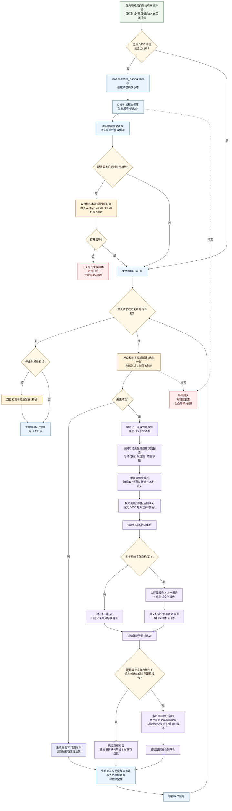
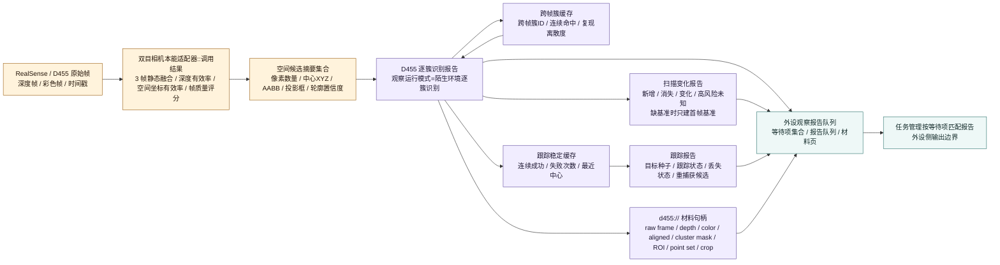

# D455 外设侧工作流程图 v0.1

更新时间：2026-06-06

## 用途

本图只画 D455 外设侧：

```text
外设等待项 / 启动请求
-> D455 外设线程生命周期
-> RealSense 适配器打开与采集
-> 外设内部材料加工
-> 逐簇识别 / 扫描变化 / 目标跟踪报告生成
-> 外设观察报告队列与 d455:// 材料页
```

本图不画自我侧方法执行细节；自我侧只作为等待项来源和报告消费者边界出现。

## 依据

- `规范/双目相机外设独占观察线程规范20260527.md`
- `规范/双目相机外设功能能力与实现途径总结20260527.md`
- `规范/外设独立控制线程与消息承接边界规范20260527.md`
- `双目相机本能适配器.h`
- `双目相机本能适配器.cpp`
- `外设线程_D455深度相机.ixx`
- `外设观察报告队列.ixx`

## 外设线程主循环



## 外设侧材料与报告流



## 三类报告生成口径

| 报告 | 生成入口 | 外设侧输入 | 外设侧输出 | 失败 / 跳过条件 |
| --- | --- | --- | --- | --- |
| 逐簇识别报告 | `D455_从调用结果生成逐簇识别报告` | `双目相机本能适配器::调用结果`、空间候选列表、质量字段 | 帧句柄、空间候选句柄、像素归属材料、观察像素簇集合、质量和缺口摘要 | 采集失败时不生成正常报告，只生成失败样本和线程稳定性结果 |
| 扫描变化报告 | `D455_从逐簇识别报告生成扫描变化报告` | 当前逐簇识别报告、上一逐簇识别报告、扫描等待项 | 新增 / 消失 / 变化簇数量，高风险未知区域数量，差异摘要 | 等待项缺目标 / 基准则跳过；缺上一报告时只建立首帧基准 |
| 跟踪报告 | `D455_从逐簇识别报告生成跟踪报告` | 当前逐簇识别报告、跟踪等待项目标种子、跟踪稳定缓存 | 跟踪状态、丢失状态、连续成功、失败次数、重捕获候选数量 | 等待项缺目标种子则跳过；种子不可解析或未命中当前簇则记丢失 |

## 外设侧不负责

```text
1. 不直接写自我需求树。
2. 不直接写世界树真值。
3. 不直接确认已确认观察存在。
4. 不直接生成方法动作动态。
5. 不直接结算安全值 / 服务值。
6. 不把内部采集、滤波、聚簇、跨帧匹配、跟踪缓存登记成自我层本能方法。
7. 不把逐簇识别报告、扫描变化报告或跟踪报告当作需求满足结论。
```

## 当前工程锚点

```text
适配器层：
    双目相机本能适配器::打开
    双目相机本能适配器::采集一帧
    双目相机本能适配器::释放

线程层：
    外设线程_D455深度相机类::启动
    D455_线程主循环
    D455_评估稳定性

报告层：
    D455_从调用结果生成逐簇识别报告
    D455_从逐簇识别报告生成扫描变化报告
    D455_从逐簇识别报告生成跟踪报告

数据面：
    结构_外设观察等待项
    结构_外设观察报告队列项
    提交外设观察报告
    提交D455短期观察材料页
    读取外设观察等待项集合
```

## 定案

```text
D455 外设侧只负责：
    控制硬件
    取得观察材料
    做外设内部工程加工
    输出三类可承接报告
    保留可回查材料页和日志证据

正式认知、世界入账、需求满足和价值结算都不在外设侧完成。
```
