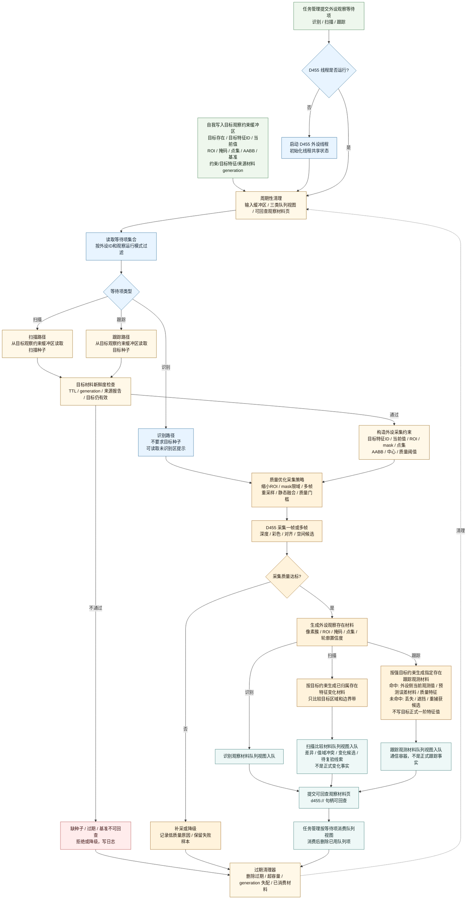
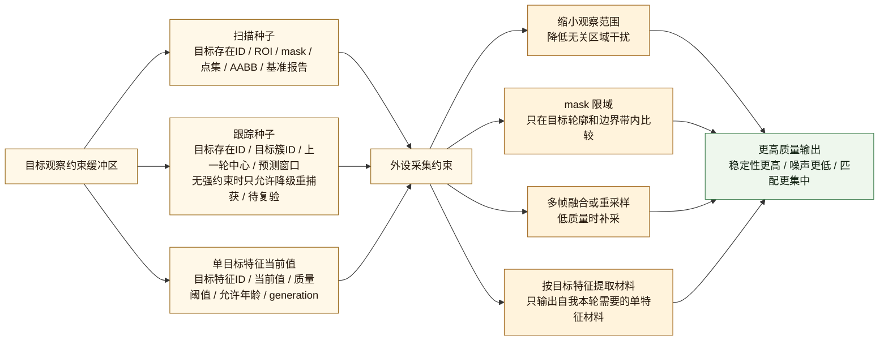
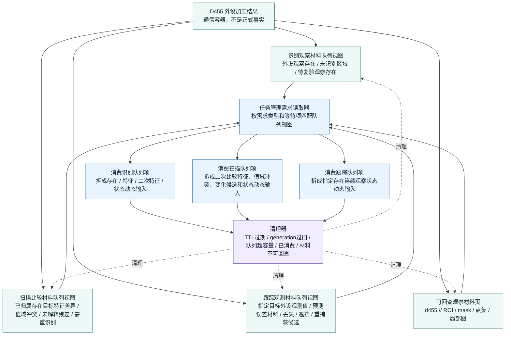

# D455 外设侧工作流程图 v0.2

更新时间：2026-06-06

## 用途

本图在 v0.1 的 D455 外设线程流程上，补入外设侧数据面：

```text
目标观察约束缓冲区
-> 外设按扫描 / 跟踪需要读取目标种子、目标特征ID、该特征当前值、ROI、掩码、点集和基准
-> 外设用这些约束提升采集和报告质量
-> 外设生成识别观察材料 / 扫描比较材料 / 跟踪观测材料三类逻辑队列视图
-> 任务管理按等待项和活跃需求消费对应视图，用完删除，并清理过期数据
```

核心口径：

```text
自我给外设的是观察约束和已确认存在材料，不是最终真值；
外设给自我的是观察材料队列项，不是需求满足结论；
报告 / 包 / 队列项 / 材料页都是线程通信容器；
正式承接对象只能是存在、特征、二次特征和状态动态；
缓存、队列视图和可回查观察材料页都必须受 TTL / generation / 容量 / 已消费状态约束。
```

## 依据

- `规范/规范目录.md`
- `计划/计划索引.md`
- `规范/观察像素簇与存在候选分层规范20260527.md`
- `规范/当前场景特征值明确标准规范20260602.md`
- `外设线程_D455深度相机.ixx`
- `外设观察报告队列.ixx`
- `任务模块.管理界面线程.impl.cpp`
- `流程图/20260606_D455外设侧工作流程图_v0.1.md`
- `流程图/20260606_自我外设交互流程图_v0.1.md`

## 当前工程对照

```text
当前已有：
    结构_外设观察等待项：
        目标区域或目标簇
        最大允许报告年龄毫秒
        观察运行模式
        期望报告类型

    结构_外设观察队列共享状态：
        报告队列
        D455材料页队列
        等待项集合
        队列容量
        D455材料页容量
        D455材料页保留毫秒

    三类报告类型：
        逐簇识别报告
        扫描变化报告（修正语义：扫描比较材料 / 变化候选材料）
        跟踪报告（修正语义：跟踪观测材料 / 跟踪比较材料 / 丢失遮挡重捕获候选材料）

需要补成明确契约：
    目标观察约束缓冲区；
    统一报告队列上的识别 / 扫描 / 跟踪三类逻辑队列视图；
    自我消费后删除队列项；
    外设侧按 TTL / generation / 容量 / 已消费状态做清理；
    外设采集前读取缓冲区，用单特征当前值、ROI / mask / 点集 / 基准提升数据质量。

物理层可继续使用统一报告队列；
逻辑层必须提供三类队列视图，避免识别、扫描、跟踪观察材料互相污染。
```

## 外设侧主流程 v0.2



## 缓冲区提升数据质量的逻辑



## 三类队列视图与清理



## 数据结构口径

| 数据面 | 作用 | 外设侧用法 | 清理条件 |
| --- | --- | --- | --- |
| 目标观察约束缓冲区 | 存储自我提供的单特征观察约束 | 扫描读取目标存在、目标特征ID、该特征当前值、ROI / mask / 点集 / 基准；跟踪读取目标种子、预测窗口和该特征当前值 | TTL 到期、约束generation / 目标特征generation / 来源材料generation 失配、来源报告不可回查、目标被替代、该特征当前值被新版本替代 |
| 识别观察材料队列视图 | 存储外设生成的外设观察存在材料 | 供自我验证外设观察材料、确认归属；消费后拆成存在 / 特征 / 二次特征 / 状态动态输入 | 自我读取后删除；超过允许年龄删除；超容量裁剪 |
| 扫描比较材料队列视图 | 存储外设生成的已归属存在目标特征比较材料 | 供自我扫描已识别区域；消费后拆成二次比较特征、值域冲突、值域内变化候选或待复验线索；不直接提交发现事实或变化事实 | 自我读取后删除；目标约束过期删除；基准不可回查删除；三类 generation 失配删除 |
| 跟踪观测材料队列视图 | 存储外设生成的指定存在跟踪观测材料 | 供自我跟踪指定存在；消费后拆成外设侧当前观测值、二次比较材料、丢失 / 遮挡 / 重捕获候选和跟踪状态动态输入；不直接写目标正式一阶特征值 | 自我读取后删除；目标种子过期删除；主动跟踪对象切换时清理旧项；三类 generation 失配删除 |
| 可回查观察材料页 | 存储可回查 d455:// 材料 | 供自我按句柄回查 ROI、掩码、点集和局部图；材料页本身不是正式事实主体 | 过期时间到达删除；超容量删除最旧页 |

## 外设侧不负责

```text
1. 不直接写自我需求树。
2. 不直接写世界树真值。
3. 不直接确认已确认观察存在。
4. 不直接生成自我方法动作动态。
5. 不直接结算安全值 / 服务值。
6. 不把缓存中的自我存在信息当成外设自己的真值。
7. 不把识别 / 扫描 / 跟踪队列视图中的材料当作需求满足结论。
8. 不把报告 / 包 / 队列项 / 材料页当作正式事实主体。
9. 不使用过期、generation 失配或材料不可回查的数据继续生成新鲜报告。
```

## 定案

```text
D455 外设侧 v0.2 的关键变化是：

外设线程不再只被动采集全帧并吐报告；
它应先读取目标观察约束缓冲区，
按扫描 / 跟踪需要取得目标种子、目标特征ID、该特征当前值、ROI、mask、点集和基准，
再用这些约束提升采集质量和报告质量。

缓冲区记录是增量单特征约束：
    一个目标存在；
    一个目标特征；
    一个当前值；
    一组必要观察约束。
不得把它实现成存在全量快照或全量特征集。

外设输出必须进入统一报告队列上的识别观察材料 / 扫描比较材料 / 跟踪观测材料三类逻辑队列视图；
任务管理按需求和等待项消费对应视图，用完删除；
队列项被消费后，只能作为正式存在、特征、二次特征和状态动态的输入材料；
清理器持续淘汰过期、超容量、已消费和不可回查材料。
```

扫描额外硬规则：

```text
D455 侧扫描必须读取目标观察约束特征组；
必须校验约束generation、目标特征generation、来源材料generation；
必须用 ROI / 掩码 / 点集 / AABB 限定目标区域；
只计算目标特征类型ID 对应的比较材料；
无历史基准时只返回基准缺失或基准建立线索，不返回正式发现事实；
扫描比较材料不得被命名或解释为正式变化动态。
```

跟踪额外硬规则：

```text
D455 侧跟踪必须优先读取强目标观察约束：
    目标存在ID；
    目标特征类型ID；
    目标特征当前值；
    目标特征值域；
    ROI / 掩码 / AABB / 点集之一；
    约束generation；
    目标特征generation；
    来源材料generation；
    TTL 未过期。

无强约束但有旧目标种子：
    只能降级匹配；
    只能输出候选命中 / 待复验 / 重捕获候选 / 证据不足；
    不得输出稳定跟踪动态候选；
    不得提交指定存在跟踪事实。

命中目标簇：
    生成目标跟踪观测材料；
    写外设侧当前观测值、预测误差材料和质量特征。

未命中目标簇：
    生成目标未命中材料；
    写丢失候选、遮挡候选、重捕获候选；
    不写目标特征外设观测值。

同一帧主动跟踪数量是调度策略：
    当前帧主动跟踪处理数量 < 最大允许主动跟踪数量；
    不是跟踪语义规则。

跟踪观测材料不得被命名或解释为目标存在正式一阶特征值或正式跟踪事实。
```
