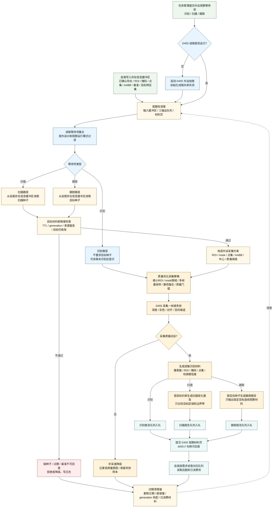
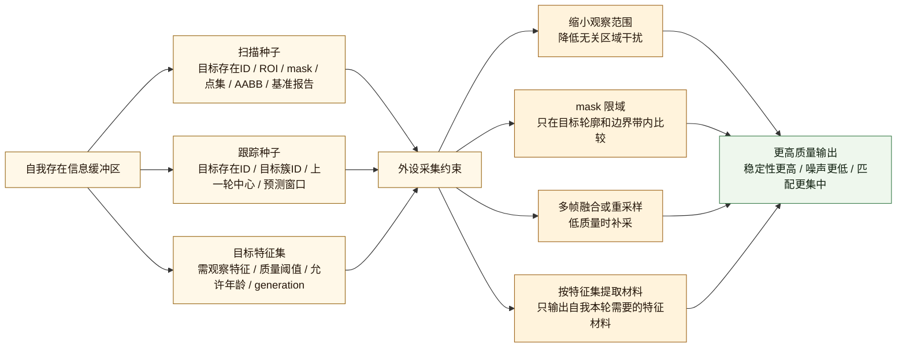
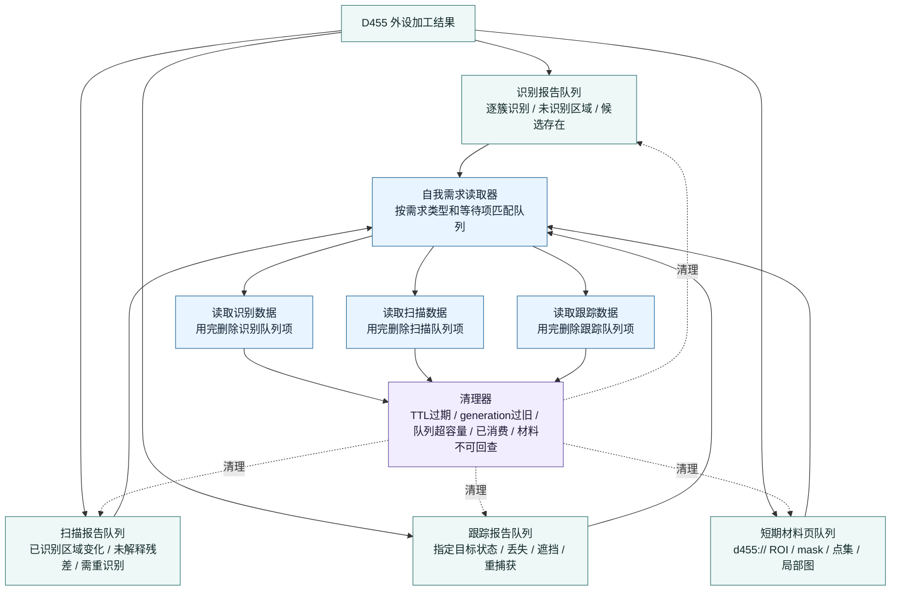

# D455 外设侧工作流程图 v0.2

更新时间：2026-06-06

## 用途

本图在 v0.1 的 D455 外设线程流程上，补入外设侧数据面：

```text
自我存在信息缓冲区
-> 外设按扫描 / 跟踪需要读取目标种子、ROI、掩码、点集、基准和目标特征集
-> 外设用这些约束提升采集和报告质量
-> 外设生成识别 / 扫描 / 跟踪三类输出队列
-> 自我按需求读取对应队列，用完删除，并清理过期数据
```

核心口径：

```text
自我给外设的是观察约束和已确认存在材料，不是最终真值；
外设给自我的是新鲜材料、候选和变化报告，不是需求满足结论；
缓存、队列和材料页都必须受 TTL / generation / 容量 / 已消费状态约束。
```

## 依据

- `规范/规范目录.md`
- `计划/计划索引.md`
- `规范/观察像素簇与存在候选分层规范20260527.md`
- `规范/当前场景特征值明确标准规范20260602.md`
- `外设线程_D455深度相机.ixx`
- `外设观察报告队列.ixx`
- `任务模块.管理界面线程.impl.cpp`
- `流程图/20260606_D455外设侧工作流程图_v0.1.md`
- `流程图/20260606_自我外设交互流程图_v0.1.md`

## 当前工程对照

```text
当前已有：
    结构_外设观察等待项：
        目标区域或目标簇
        最大允许报告年龄毫秒
        观察运行模式
        期望报告类型

    结构_外设观察队列共享状态：
        报告队列
        D455材料页队列
        等待项集合
        队列容量
        D455材料页容量
        D455材料页保留毫秒

    三类报告类型：
        逐簇识别报告
        扫描变化报告
        跟踪报告

需要补成明确契约：
    自我存在信息缓冲区；
    识别 / 扫描 / 跟踪三类逻辑输出队列或三类队列视图；
    自我消费后删除队列项；
    外设侧按 TTL / generation / 容量 / 已消费状态做清理；
    外设采集前读取缓冲区，用 ROI / mask / 点集 / 基准 / 目标特征集提升数据质量。
```

## 外设侧主流程 v0.2



## 缓冲区提升数据质量的逻辑



## 三队列与清理



## 数据结构口径

| 数据面 | 作用 | 外设侧用法 | 清理条件 |
| --- | --- | --- | --- |
| 自我存在信息缓冲区 | 存储自我提供的已确认存在信息 | 扫描读取 ROI / mask / 点集 / 基准；跟踪读取目标种子 / 预测窗口 / 目标特征集 | TTL 到期、generation 失配、来源报告不可回查、目标被替代 |
| 识别报告队列 | 存储外设生成的逐簇识别材料 | 供自我验证候选存在、确认归属 | 自我读取后删除；超过允许年龄删除；超容量裁剪 |
| 扫描报告队列 | 存储外设生成的已识别区域变化材料 | 供自我扫描已识别区域，提交发现事实或变化事实 | 自我读取后删除；目标约束过期删除；基准不可回查删除 |
| 跟踪报告队列 | 存储外设生成的指定目标连续观察材料 | 供自我跟踪指定存在，提交丢失、遮挡、重捕获或区间迁移事实 | 自我读取后删除；目标种子过期删除；主动跟踪对象切换时清理旧项 |
| 短期材料页队列 | 存储可回查 d455:// 材料 | 供自我按句柄回查 ROI、掩码、点集和局部图 | 过期时间到达删除；超容量删除最旧页 |

## 外设侧不负责

```text
1. 不直接写自我需求树。
2. 不直接写世界树真值。
3. 不直接确认已确认观察存在。
4. 不直接生成自我方法动作动态。
5. 不直接结算安全值 / 服务值。
6. 不把缓存中的自我存在信息当成外设自己的真值。
7. 不把识别 / 扫描 / 跟踪队列中的材料当作需求满足结论。
8. 不使用过期、generation 失配或材料不可回查的数据继续生成新鲜报告。
```

## 定案

```text
D455 外设侧 v0.2 的关键变化是：

外设线程不再只被动采集全帧并吐报告；
它应先读取自我存在信息缓冲区，
按扫描 / 跟踪需要取得目标种子、ROI、mask、点集、基准和目标特征集，
再用这些约束提升采集质量和报告质量。

外设输出必须进入识别 / 扫描 / 跟踪三类队列或三类队列视图；
自我按需求读取对应队列，用完删除；
清理器持续淘汰过期、超容量、已消费和不可回查材料。
```
