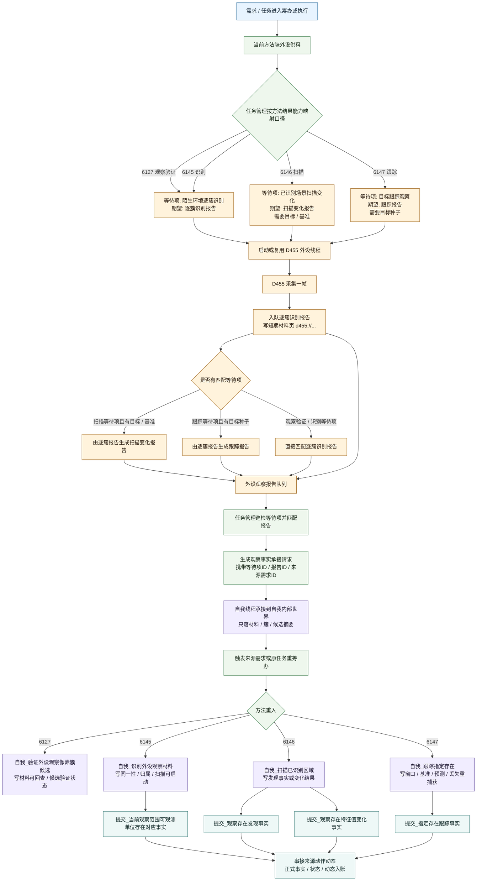
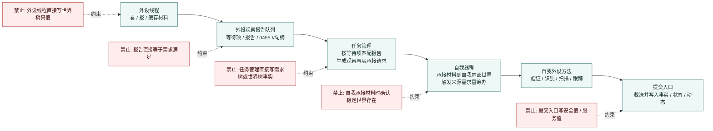

# 外设工作流程图 v0.1

更新时间：2026-06-06

## 用途

本图用于梳理当前 D455 / 外设工作链路：

```text
任务缺供料
-> 外设等待项
-> D455 报告
-> 任务管理承接
-> 自我材料落账
-> 四类外设相关方法重入
-> 提交入口正式入账
```

本图只描述当前代码与计划索引中的工作流程，不宣称 `6127 / 6145 / 6146 / 6147` 自然业务链已经全部闭合。

## 依据

- `规范/外设观察特征与自我场景认知本能方法分层规范20260525.md`
- `规范/双目相机外设独占观察线程规范20260527.md`
- `规范/双目相机外设功能能力与实现途径总结20260527.md`
- `规范/观察像素簇与存在候选分层规范20260527.md`
- `计划/计划索引.md`
- `任务模块.管理界面线程.impl.cpp`
- `任务模块.管理工作线程.ixx`
- `外设观察报告队列.ixx`
- `外设线程_D455深度相机.ixx`
- `自我线程模块.impl.cpp`
- `自我动作实现.外设模块.ixx`

## 总流程



## 分层边界



## 三类外显观察运行模式

| 运行模式 | 报告类型 | 主要用途 | 当前关键前置 |
| --- | --- | --- | --- |
| 陌生环境逐簇识别 | 逐簇识别报告 | 提供观察像素簇、材料句柄、候选与冲突材料 | 观察验证 / 识别等待项可直接匹配 |
| 已识别场景扫描变化 | 扫描变化报告 | 为已归属区域生成发现事实或变化材料 | 需要目标 / 基准；无目标时拒绝创建扫描等待项 |
| 目标跟踪观察 | 跟踪报告 | 为指定目标提供连续观察、丢失、重捕获材料 | 需要目标种子；无目标种子时拒绝创建跟踪等待项 |

## 四方法与提交入口

| 方法 | 本能ID | 读取材料 | 写出正式结果 | 后续提交入口 |
| --- | ---: | --- | --- | --- |
| 自我_验证外设观察像素簇候选 | 6127 | 最新 D455 逐簇识别报告、d455:// 材料句柄、簇投影与空间材料 | 外设观察材料可回查状态、外设像素簇候选验证状态、观察稳定状态摘要 | 为 6145 提供前置 |
| 自我_识别外设观察材料 | 6145 | 6127 验证状态、稳定复现 / 观察完成 / 可复验状态、逐簇识别报告 | 同一性状态、归属状态、候选确认方案、扫描可启动状态 | 提交_当前观察范围可观测单位存在对应事实 |
| 自我_扫描已识别区域 | 6146 | 已归属状态、扫描可启动状态、当前 / 历史观察存在 | 发现事实、扫描入账状态、变化结果、扫描基准 | 提交_观察存在发现事实；提交_观察存在特征值变化事实 |
| 自我_跟踪指定存在 | 6147 | 目标存在、已归属状态、目标观察窗口、跟踪基准、预测区间 | 目标跟踪状态、窗口状态、预测误差、丢失 / 重捕获状态 | 提交_指定存在跟踪事实 |

## 当前未闭合点

```text
计划索引当前主动切片是 P9c。

已确认：
    6127 / 6145 等待项和 D455 逐簇识别报告链存在。
    外设报告承接能按 来源需求ID 唤醒原等待任务。
    6127 已能重入执行到完成。

当前缺口：
    6145 已自然执行，但稳定复现 / 观察完成 / 可复验条件仍未自然闭合。
    6146 / 6147 仍需要已归属存在、基准、目标种子和观察窗口。
```

## 定案

```text
外设只供材料；
任务管理只承接报告并上报请求；
自我线程只先落材料和候选摘要；
自我外设方法生成正式中间结果；
提交入口才把事实、状态和动态写入账本。
```

不得把以下内容画成已经成立的事实：

```text
D455 报告 == 世界存在真值
观察像素簇 == 已确认观察存在
扫描变化报告 == 当前场景明确
跟踪报告 == 全场景安全
提交入口成功 == 需求满足 / 安全值 / 服务值结算
```
