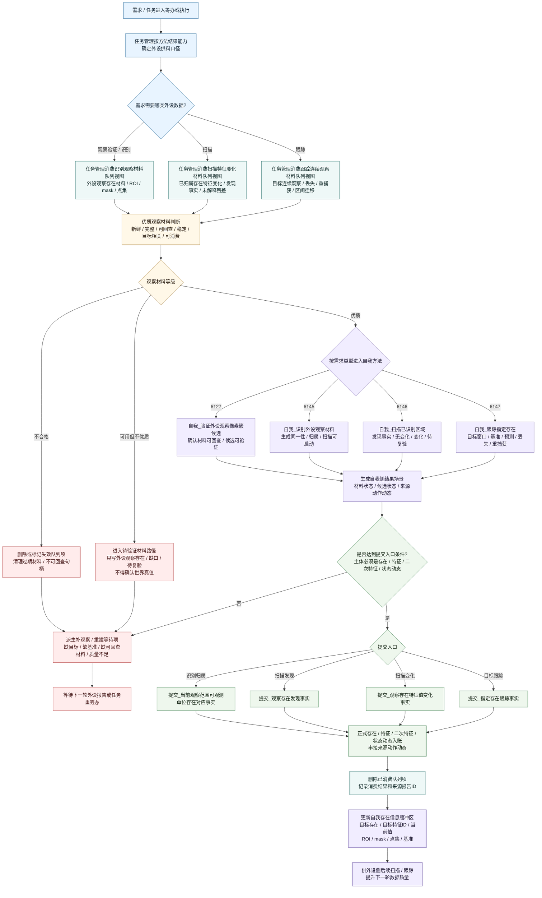
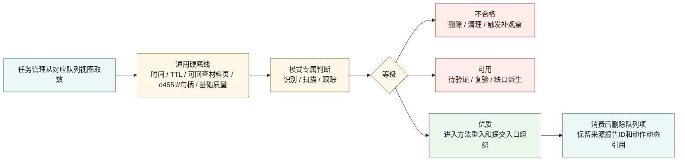
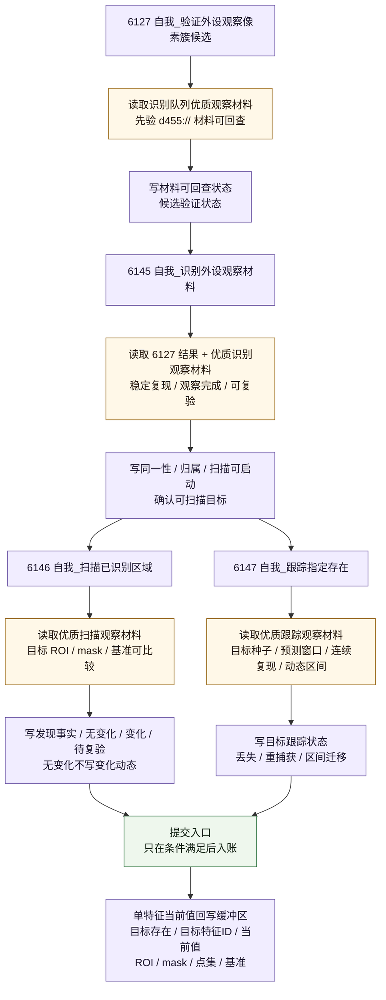

# 自我侧外设工作流程图 v0.2

更新时间：2026-06-06

## 用途

本图优化 v0.1 的自我侧流程，把“优质观察材料判断标准”接入任务管理承接和自我消费外设材料的过程：

```text
需求 / 任务需要外设供料
-> 任务管理按等待项 / 活跃需求读取识别 / 扫描 / 跟踪队列视图
-> 先做优质观察材料判断
-> 不合格材料删除并触发补观察 / 重建目标约束
-> 可用材料进入待验证 / 缺口派生
-> 优质观察材料进入自我外设方法重入
-> 自我生成结果场景
-> 提交入口正式入账
-> 已消费队列项删除，过期数据清理
-> 必要时把已确认存在的单特征当前值写入外设侧缓冲区
```

本图只描述任务管理承接、自我侧消费、判断、入账和回写外设缓冲区的流程；不宣称 `6127 / 6145 / 6146 / 6147` 自然业务链已经全部闭合。
`6127 / 6145 / 6146 / 6147` 的工程方法名保持当前代码口径，不按外部命名建议改名。

## 依据

- `规范/外设观察特征与自我场景认知本能方法分层规范20260525.md`
- `规范/双目相机外设独占观察线程规范20260527.md`
- `规范/双目相机外设功能能力与实现途径总结20260527.md`
- `规范/观察像素簇与存在候选分层规范20260527.md`
- `规范/当前场景特征值明确标准规范20260602.md`
- `计划/计划索引.md`
- `流程图/20260606_外设工作流程图_v0.1.md`
- `流程图/20260606_D455外设侧工作流程图_v0.2.md`
- `流程图/20260606_自我外设交互流程图_v0.1.md`
- `流程图/20260606_外设优质数据判断标准与依据_v0.1.md`
- `外设观察报告队列.ixx`
- `外设线程_D455深度相机.ixx`
- `自我动作实现.外设模块.ixx`
- `任务模块.管理界面线程.impl.cpp`

## 自我侧总流程 v0.2



## 优质观察材料判断接入点



## 三类队列视图的自我侧消费口径

| 队列视图 / 材料页 | 任务管理读取条件 | 优质观察材料判定重点 | 自我侧动作 | 用完处理 |
| --- | --- | --- | --- | --- |
| 识别观察材料队列视图 | 需求目标是观察验证、外设观察存在验证、观察存在确认、未知区域识别 | 队列项新鲜、材料可回查、外设观察存在材料有 ROI / mask / 点集 / 空间候选、轮廓质量达标 | 6127 验证材料；6145 识别同一性和归属 | 生成结果场景后删除已消费项；不合格项清理 |
| 扫描特征变化材料队列视图 | 需求目标是已识别区域扫描、发现事实、目标特征变化 | 目标上下文新鲜、基准可回查、目标 ROI / mask 可比较、首次扫描不生成变化动态 | 6146 写发现 / 无变化 / 变化 / 待复验；满足条件后进入发现或变化提交入口 | 提交或派生复验缺口后删除已消费项 |
| 跟踪连续观察材料队列视图 | 需求目标是指定存在跟踪、丢失、遮挡、重捕获、区间迁移 | 目标种子有效、命中目标、连续成功、复现离散度达标、目标质量达标、动态区间迁移合法 | 6147 写目标窗口、预测误差、丢失 / 重捕获 / 区间迁移 | 提交跟踪事实或派生前置缺口后删除已消费项 |
| 可回查观察材料页 | 自我按 d455:// 句柄回查 ROI、mask、点集、局部图 | 句柄可解析、材料未过期、类型匹配、材料未就绪时不得伪造 | 为 6127 / 6145 / 6146 / 6147 提供材料依据 | 按 TTL 和容量清理，不因材料页消费立即当真值 |
| 自我存在信息缓冲区 | 已确认存在的某一个目标特征需要外设继续扫描或跟踪 | 目标存在有效、目标特征ID明确、该特征当前值明确、来源报告可回查、generation 未失配 | 写入外设侧扫描 / 跟踪种子和单特征当前值，供外设提升下一轮数据质量 | 目标完成、替代、过期、撤销或该特征当前值被新版本替代时清理 |

## 自我侧方法优化后流程



## 提交入口边界

| 提交入口 | 允许消费 | 不允许消费 |
| --- | --- | --- |
| `提交_当前观察范围可观测单位存在对应事实` | 6145 生成的同一性 / 归属结果、来源动作动态、优质识别材料依据 | 直接消费外设逐簇报告并当作已确认存在 |
| `提交_观察存在发现事实` | 6146 首次扫描发现事实或发现特征事实 | 无基准时生成变化动态 |
| `提交_观察存在特征值变化事实` | 6146 在有可比历史后生成的变化结果 | 未变化、目标不确定、基准不可回查时提交变化 |
| `提交_指定存在跟踪事实` | 6147 指定目标跟踪结果、丢失 / 重捕获 / 区间迁移材料 | 用跟踪报告替代全场景扫描或安全结论 |

总规则：

```text
提交入口不接受“报告 / 包 / 队列项 / 材料页”作为事实主体；
提交入口只接受：
    存在；
    特征；
    二次特征；
    状态动态；
    以及它们的来源动作动态引用。
```

## 清理和删除机制

```text
自我读取队列后必须做两类清理：

1. 消费删除：
       队列项已被某个需求 / 任务消费；
       已生成结果场景、提交事实或派生缺口；
       删除对应识别 / 扫描 / 跟踪队列项，保留来源报告ID、来源动作动态和必要材料引用。

2. 过期清理：
       报告年龄超过等待项最大允许年龄；
       d455:// 材料页已过期或不可回查；
       自我存在信息缓冲区的目标已被替代、任务撤销或 generation 失配；
       队列超容量。
```

## 不合格 / 可用 / 优质的自我侧处置

| 等级 | 自我侧处置 | 是否允许提交入口 |
| --- | --- | --- |
| 不合格 | 删除或标记失效；生成补观察 / 缺目标 / 缺基准 / 材料不可回查缺口 | 不允许 |
| 可用但不优质 | 只进入候选、待验证、待复验、缺口派生；可写材料状态，不写最终事实 | 一般不允许；除非提交入口明确支持“发现事实”且不写变化 / 满足 |
| 优质 | 进入 6127 / 6145 / 6146 / 6147 方法重入；生成结果场景；满足条件后提交 | 允许，但仍必须经提交入口裁决 |

## 定案

```text
自我侧 v0.2 的核心变化：

外设报告、包、队列项和材料页不再被自我直接当作正式事实；
任务管理必须先按需求和等待项从识别 / 扫描 / 跟踪队列视图取数，
再按优质观察材料标准分级。

不合格观察材料：
    删除、清理、派生补观察；

可用但不优质观察材料：
    只作为外设观察存在、待验证或待复验材料；

优质观察材料：
    进入自我外设方法，生成结果场景，再由提交入口入账。

自我侧消费完成后删除队列项；
同时把已确认存在的某一个目标特征当前值，
连同 ROI / mask / 点集 / 基准等必要回查约束写入外设缓冲区，
供外设侧下一轮扫描或跟踪取得更高质量观察材料。
```

不得把以下内容画成已经成立的事实：

```text
写入外设缓冲区 == 提交存在全量快照
优质外设观察材料 == 世界存在真值
优质扫描材料 == 当前场景明确
优质跟踪材料 == 全场景安全
队列数据被读取 == 需求满足
提交入口成功 == 安全值 / 服务值结算
报告 / 包 / 队列项 / 材料页 == 正式事实主体
```
