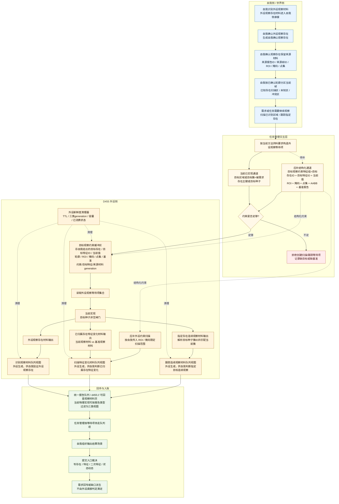
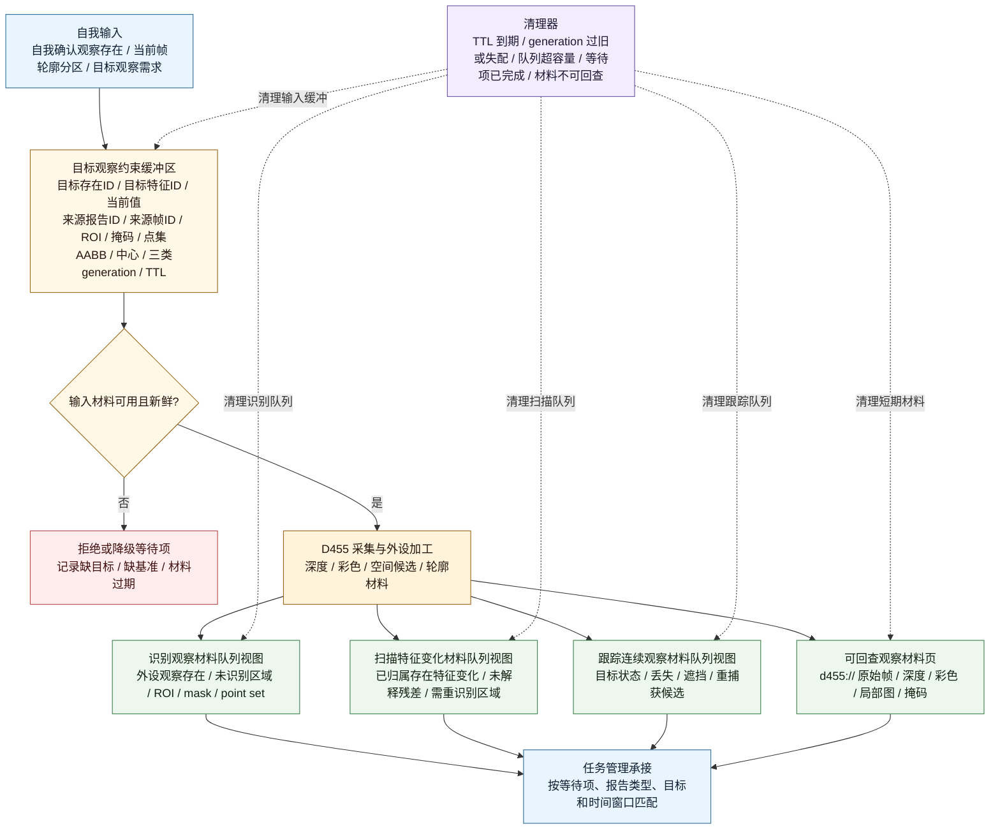

# 自我外设交互流程图 v0.1

更新时间：2026-06-06

## 用途

本图补前两张图没有画清楚的中间层：

```text
自我已识别 / 已确认一个自我确认观察存在
-> 回查该存在的轮廓、ROI、掩码、点集、扫描基准
-> 形成外设观察意图或等待项
-> 外设按目标约束扫描 / 跟踪
-> 外设回传材料
-> 自我再组织结果场景并提交入账
```

这里的关键不是外设单向供报告，而是自我和外设之间存在双向交互：

```text
自我给外设目标观察约束特征组；
外设给自我观察材料；
自我负责判断、组织、提交和因果入账。
```

## 依据

- `规范/规范目录.md`
- `计划/计划索引.md`
- `计划/20260602_外设三分法技术储备与实施路线_v0.1.md`
- `计划/20260604_外设三分法真实D455样本实施切片计划_v0.1.md`
- `计划/完成项/20260529_R3外设相机能力接入自我内外交互桥实施计划_v0.1.md`
- `外设观察报告队列.ixx`
- `任务模块.管理界面线程.impl.cpp`
- `外设线程_D455深度相机.ixx`
- `自我动作实现.外设模块.ixx`

## 当前结论

```text
已实现：
    外设观察材料侧已经有 ROI / 掩码 / 点集 / 空间候选等可回查材料句柄；
    任务管理可以把来源需求的被需求存在写入 外设观察等待项.目标区域或目标簇；
    D455 扫描 / 跟踪等待项至少要求目标种子非空；
    自我侧已有 按已确认轮廓分区当前帧 的方法，能把已确认存在与下一帧轮廓做区域归属；
    当前共享状态里有统一报告队列、D455材料页队列、等待项集合；
    统一报告队列按容量裁剪，D455材料页按容量和过期时间清理，等待项完成后删除。

未完全实现：
    还没有完整的结构化入参把
        某一目标特征当前值 / 已确认存在轮廓 / ROI / 掩码 / 点集 / 基准报告 / 阈值
    作为一个目标观察约束特征组交给外设线程，
    因此当前扫描更接近按目标种子和跨帧报告比较，
    不是严格的 外设按自我传入 mask 限定扫描；
    还没有把外设侧明确拆成
        目标观察约束缓冲区
        识别观察材料队列视图
        扫描特征变化材料队列视图
        跟踪连续观察材料队列视图
        统一清理器
    这组契约结构。
```

## 双向交互总图



## 外设侧缓冲区与三队列结构



## 用户例子的流程

用户例子：

```text
自我识别了一个存在，
将存在的轮廓交互给外设做掩码，
以进行扫描。
```

对应流程应画成：

```mermaid
flowchart LR
    A["自我确认观察存在 E<br/>来源于外设观察材料"]
    B["回查 E 的目标特征当前值和局部材料<br/>目标特征ID / 当前值 / 轮廓 / ROI / 掩码 / 点集 / AABB / 来源帧"]
    C["生成扫描约束意图<br/>只扫描 E 的已知覆盖区域和边界带"]
    D["任务管理构造等待项"]
    E["当前可落字段<br/>目标区域或目标簇=E 的主键或簇种子"]
    F["应补字段<br/>目标轮廓约束特征 / 目标掩码特征"]
    G["D455 按约束采集下一帧<br/>用 ROI / mask 缩小扫描范围"]
    H["比较基准与当前材料<br/>像素归属 / 深度 / 轮廓 / 空间位置变化"]
    I["返回扫描特征变化材料队列项<br/>变化 / 未解释残差 / 遮挡 / 需重识别"]
    J["自我扫描已识别区域<br/>组织结果场景"]
    K["提交入口写入事实与动作动态<br/>不直接写需求满足结论"]

    A --> B --> C --> D --> E
    D -.当前缺口.-> F
    E --> G
    F -.完整契约.-> G
    G --> H --> I --> J --> K

    classDef self fill:#e8f4ff,stroke:#2f6f9f,color:#102030;
    classDef task fill:#fff8e8,stroke:#9a6a1a,color:#24160a;
    classDef d455 fill:#fff3dc,stroke:#a0671e,color:#24160a;
    classDef back fill:#eef7ed,stroke:#3f7f4f,color:#102010;
    classDef gap fill:#ffecec,stroke:#b84a4a,color:#401111;

    class A,B,C,J,K self;
    class D,E,F task;
    class G,H,I d455;
    class F gap;
```



## 交互字段口径

| 材料 / 字段 | 当前位置 | 当前含义 | 交互判断 |
| --- | --- | --- | --- |
| `目标区域或目标簇` | `结构_外设观察等待项` | 任务管理从来源需求的被需求存在填入目标主键或目标种子 | 已有粗粒度目标通道；不是结构化轮廓 / 掩码包 |
| `ROI引用` / `点集引用` / `空间候选引用` | `结构_外设观察像素簇摘要` | D455 报告侧输出的可回查材料句柄 | 已有外设到自我的材料通道 |
| `像素集合掩码句柄` / `彩色轮廓局部图句柄` / `深度轮廓局部图句柄` | `结构_外设观察像素簇摘要` | D455 报告侧输出的局部观察材料句柄 | 已有外设输出掩码材料；还不是自我给外设的扫描入参 |
| `自我_按已确认轮廓分区当前帧` | `自我动作实现.外设模块.ixx` | 用已确认存在和最新 D455 逐簇识别报告做当前帧区域归属 | 已有自我侧轮廓分区；可作为生成扫描区的上游 |
| 目标观察约束特征组 | 当前未形成独立结构 | 应包含目标存在ID、目标特征ID、该特征当前值、来源报告、来源帧、ROI、掩码、点集、AABB、约束generation、目标特征generation、来源材料generation、TTL、质量阈值 | 这是用户例子要补的关键交互契约；工程通信层可以打包传输，正式语义是特征组；按单特征增量提交，不做存在全量快照 |
| 扫描变化报告 | `D455_从逐簇识别报告生成扫描变化报告` | 基于当前 / 基准逐簇报告输出新增、消失、变化、高风险未知 | 已有扫描材料报告；尚未严格绑定自我传入 mask 进行局部扫描 |

## 缓冲区和队列口径

| 结构 | 数据来源 | 消费方 | 新鲜度规则 |
| --- | --- | --- | --- |
| 目标观察约束缓冲区 | 自我 / 任务管理写入的单个存在、单个目标特征当前值、轮廓、ROI、掩码、点集、基准报告 | 外设扫描 / 跟踪线程 | TTL 到期、来源报告过期、约束generation / 目标特征generation / 来源材料generation 不匹配、目标存在已被替代或该特征当前值被新版本替代时清理 |
| 识别观察材料队列视图 | D455 外设观察存在材料生成 | 自我验证外设观察材料、确认观察存在归属 | 按容量裁剪；超过可用时间窗口后不得匹配等待项 |
| 扫描特征变化材料队列视图 | D455 基于已知区域 / 目标约束生成 | 自我扫描已识别区域、提交存在特征变化事实 | 需要目标约束和基准；目标约束过期则报告失效 |
| 跟踪连续观察材料队列视图 | D455 基于指定目标种子生成 | 自我跟踪指定存在、提交目标连续观察事实 | 一次主动目标跟踪只消费匹配目标；目标丢失或种子过期则清理或重建 |
| 可回查观察材料页 | D455 队列项入队时同步提交 | 自我按 d455:// 句柄回查 ROI / 掩码 / 点集 / 局部图 | 当前代码已有容量和过期时间清理；过期后句柄只能返回过期状态 |

当前代码物理上可以继续是一个 `报告队列` 按报告类型过滤；逻辑上必须保持识别 / 扫描 / 跟踪三类队列视图，避免识别、扫描、跟踪材料互相污染。

## 边界

```text
1. 自我传给外设的是某一存在某一目标特征的当前值和必要观察约束，不是存在全量快照，也不是需求满足结论。
2. 外设按约束扫描后输出的是观察材料队列项，不是世界真值。
3. 自我必须通过本能方法组织结果场景，再经提交入口裁决写存在、特征、二次特征和状态动态。
4. 如果目标轮廓、扫描基准或材料句柄不可回查，应生成缺口或拒绝等待项，不伪造扫描成功。
5. 轮廓分区可以生成已知存在扫描区；目标跟踪必须另有明确目标种子。
6. 外设侧缓存和队列都必须有清理机制；过期材料不能继续作为新鲜观察证据。
```

## 定案

```text
前两张图缺的是这条交互层：

自我确认存在
-> 单个目标特征当前值 + 轮廓 / ROI / 掩码 / 点集材料成为目标观察约束特征组
-> 任务管理把目标约束交给外设
-> 外设按约束扫描或跟踪
-> 队列项回到任务管理 / 自我侧
-> 自我提交存在、特征、二次特征和状态动态

当前代码已有粗粒度目标种子和外设输出材料句柄；
下一步若要实现用户例子的完整链路，
应补：
    目标观察约束缓冲区；
    识别 / 扫描 / 跟踪三类队列视图；
    队列视图和可回查观察材料页的统一清理机制；
    结构化目标观察约束特征组，并让 D455 扫描特征变化材料消费该约束。

P0 实施项：
    实现目标观察约束特征组；
    保持一个目标存在、一个目标特征、一个当前值、一组观察约束；
    不实现成存在全量快照。
```

## 因果链

```text
自我确认观察存在.目标特征当前值
    + ROI / 掩码 / 点集 / AABB / 基准
        -> 目标观察约束特征组

目标观察约束特征组
    + 外设等待项
        -> D455 约束采集

D455 约束采集
    + 优质观察材料判断通过
        -> 识别 / 扫描 / 跟踪队列视图项

队列视图项被需求消费
    + 自我方法组织结果场景
    + 提交入口裁决通过
        -> 正式存在特征 / 二次特征 / 状态动态入账

正式入账结果
    -> 更新单特征当前值
    -> 回写目标观察约束缓冲区
    -> 提升下一轮外设观察质量
```
