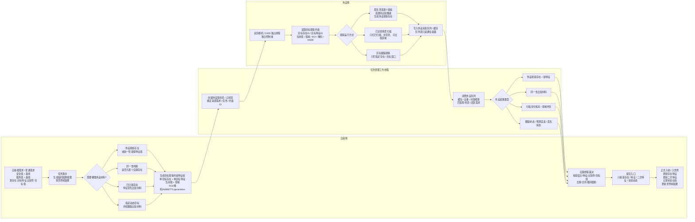
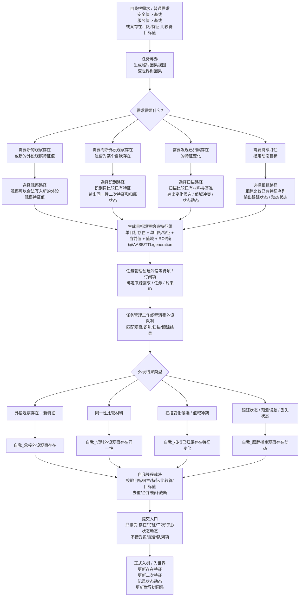
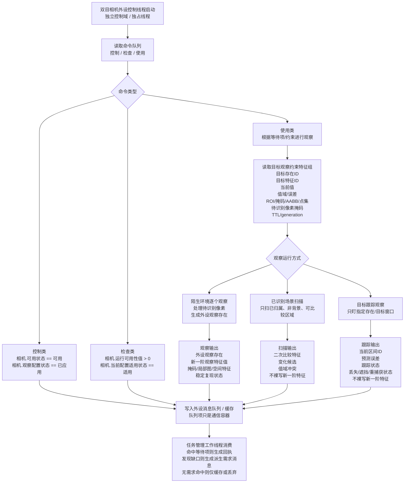
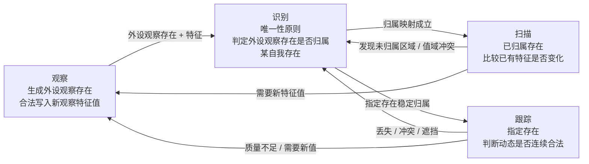
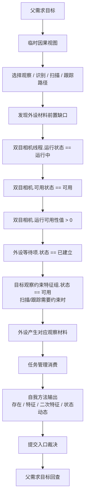

# 相机外设综合工作流程图 v0.1

更新时间：2026-06-07

适用范围：双目相机 / D455 类感知外设。本文只整理规范口径，不证明代码已实现。

核心定案：

```text
自我给外设观察约束，外设给自我外设观察存在；
任务管理分拣消息，自我裁决入账。

正式认知链只承接：
    存在
    特征
    二次特征
    状态动态

包 / 报告 / 队列项只是线程通信容器，不能作为正式世界事实。
```

## 1. 综合总图



## 2. 自我侧综合流程图



## 3. 外设侧综合流程图



## 4. 四个本能方法关系图



## 5. 三种相机运行方式

```text
陌生环境逐个观察：
    处理待识别像素；
    生成外设观察存在、新一阶观察特征值、掩码、局部图、空间特征和稳定复现状态。

已识别场景扫描变化：
    只扫已归属、非背景、可比较区域；
    输出变化候选、值域冲突、无变化事实和下一轮基准更新线索；
    不直接确认新存在。

目标跟踪观察：
    只盯指定存在 / 目标窗口；
    输出跟踪状态、预测误差、丢失 / 遮挡 / 重捕获状态；
    不把外设内部跟踪ID写成自我世界存在ID。
```

## 6. 待识别像素与过滤

```text
粗待识别像素 =
    全部像素 - 已归入外设观察存在的像素

净待识别像素 =
    粗待识别像素
    - 背景像素
    - 不可观测区域像素
    - 低价值区域像素
```

过滤输入：

```text
已观察完成掩码
已归属存在掩码
背景过滤掩码
待识别像素掩码
扫描候选掩码
跟踪目标掩码
空间占位过滤集合
```

## 7. 识别唯一性原则

```text
当前识别范围状态 == 已确定
外设观察存在.可复验状态 == 可复验
候选集合数量 == 1
硬冲突数量 == 0
用于唯一识别特征数量 > 0
归属映射状态 == 已建立
```

只要一个特征或多个特征组合能够在当前场景范围内确定唯一存在，就可以完成识别。

```text
候选数量 > 1:
    继续使用已有特征缩小候选。

已有特征不足以唯一:
    进入观察补完。

唯一但硬冲突 > 0:
    进入观察复验。
```

## 8. 基准规则

```text
初始基准
当前有效基准
滚动基准
```

基准更新条件：

```text
匹配状态 == 匹配
丢失状态 == 未丢失
关键特征误差值 < 最大允许误差
连续稳定帧数 > 最小稳定帧数
非法区间跳变次数 == 0
质量状态 == 可用 / 降级可用
```

基准冻结条件：

```text
掩码重合率 < 最低掩码重合率
轮廓偏差 > 最大允许轮廓偏差
当前值超出特征值域
目标区域待识别像素增加
疑似拆分 / 合并 / 遮挡
```

## 9. 启动相机外设运行的需求因果



## 10. 合法来源规则

```text
所有特征值必须有合法来源。
所有阈值必须有来源。
所有枚举状态必须有量化判定规则。
所有状态动态必须有输入特征、输出特征、来源方法和来源需求。
```

示例：

```text
外设观察存在.匹配状态 == 匹配
```

必须由：

```text
匹配评分 > 最低匹配评分
硬冲突数量 == 0
连续匹配帧数 > 最小连续匹配帧数
```

推出。

## 11. 实时性和舍弃策略

可以舍弃：

```text
过期扫描材料
重复扫描材料
无需求命中的材料
低优先级局部细分
中间跟踪帧
低优先级配置学习样本
```

不能舍弃：

```text
安全事件
活跃任务回执
状态跃迁
跟踪目标丢失
外设错误
影响父需求判断的缺口事实
```

## 12. 最终定案

```text
自我决定看什么、为什么看、结果是否入账；
相机负责按约束稳定给出外设观察存在和可比较特征；
观察写新值，识别定唯一，扫描记变化，跟踪守动态。
```
