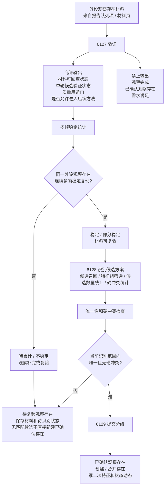
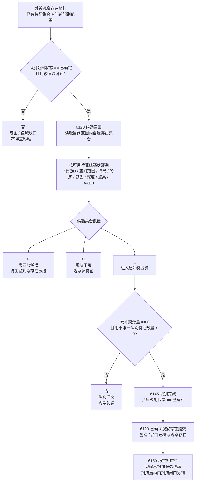
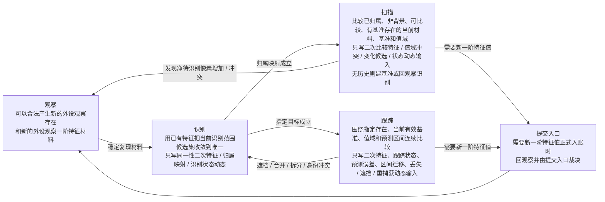
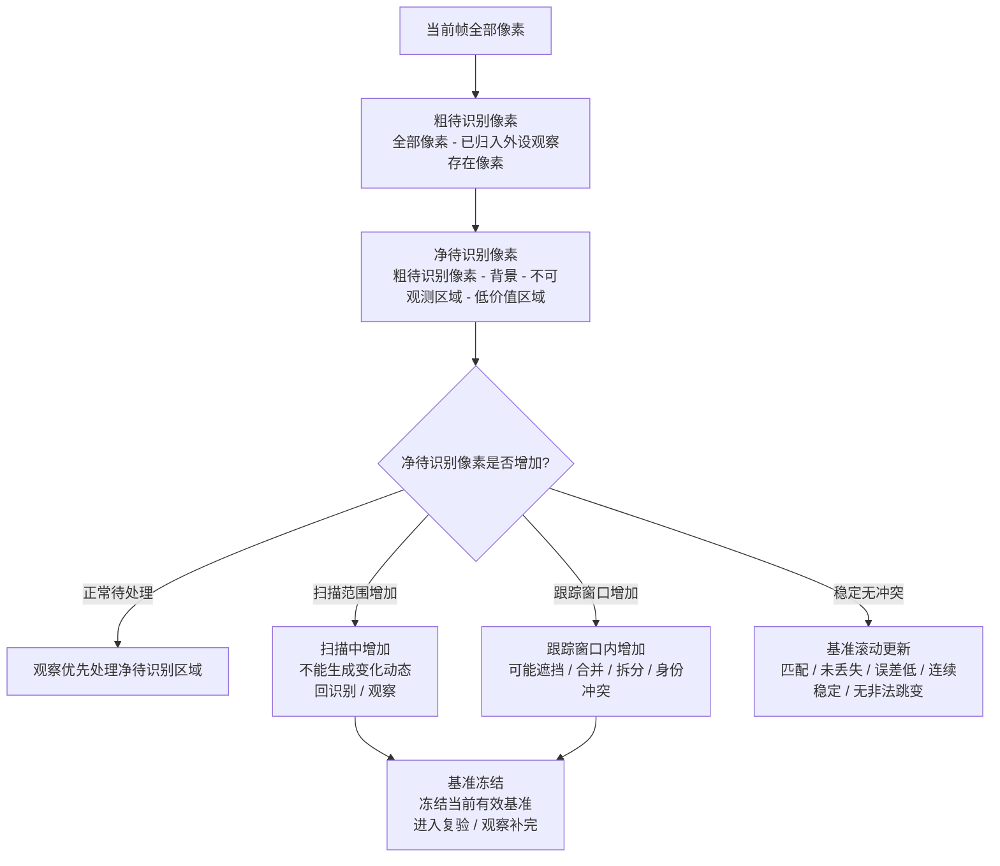
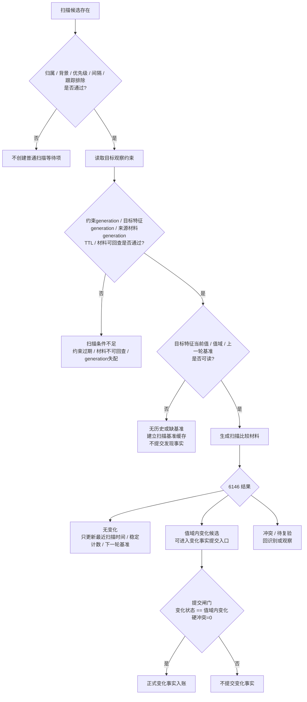
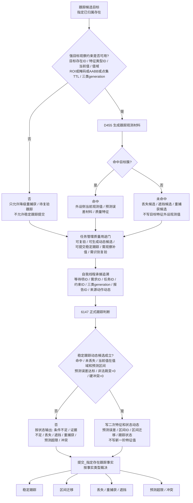

# 相机外设综合工作流程图 v0.2

更新时间：2026-06-07

适用范围：双目相机 / D455 类感知外设。本文是 v0.1 的修正版，只表达目标流程和修正边界，不证明代码已经全部实现。

核心定案：

```text
当前代码主链保留：
    外设产材料 -> 任务管理分拣 -> 自我承接候选 -> 6127 验证 -> 6128 生成识别候选方案 -> 6129 分级提交观察存在事实

修正方向：
    把报告驱动的单帧承接升级为：
        特征约束驱动的多帧观察
        当前识别范围内唯一识别
        低成本扫描
        指定目标跟踪
        分级提交入账

正式认知链只承接：
    存在
    特征
    二次特征
    状态动态

报告 / 包 / 队列项 / 材料页 / 目标观察约束：
    只是通信、缓存或约束容器，不能作为正式世界事实主体。
```

## 1. 修正后综合总图

```mermaid
flowchart LR
    subgraph NEED["需求与约束层"]
        A["父需求目标<br/>需要外设观察材料"]
        B["临时因果视图<br/>选择观察 / 识别 / 扫描 / 跟踪路径"]
        C["目标观察约束缓冲区<br/>单目标 + 单特征 + 当前值<br/>ROI / 掩码 / 点集 / AABB<br/>约束generation / 目标特征generation / 来源材料generation"]
        D["外设等待项 / 订阅项<br/>绑定来源需求 / 任务 / 约束ID"]
    end

    subgraph DEVICE["D455 外设侧"]
        E["读取等待项和目标观察约束<br/>约束不是世界真值"]
        F{"运行方式"}
        F1["观察<br/>优先处理净待识别像素<br/>生成外设观察存在及一阶观察特征材料"]
        F2["扫描<br/>只处理已归属、非背景、可比较、有基准区域<br/>输出扫描比较材料 / 值域内变化候选 / 冲突待复验线索<br/>不发现新存在 / 不写新一阶特征值"]
        F3["跟踪<br/>只处理指定存在窗口<br/>输出跟踪观测材料 / 外设侧当前观测值 / 预测误差材料 / 丢失遮挡重捕获候选<br/>不写目标正式一阶特征值"]
        G["写外设队列项和材料页<br/>工程容器，不是正式事实"]
    end

    subgraph TM["任务管理承接层"]
        H["队列视图消费<br/>识别 / 扫描 / 跟踪"]
        I["质量用途门<br/>可进入验证<br/>可进入识别<br/>可生成扫描变化候选<br/>可生成跟踪动态候选<br/>可进入提交入口组织"]
        J{"用途门结果"}
        J1["不合格<br/>普通目标清理或回执<br/>命中活跃父需求关键缺口时上报缺口"]
        J2["可用<br/>进入 6127 / 待识别 / 待复验<br/>不生成正式变化动态"]
        J3["优质<br/>可进入扫描 / 跟踪候选<br/>可进入提交入口组织<br/>仍需提交入口裁决"]
    end

    subgraph SELF["自我方法与提交层"]
        K["6127 单轮验证<br/>材料可回查<br/>候选一致性<br/>单轮质量等级"]
        L["多帧稳定统计<br/>连续稳定帧 / 关键误差<br/>丢失 / 漂移 / 拆分 / 合并 / 冲突"]
        M["6128 识别候选方案<br/>候选召回 / 特征组筛选<br/>无匹配候选 / 候选唯一 / 冲突 / 证据不足"]
        N["唯一性判定<br/>识别范围已确定<br/>候选数量=1<br/>硬冲突=0<br/>用于唯一识别特征>0<br/>归属映射已建立"]
        O["6129 分级提交"]
        O1["待复验观察存在入账<br/>待复验 / 待识别 / 待归属<br/>保存材料，不写已确认真值"]
        O2["已确认观察存在入账<br/>创建或合并已确认观察存在<br/>写关系二次特征和状态动态"]
        P["正式入世界 / 入因果账本<br/>存在 / 特征 / 二次特征 / 状态动态"]
    end

    A --> B --> C --> D --> E --> F
    F --> F1 --> G
    F --> F2 --> G
    F --> F3 --> G
    G --> H --> I --> J
    J --> J1
    J --> J2 --> K
    J --> J3 --> K
    K --> L --> M --> N --> O
    O --> O1 --> P
    O --> O2 --> P
```



## 2. 6127 / 6128 / 6129 修正闸门



## 3. 识别唯一性专项闸门



识别完成条件：

```text
候选集合数量 == 1
硬冲突数量 == 0
用于唯一识别特征数量 > 0
归属映射状态 == 已建立
```

非完成分支：

```text
候选数量 > 1：
    证据不足，回观察补特征。

候选数量 == 0：
    无匹配候选，只能进入待复验观察存在承接。

候选唯一但硬冲突数量 > 0：
    识别冲突，回观察复验。
```

固定匹配分数只保留为默认视觉特征组评分：

```text
投影重叠率 / 中心距离 / 深度差
最低同一性评分
最低唯一性分差
最小同一性证据帧数
```

上述阈值应来自识别策略特征值，不应写死成所有识别场景共用的唯一原则。

## 4. 识别、扫描、跟踪的正式语义



## 5. 待识别像素与基准冻结



## 6. 质量用途门

| 等级 | 允许用途 | 禁止用途 |
| --- | --- | --- |
| 不合格 | 普通目标清理、错误日志、回执或重建等待项；若命中活跃父需求关键缺口，则上报缺口事实或派生需求消息 | 生成稳定正式动态、进入稳定提交入口 |
| 可用 | 6127 验证、识别待复验、材料保存、观察补完 | 正式扫描变化动态、稳定跟踪动态、已确认观察存在入账 |
| 优质 | 扫描变化候选、跟踪动态候选、提交入口组织候选 | 绕过多帧稳定、唯一性、硬冲突和提交入口裁决 |

## 7. 扫描专项闸门



## 8. 跟踪专项闸门



跟踪基准管理：

```text
稳定命中、未丢失、预测误差达标、连续命中足够、非法跳变为 0、质量可用：
    允许滚动更新当前有效基准。

未命中、丢失、遮挡、待识别像素增加、值域冲突、身份冲突、预测误差超限：
    冻结当前有效基准；
    不提交稳定动态；
    回重捕获 / 识别 / 观察。
```

## 9. 最终边界

```text
报告生成 != 事实成立。
报告优质 != 已确认观察存在。
单帧可回查 != 观察完成。
观察完成 != 识别完成。
新建方案 != 已确认观察存在。
无匹配候选 != 可以直接新建已确认观察存在。
识别完成 != 新一阶特征值已写入。
识别完成 == 当前范围候选唯一 + 无硬冲突 + 归属映射已建立。
扫描 / 跟踪 != 新一阶特征生产者。
跟踪报告 != 正式跟踪事实。
外设侧当前观测值 != 目标存在正式特征值。
无强目标观察约束 != 可以提交稳定跟踪事实。
未命中目标簇 != 普通跟踪成功报告。
跟踪失败 != 全部是条件不足；丢失、遮挡、预测超限和冲突可能是状态动态。
扫描无历史 != 发现事实。
变化状态 != 未变化 != 可以提交变化事实。
队列项消费 != 需求满足。
提交入口成功 != 安全值 / 服务值结算。
```
