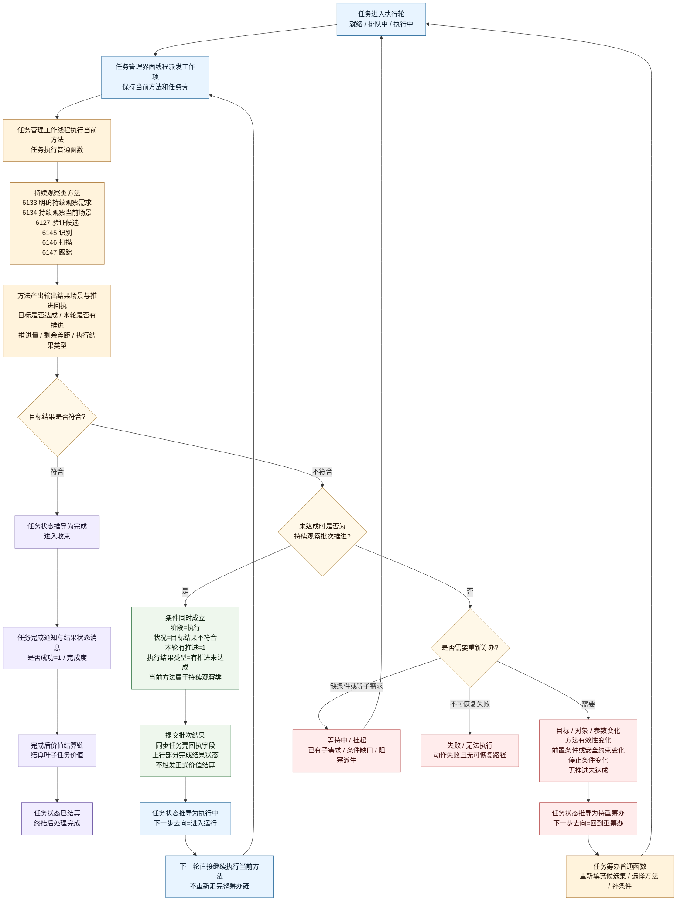
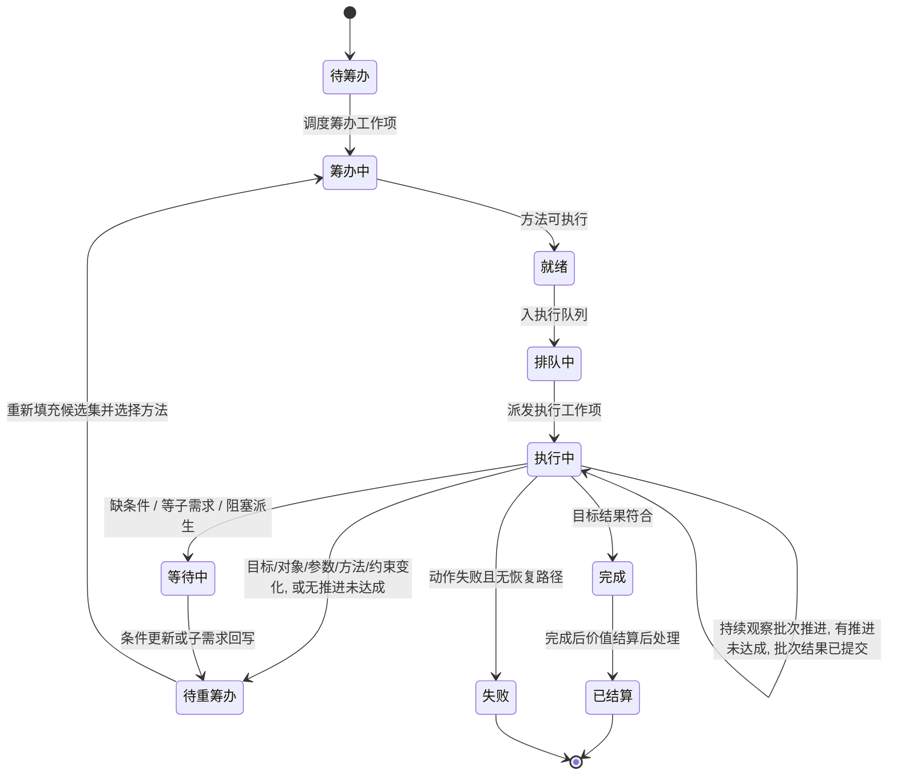

# 持续观察批次结果提交任务管理流程图 v0.1

更新时间：2026-06-08

## 用途

本图用于固化“持续执行、批次提交结果、未完成不结算”的任务管理口径。

重点边界：

- `已结算` 仍是任务完成后的价值结算后处理状态，不用于批次结果提交。
- 观察、识别、扫描、跟踪等持续观察类方法在执行阶段产出 `有推进未达成` 时，任务保持 `执行中`，下一轮继续执行。
- `待重筹办` 保留给目标、对象、参数、方法有效性、前置条件、安全约束或停止条件变化等需要重新筹办的场景。
- 批次结果可以同步到任务壳和上行结果状态消息，但不等同于安全值 / 服务值正式结算。

依据：

- `规范/任务筹办与执行边界规范20260512.md`
- `规范/安全服务值结算规范20260518.md`
- `任务模块.管理工作线程.ixx`
- `任务模块.管理界面线程.impl.cpp`
- `本能方法类.h`

## 任务管理执行回路

## 状态机口径

## 当前代码落点

| 逻辑点 | 当前代码口径 |
| --- | --- |
| 批次推进识别 | `私有_任务推进回执是持续观察批次推进` |
| 覆盖的方法范围 | 持续观察需求、持续观察当前场景、验证候选、识别、扫描、跟踪 |
| 批次推进状态 | `目标结果不符合 + 有推进未达成` 推导为 `执行中` |
| 下一步去向 | `执行中` 与 `就绪`、`排队中` 一样进入可运行路径 |
| 重新筹办状态 | 非持续观察批次推进或显式需要重筹办时仍为 `待重筹办` |
| 正式价值结算 | 仍要求任务完成后走结算链，不由批次结果提前触发 |
