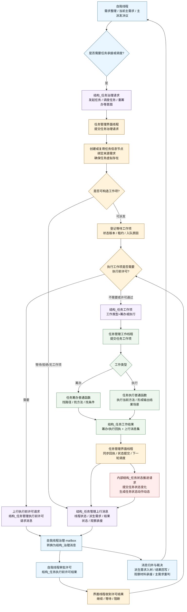
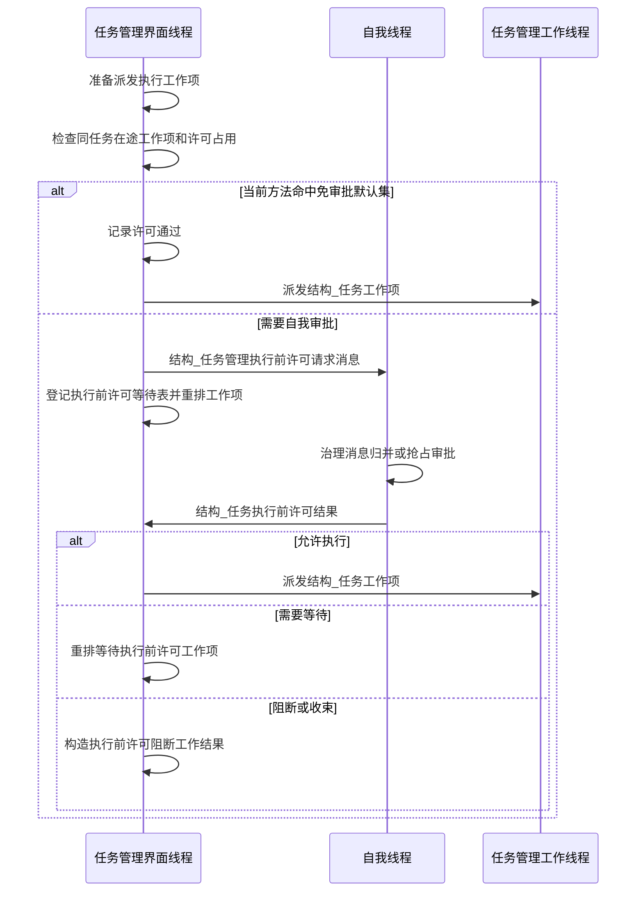
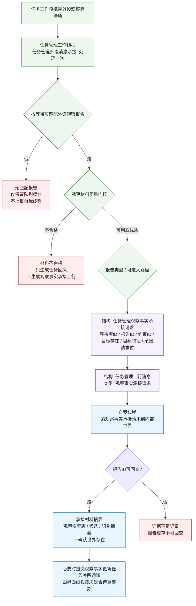
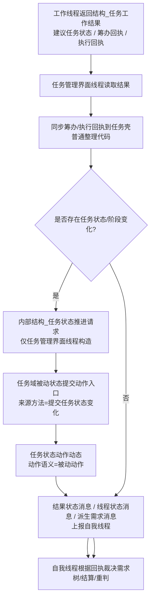

# 三线程消息传递清单与流程图 v0.1

更新时间：2026-06-09

## 用途

本文按当前规范和代码，重新梳理以下三者之间通过消息传递的信息：

- 自我线程
- 任务管理界面线程
- 任务管理工作线程

本文只整理消息边界和数据流，不作为“自我苏醒完成”“初步成熟完成”或业务链路验收通过证明。

## 依据

- `规范/规范目录.md`
- `规范/方法动作动态硬规则规范20260512.md`
- `规范/自我线程与任务管理线程权责边界规范20260512.md`
- `规范/任务筹办与执行边界规范20260512.md`
- `规范/自我内部循环实现规范20260512.md`
- `规范/需求树生长机制规范20260512.md`
- `规范/任务筹办父方法与协作子方法链规范20260513.md`
- `规范/任务筹办按方法能力查找到就绪因果链规范20260513.md`
- `规范/外设独立控制线程与消息承接边界规范20260527.md`
- `规范/相机外设综合工作流程规范20260607.md`
- `任务模块.管理线程协议.ixx`
- `任务模块.工作线程消息协议.ixx`
- `自我线程模块.消息协议.ixx`
- `任务模块.管理界面线程.impl.cpp`
- `任务模块.管理工作线程.ixx`
- `自我线程模块.impl.cpp`

## 总边界

| 层级 | 负责什么 | 可以发出的跨线程信息 | 禁止事项 |
| --- | --- | --- | --- |
| 自我线程 | 需求树、需求估权、任务发起意图、调度意图、执行前许可、任务回执后的需求裁决 | `结构_任务治理请求`、观察事实更新唤醒通知、父任务等待条件变化通知、任务价值结算完成通知、`结构_任务执行前许可结果` | 不直接写任务状态、当前方法、候选方法集、执行输入参数场景、筹办/执行缺口 |
| 任务管理界面线程 | 任务请求承接、任务虚拟存在维护、工作项构造、调度队列、状态提交、上行消息桥接 | `结构_任务工作项`、`结构_任务管理上行消息`、内部 `结构_任务状态推进请求` | 不直接写需求树；不得把线程当动作动态来源；不得让自我线程构造目标任务状态推进请求 |
| 任务管理工作线程 | 执行一轮筹办或执行工作包，承接外设等待项，生成工作结果与上行消息 | `结构_任务工作结果`、`结构_任务管理上行消息` 中的派生需求/结果状态/观察事实承接请求/执行前许可请求 | 不裸写任务状态、需求树或世界真值；不把外设报告直接解释成需求满足或世界事实 |

核心口径：

```text
自我线程发意图和许可。
任务管理界面线程承接意图、裁决任务域状态并派发工作项。
任务管理工作线程只跑一轮筹办 / 执行 / 外设承接，返回回执和上行材料。
任务状态动作动态必须由任务域被动状态提交动作入口生成，来源方法固定为 提交任务状态变化。
```

## 消息清单

### 1. 自我线程 -> 任务管理界面线程

| 信息 | 当前结构 / 入口 | 主要字段 | 允许表达 | 不得表达 |
| --- | --- | --- | --- | --- |
| 任务发起意图 | `结构_任务治理请求` + `任务管理界面线程::提交任务治理请求` | `请求类型=发起任务`、`来源需求`、`发起存在`、`作用对象`、`所属场景`、`允许创建任务信息节点`、`允许创建任务虚拟存在`、`允许派发工作线程`、`幂等键` | 某个正式需求需要任务承接；允许任务管理创建任务信息节点和任务虚拟存在 | 不写任务状态为筹办中/就绪/完成；不直接创建任务虚拟存在 |
| 任务调度意图 | `结构_任务治理请求` + `提交任务治理请求` | `请求类型=调度任务`、`任务信息节点`、`来源需求`、`允许派发工作线程`、`请求摘要` | 当前主任务建议进入任务管理调度；让界面线程根据任务状态构造工作项 | 不指定下一任务状态；不绕过任务管理队列同步消费工作项 |
| 重筹办 / 等待 / 取消 / 权重类治理意图 | `结构_任务治理请求` | `请求类型=重筹办任务/等待任务/取消任务/更新权重`、`任务信息节点`、`来源需求`、权重/判据字段 | 任务生命周期事件或治理意图 | 不把生命周期事件写成目标状态推进命令 |
| 观察事实更新唤醒 | `结构_观察事实更新任务唤醒通知` + `提交观察事实更新任务唤醒通知` | `任务信息节点`、`来源需求`、`报告ID`、`等待项ID`、`安全根路径`、`事件摘要` | 观察材料已更新，相关任务可能需要重筹办 | 不直接要求任务状态变成 `待重筹办`；是否推进由界面线程裁决 |
| 父任务等待条件变化 | `结构_父任务等待条件变化通知` + `提交父任务等待条件变化通知` | `父需求`、`子需求`、`子任务信息节点`、`子任务状态动作动态`、`父需求仍需推进`、`子需求已满足` | 子需求/子任务事实可能解除父任务等待 | 不直接改父任务状态；不把子需求满足等同父需求满足 |
| 任务价值结算完成 | `结构_任务价值结算完成通知` + `提交任务价值结算完成通知` | `任务信息节点`、`来源需求`、`事件摘要` | 叶子任务价值结算后处理完成，任务可进入已结算状态裁决 | 不用结算通知提前完成任务；任务必须先是完成态 |
| 执行前许可结果 | `结构_任务执行前许可结果` + `提交任务执行前许可结果` | `工作项ID`、`已审批`、`允许执行`、`需要等待`、`需要收束`、禁止项/方向证据字段、`原因` | 对某个执行工作项是否允许开始真实动作执行作一次性许可 | 不裁决筹办/就绪/排队/完成/失败；不替代任务状态推进 |

说明：

- `结构_任务治理请求.建议初始任务状态` 只用于任务创建初始化语义，不能作为自我线程跨线程指定任意目标任务状态的通道。
- `结构_任务状态推进请求` 是任务管理界面线程内部提交结构，注释中已经明确“自我线程不得构造本结构来指定目标任务状态或阶段”。
- `请求摘要`、`原因` 等文本字段只作为日志展示，不作为机器审批、去重、结算或因果判断语义。

### 2. 任务管理界面线程 -> 任务管理工作线程

| 信息 | 当前结构 / 入口 | 主要字段 | 允许表达 | 不得表达 |
| --- | --- | --- | --- | --- |
| 筹办工作项 | `结构_任务工作项` + `任务管理工作线程::提交任务工作项` | `工作类型=筹办`、`请求ID`、`工作项ID`、`状态版本`、`任务信息节点`、`任务虚拟存在`、`来源需求`、`任务根节点`、控制态/局部运行态 | 让工作线程调用任务筹办普通函数执行一轮，形成筹办回执 | 不让工作线程直接写任务状态；状态落账仍回界面线程提交 |
| 执行工作项 | `结构_任务工作项` + `提交任务工作项` | `工作类型=执行`、`任务信息节点`、`当前状态镜像`、`任务局部运行态`、`当前时间` | 让工作线程调用任务执行普通函数或当前方法执行一轮 | 真实执行前必须通过执行前许可门控；执行成功不等于任务完成 |
| 外设观察等待项随工作项传入 | `结构_任务工作项.存在外设观察等待项` / `外设观察等待项` | `等待项ID`、目标外设、观察运行模式、期望报告类型、目标约束相关字段 | 让工作线程作为外设消息第一承接者匹配外设报告并生成上行草案 | 不把等待项、报告、材料页、目标观察约束当正式世界事实 |

### 3. 任务管理工作线程 -> 任务管理界面线程

| 信息 | 当前结构 / 入口 | 主要字段 | 允许表达 | 不得表达 |
| --- | --- | --- | --- | --- |
| 工作结果 | `结构_任务工作结果` | `已处理`、`推进成功`、`已执行筹办`、`已执行方法`、`任务完成`、`任务失败`、`需要等待`、`产生派生需求`、`建议界面线程下一轮`、`建议自我线程重判` | 本轮工作包实际结果、建议状态、回执和下一步提示 | 不作为任务状态最终落账；界面线程仍需调用状态提交入口 |
| 筹办情况 | `结构_任务工作结果.任务筹办情况` | `筹办回执`、`方法运行结果`、`结果场景`、`建议任务状态`、`建议任务阶段` | 任务筹办普通函数的一轮过程回执 | 不直接修改任务虚拟存在任务状态 |
| 执行情况 | `结构_任务工作结果.任务执行情况` | `执行回执`、`执行数据`、`方法运行结果`、`输出结果场景`、`建议任务状态`、`建议任务阶段` | 任务执行普通函数的一轮过程回执、输出结果场景引用 | 不把方法执行成功直接写成任务完成 |
| 推进事件与上行消息 | `推进事件列表`、`上行消息集` | `结构_任务推进事件`、`结构_任务管理上行消息` | 给界面线程/自我线程的状态、派生需求、结果、观察承接、许可请求材料 | 不绕过自我线程入树裁决或世界树提交入口 |
| 外设消息承接摘要 | `存在外设消息承接结果` 等字段 | `外设消息命中报告`、`外设观察等待项ID`、`外设观察报告ID`、`外设观察承接上行消息数`、`外设消息承接摘要` | 说明外设报告是否被等待项命中及是否生成观察承接上行 | 摘要字段不能作为逻辑语义、去重、结算或因果依据 |

### 4. 任务管理界面线程 -> 自我线程

统一载体：

```text
结构_任务管理上行消息 {
    类型 = 线程状态消息 / 派生需求消息 / 结果状态消息 / 观察事实承接请求 / 执行前许可请求
    载荷 = 对应消息结构
}
```

| 上行类型 | 当前载荷 | 主要字段 | 自我线程消费口 | 允许结果 |
| --- | --- | --- | --- | --- |
| 线程状态消息 | `结构_任务管理线程状态消息` | 运行状态、结束状态、控制意图、控制响应、补充特征 | `从任务管理上行消息构造治理消息` -> 主循环消息归并 | 落任务管理线程状态、执行尝试对账 |
| 派生需求消息 | `结构_任务管理派生需求消息` | 当前方法、方法虚拟存在、来源因果/动态/方法、父需求、派生需求类型、因果路径生成类型、阻塞级别、目标特征/主体/当前状态/目标状态/满足关系 | `私有_落任务管理派生需求到自我内部世界` | 进入统一需求树生长入口；可能生成/合并/拒绝派生需求 |
| 结果状态消息 | `结构_任务管理结果状态消息` | 结果状态、完成度、结果值、是否成功、任务价值反馈、服务对象状态变化集、关键中间状态变化集、未满足项集 | `私有_落任务管理结果到自我内部世界` | 触发需求回写、价值结算、父链继续判断或主需求重判 |
| 观察事实承接请求 | `结构_任务管理观察事实承接请求` | 等待项ID、报告ID、来源需求ID、目标观察约束ID、目标存在ID、目标特征类型ID、来源外设、观察运行模式、报告类型、承接请求位、报告摘要、证据摘要 | `私有_落任务管理观察事实承接请求到自我内部世界` | 只承接观察材料/候选/摘要；可触发来源任务唤醒；不确认世界真值 |
| 执行前许可请求 | `结构_任务管理执行前许可请求消息` | 请求ID、工作项ID、任务指针/主键、来源需求、当前方法、预计安全/服务变化、禁止项/方向证据 | `私有_审批任务执行前许可请求_线程侧` | 返回 `结构_任务执行前许可结果` 给界面线程；许可绑定工作项 |

### 5. 自我线程内部治理消息归并

任务管理上行消息进入自我线程后会被转换为：

```text
结构_治理消息 {
    头
    语义
    来源
    附加载荷
    轨迹
    变化项集
}
```

关键载荷字段：

```text
任务管理线程状态
任务管理派生需求
任务管理结果状态
任务管理观察事实承接请求
任务管理执行前许可请求
执行尝试汇总
执行对账结果
```

处理顺序要点：

1. 自我线程每轮先冻结治理消息批次。
2. 规范化消息并落一次特征账。
3. 观察事实承接和执行前许可可被抢占处理，避免高优先级外设承接和许可审批被普通批次拖住。
4. 若存在待落账派生需求消息，本轮会暂停任务派发，优先让派生需求入树。
5. 派生需求、结果状态、观察事实承接请求和许可请求都走自我线程裁决，不由任务管理直接写需求树或世界真值。

## 整体流程图



## 执行前许可流程图



边界：

- 执行前许可只绑定 `工作项ID`。
- 工作线程未结束前，同一工作项不得重复审批。
- 许可只决定是否开始真实动作执行，不裁决任务状态。

## 外设观察承接流程图



边界：

- 外设报告、等待项、材料页和目标观察约束都是通信容器。
- 自我线程当前承接的是观察材料、像素簇、候选和摘要，不直接写世界树真值。
- 承接成功可以唤醒来源任务重筹办，但仍由任务管理界面线程裁决和提交任务状态。

## 状态提交边界流程图



禁止误用：

- `结构_任务状态推进请求` 不属于自我线程下发状态的通道。
- `任务筹办`、`任务执行`、`同步筹办回执`、`同步执行回执` 不作为主动候选方法或动作动态来源。
- 任务完成属于任务域；需求满足属于需求域。两者通过回执和自我线程裁决连接，不是同一个状态。

## 当前代码落点

| 逻辑点 | 当前入口 / 结构 |
| --- | --- |
| 自我线程构造任务发起请求 | `私有_提交任务发起请求到任务管理界面线程_线程侧` |
| 自我线程构造调度请求 | `步骤_生成并执行主派发决议_` 中构造 `结构_任务治理请求` |
| 任务请求承接 | `任务管理界面线程::提交任务治理请求` |
| 任务工作项 | `结构_任务工作项` |
| 工作线程执行一轮 | `任务管理工作线程::提交任务工作项` |
| 工作线程外设承接 | `任务管理外设消息承接_处理一次` |
| 工作结果 | `结构_任务工作结果` |
| 上行消息统一载体 | `结构_任务管理上行消息` |
| 上行消息入自我线程 | `上报任务管理上行消息` |
| 上行消息转治理消息 | `从任务管理上行消息构造治理消息` |
| 派生需求落账 | `私有_落任务管理派生需求到自我内部世界` |
| 结果状态落账 | `私有_落任务管理结果到自我内部世界` |
| 观察事实承接落账 | `私有_落任务管理观察事实承接请求到自我内部世界` |
| 执行前许可审批 | `私有_审批任务执行前许可请求_线程侧` |
| 执行前许可结果回界面线程 | `任务管理界面线程::提交任务执行前许可结果` |
| 内部任务状态推进 | `任务管理界面线程::提交任务状态推进请求` |

## 复核结论

当前规范和代码可整理为一条稳定消息链：

```text
自我线程
    -> 任务管理界面线程：意图 / 生命周期事件 / 执行前许可结果
任务管理界面线程
    -> 任务管理工作线程：任务工作项
任务管理工作线程
    -> 任务管理界面线程：任务工作结果 + 上行消息集
任务管理界面线程
    -> 自我线程：任务管理上行消息
自我线程
    -> 自我内部世界 / 需求树裁决 / 下一轮主需求重判
```

其中最重要的边界是：

```text
1. 自我线程不写任务状态，只发意图、事件和执行前许可。
2. 任务管理界面线程是任务域提交和队列调度边界。
3. 任务管理工作线程只跑工作包并返回过程事实。
4. 派生需求必须回到自我线程入树裁决。
5. 外设观察事实承接请求只承接材料，不确认世界真值。
6. 任务状态动作动态只由提交任务状态变化这条被动状态提交链生成。
```
