# 任务执行及结算流程图

更新时间：2026-06-12

## 依据

```text
规范/禁止性规范20260611.md
规范/规范目录.md
计划/计划索引.md
规范/任务筹办与执行边界规范20260512.md
规范/自我内部循环实现规范20260512.md
规范/安全服务值结算规范20260518.md
任务主信息类.h:16-22
任务模块.执行.ixx:1477-1604
任务模块.管理工作线程.ixx:621-643, 2013-2125, 2678-2752, 2808-2965, 3228-3370, 3750-3812
任务模块.工作线程消息协议.ixx:314-339
任务模块.管理界面线程.impl.cpp:1495-1832, 9156-9220, 9310-9342
自我线程模块.消息协议.ixx:1690-1758
自我线程模块.impl.cpp:1726-1798, 1800-2144, 4352-4625, 8262-8378, 14650-14686, 14831-14850, 16479-16576
自我动作实现模块.ixx:12667-12898
```

## 说明

本图按当前代码路径整理任务执行到任务完成后结算的主链。它描述“任务完成如何进入已结算和价值后处理”，不宣称内部循环全部完成。

## 流程图

```mermaid
flowchart TD
    Start["任务管理界面线程派发工作项<br/>授权本轮筹办 / 执行 / 同步"] --> WT0["私有_推进任务一步_工作线程<br/>读取任务与控制态<br/>任务模块.管理工作线程.ixx:2808"]

    subgraph WorkThread["任务管理工作线程：任务执行一轮"]
        WT0 --> WT1{"本轮执行筹办?"}
        WT1 -- "是" --> WT2["私有_调用任务筹办普通函数<br/>写筹办回执到任务虚拟存在<br/>任务模块.管理工作线程.ixx:2822-2848"]
        WT2 --> WT3{"筹办回执=方法可执行?"}
        WT3 -- "否" --> WT4["构造未执行任务结果<br/>停在任务管理层<br/>不上穿执行桥<br/>任务模块.管理工作线程.ixx:2918-2935"]
        WT3 -- "是" --> WT5{"工作项允许本轮执行方法?"}
        WT1 -- "否" --> WT5
        WT5 -- "否" --> WT6["仅同步状态 / 回执<br/>本轮不执行方法<br/>任务模块.管理工作线程.ixx:2937-2965"]
        WT5 -- "是" --> WT7["私有_调用任务执行普通函数<br/>任务执行仍是普通生命周期函数<br/>任务模块.管理工作线程.ixx:621-643"]
        WT7 --> WT8["执行任务<br/>读取当前方法和可执行输入参数场景<br/>任务模块.执行.ixx:1477-1575"]
        WT8 --> WT9{"存在当前方法?"}
        WT9 -- "否" --> WT10["生成结构化等待 / 缺口回执<br/>建议状态=等待中<br/>不裸写失败<br/>任务模块.执行.ixx:1535-1553"]
        WT9 -- "是" --> WT11["执行桥.执行方法_同步等待<br/>调用方法树中的动作能力<br/>任务模块.执行.ixx:1576-1582"]
        WT11 --> WT12["读取本能方法运行闭环视图<br/>判断方法执行成功 / 执行缺口<br/>任务模块.执行.ixx:1585-1599"]
        WT12 --> WT13["生成执行推进回执<br/>验证实际结果状态与来源需求目标<br/>任务模块.管理工作线程.ixx:2073-2125"]
        WT10 --> WT13
        WT4 --> WT20
        WT6 --> WT20
        WT13 --> WT14["计算完成度百万分比<br/>按实际 / 目标 / 之前状态比较<br/>任务模块.管理工作线程.ixx:2013-2071"]
        WT14 --> WT15{"目标达成?"}
        WT15 -- "是" --> WT16["推导任务状态=完成<br/>下一步去向=进入收束<br/>任务模块.管理工作线程.ixx:3233-3263"]
        WT15 -- "否" --> WT17["推导为待重筹办 / 等待 / 部分完成<br/>保留缺口或派生需求上行<br/>任务模块.管理工作线程.ixx:3264-3334"]
        WT16 --> WT18["构造结果状态上行消息<br/>结果=成功，写完成度和任务价值反馈比例<br/>任务模块.管理工作线程.ixx:2678-2725"]
        WT17 --> WT18
        WT20["输出任务工作结果<br/>任务完成只表示建议自我线程重判<br/>任务模块.管理工作线程.ixx:3750-3812"] --> WT18
    end

    WT16 --> IF0
    WT17 --> IF0

    subgraph Interface["任务管理界面线程：任务状态提交"]
        IF0["提交任务状态推进请求<br/>按治理结果提交建议状态"] --> IF1["读取旧任务状态 / 旧阶段<br/>任务模块.管理界面线程.impl.cpp:1713-1723"]
        IF1 --> IF2{"旧状态已终结?"}
        IF2 -- "是" --> IF_SKIP["跳过调度推进<br/>不再由工作结果改终结任务<br/>任务模块.管理界面线程.impl.cpp:1723-1745"]
        IF2 -- "否" --> IF3{"同状态同阶段?"}
        IF3 -- "是" --> IF_SAME["只记录调度侧快照<br/>任务模块.管理界面线程.impl.cpp:1747-1759"]
        IF3 -- "否" --> IF4["定位自我_提交任务状态变化<br/>调用提交任务状态被动动作<br/>任务模块.管理界面线程.impl.cpp:1762-1790"]
        IF4 --> IF5["同步任务运行镜像并记录任务状态动作动态<br/>任务模块.管理界面线程.impl.cpp:1794-1831"]
    end

    WT18 --> UP0
    IF5 --> SET1

    subgraph Upstream["结果上行与自我线程落账"]
        UP0["结构_任务管理上行消息<br/>类型=结果状态消息<br/>任务模块.管理工作线程.ixx:2738-2747"] --> UP1["自我线程提取并上报任务管理上行消息<br/>自我线程模块.impl.cpp:14831-14841"]
        UP1 --> UP2["从任务管理结果状态消息构造治理消息<br/>结果状态、局部完成度、附加载荷<br/>自我线程模块.消息协议.ixx:1690-1758"]
        UP2 --> UP3["冻结治理邮箱批次<br/>规范化消息并归并对账<br/>自我线程模块.impl.cpp:16479-16576"]
        UP3 --> UP4{"允许继续落账?"}
        UP4 -- "否" --> UP_STOP["记录重复 / 等待 / 跳过<br/>不进入结算链"]
        UP4 -- "是" --> UP5["私有_落任务管理结果到自我内部世界<br/>落治理变化项、服务对象变化和关键中间状态<br/>自我线程模块.impl.cpp:14650-14686"]
    end

    UP5 --> SET0

    subgraph Settlement["自我线程：任务满足反馈与价值结算"]
        SET0["按成功结果满足来源需求并唤醒父任务<br/>成功结果或任务域已完成才进入<br/>自我线程模块.impl.cpp:8262-8280"] --> SET1["读取来源需求和任务状态动作动态<br/>计算完成度比例并收集正式结算证据<br/>自我线程模块.impl.cpp:8283-8328"]
        SET1 --> SET2["私有_处理任务满足反馈_线程侧<br/>校验任务属于自我任务树，定位来源需求，固化权重<br/>自我线程模块.impl.cpp:4352-4408"]
        SET2 --> SET3{"实际结果满足目标<br/>或允许收束来源需求?"}
        SET3 -- "否且任务未完成" --> SET_DELAY["延后<br/>任务状态尚未形成完成被动因<br/>自我线程模块.impl.cpp:4459-4475"]
        SET3 -- "是" --> SET4["收束来源需求 / 刷新结算证据<br/>必要时提交安全因果因素或风险场景影响<br/>自我线程模块.impl.cpp:4476-4524"]
        SET4 --> SET5{"特殊结算旁路?"}
        SET5 -- "自身缺口无变化" --> SET_SKIP1["提交已结算状态<br/>跳过核心价值结算<br/>自我线程模块.impl.cpp:4526-4552"]
        SET5 -- "安全因果因素证据搜索" --> SET_SKIP2["提交已结算状态<br/>不写风险安全层总值 / 不写自我安全值<br/>自我线程模块.impl.cpp:4555-4575"]
        SET5 -- "普通叶子任务" --> VAL0["私有_处理任务价值反馈_线程侧<br/>自我线程模块.impl.cpp:1800-2144"]
        SET_SKIP1 --> PARENT
        SET_SKIP2 --> PARENT
        VAL0 --> VAL1{"结算硬闸门"}
        VAL1 -- "缺任务 / 需求 / 硬目标 / actual" --> VAL_STOP["失败或跳过<br/>不形成核心值入账<br/>自我线程模块.impl.cpp:1810-1855"]
        VAL1 -- "通过" --> VAL2["去重并计算计划安全 / 服务增量<br/>I64_MAX 哨兵按0处理<br/>自我线程模块.impl.cpp:1868-1959"]
        VAL2 --> VAL3["提交任务已结算状态<br/>通过任务管理界面线程提交完成通知<br/>自我线程模块.impl.cpp:1769-1798, 1980-2005"]
        VAL3 --> IF_SETTLE["任务管理界面线程/任务价值结算完成通知<br/>任务完成到已结算<br/>任务模块.管理界面线程.impl.cpp:9156-9220"]
        IF_SETTLE --> VAL4["确保结算被动初始因果模板<br/>被动因=任务虚拟存在.任务状态=已结算<br/>自我线程模块.impl.cpp:2032-2054"]
        VAL4 --> VAL5["调用结算叶子任务价值本能方法<br/>构造输入参数场景和输出结果场景<br/>自我线程模块.impl.cpp:8000-8148"]
        VAL5 --> ACTION["自我动作/结算叶子任务价值<br/>要求任务状态=已结算、完成度大于0、增量合法、实际结果状态存在<br/>自我动作实现模块.ixx:12667-12760"]
        ACTION --> ACTION2["安全增量按完成度折算并写自我安全值<br/>服务直接入账关闭，转G0确认路径<br/>运行存在写D2动作动态和闭环事实<br/>自我动作实现模块.ixx:12775-12898"]
        ACTION2 --> VAL6["增强任务结算被动因果<br/>任务已结算动态到D2结算动作动态<br/>自我线程模块.impl.cpp:2092-2105"]
        VAL6 --> VAL7["写任务价值结算回执<br/>更新任务已折算安全 / 服务值<br/>自我线程模块.impl.cpp:2121-2132"]
        VAL7 --> IF_RECEIPT["任务管理界面线程/任务价值折算回执<br/>同步任务运行镜像<br/>任务模块.管理界面线程.impl.cpp:9310-9342"]
        VAL7 --> PARENT["唤醒派生需求来源任务<br/>处理共享挂接需求和横向反馈<br/>自我线程模块.impl.cpp:8345-8378"]
    end

    subgraph Boundaries["关键边界"]
        B1["任务筹办 / 任务执行是生命周期普通函数<br/>不进方法候选集，不生成方法动作动态"]
        B2["线程不是动作来源<br/>任务状态变化必须走提交任务状态变化"]
        B3["完成 != 已结算<br/>完成态只是结算后处理入口"]
        B4["需求满足不能裸写最终事实<br/>必须走收束和提交边界"]
        B5["I64_MAX 是哨兵<br/>不得作为真实安全 / 服务权重入账"]
        B6["服务值直接入账关闭<br/>服务改善需走G0已确认成功服务路径"]
    end

    B1 --> WT7
    B2 --> IF4
    B3 --> VAL3
    B4 --> SET2
    B5 --> VAL2
    B6 --> ACTION2


```



## 关键边界

```text
1. 任务执行只产出执行数据、运行存在、输出结果场景、推进回执和建议状态；真实任务状态由任务状态提交链写入。
2. 任务状态=完成只表示任务目标已经达成；任务状态=已结算表示任务完成后的价值结算后处理已经执行。
3. 自我线程落账成功结果后，才进入任务满足反馈、来源需求收束、任务价值反馈和父任务唤醒链。
4. 结算叶子任务价值要求任务已形成“已结算”被动因，并要求完成度、合法增量和实际结果状态；I64_MAX 不得作为真实权重。
5. 服务值直接入账路径在当前代码中关闭；服务改善需进入 G0 已确认成功服务后的饱和入账路径。
6. 本图不等同于真实运行验收通过；真实链路仍以日志中的任务状态提交、结果上行、满足反馈、价值结算和动作动态证据为准。
```
