# 任务执行及结算流程图 v0.2

更新时间：2026-06-12

修订对象：`流程图/20260612_任务执行及结算流程图_v0.1.md`

## 依据

```text
用户本轮修订意见：结算必须先分清任务结算域，再决定普通价值结算、内部治理闭账或证据闭账。
规范/禁止性规范20260611.md
规范/规范目录.md
计划/计划索引.md
规范/任务筹办与执行边界规范20260512.md
规范/自我内部循环实现规范20260512.md
规范/安全服务值结算规范20260518.md
任务主信息类.h:16-22
任务模块.执行.ixx:1477-1604
任务模块.管理工作线程.ixx:621-643, 2013-2125, 2678-2752, 2808-2965, 3228-3370, 3750-3812
任务模块.工作线程消息协议.ixx:314-339
任务模块.管理界面线程.impl.cpp:1495-1832, 9156-9220, 9310-9342
自我线程模块.消息协议.ixx:1690-1758
自我线程模块.impl.cpp:1726-1798, 1800-2144, 4352-4625, 8262-8378, 14650-14686, 14831-14850, 16479-16576
自我动作实现模块.ixx:12667-12898
```

## 说明

本版只修订流程图语义，不表示对应代码已经完成重构。核心变化是把“任务闭账 / 已结算状态”和“核心安全 / 服务值结算”分层：普通价值任务可进入核心价值结算；内部治理任务、任务状态提交任务、回执同步任务、证据搜索或无价值特殊任务只做治理闭账或证据闭账，不调用 `结算叶子任务价值`。

## 与 v0.1 的主要差异

```text
1. 删除原控制流：UP5 --> SET0。
   替换为：UP5 --> CL0 --> CL1，然后按任务结算域分流。

2. 原 SET5{"特殊结算旁路?"} 删除。
   其分类职责上移为 CL1{"任务结算域?"}，避免内部治理任务先进入普通来源需求满足链。

3. 原 IF5 --> SET1 实线控制流删除。
   改为 IF5 -. "仅作为完成 / 已结算被动因证据" .-> SET1；
   同时补充 IF5 -. "仅作为治理闭账证据" .-> GOV0。

4. 新增内部治理闭账分支：
   GOV0 -> GOV1 -> GOV2，不调用 VAL0/VAL5，不写核心安全值 / 服务值。

5. 新增证据 / 特殊无价值闭账分支：
   EVD0 -> EVD1，不写核心安全值 / 服务值。

6. 普通任务满足反馈与核心价值结算只保留在普通价值任务 / 普通叶子任务分支。
```

## 差异图例

```text
绿色：v0.2 新增节点或新增分支。
黄色：v0.2 调整语义或调整连线后的节点。
红色虚线：v0.1 删除、替换或迁移的旧节点 / 旧线。
蓝色虚线：证据输入，不是控制流入口。
```

## 流程图

```mermaid
flowchart TD
    Start["任务管理界面线程派发工作项<br/>授权本轮筹办 / 执行 / 同步"] --> WT0["私有_推进任务一步_工作线程<br/>读取任务与控制态<br/>任务模块.管理工作线程.ixx:2808"]

    subgraph WorkThread["任务管理工作线程：任务执行一轮"]
        WT0 --> WT1{"本轮执行筹办?"}
        WT1 -- "是" --> WT2["私有_调用任务筹办普通函数<br/>写筹办回执到任务虚拟存在<br/>任务模块.管理工作线程.ixx:2822-2848"]
        WT2 --> WT3{"筹办回执=方法可执行?"}
        WT3 -- "否" --> WT4["构造未执行任务结果<br/>停在任务管理层<br/>不上穿执行桥<br/>任务模块.管理工作线程.ixx:2918-2935"]
        WT3 -- "是" --> WT5{"工作项允许本轮执行方法?"}
        WT1 -- "否" --> WT5
        WT5 -- "否" --> WT6["仅同步状态 / 回执<br/>本轮不执行方法<br/>任务模块.管理工作线程.ixx:2937-2965"]
        WT5 -- "是" --> WT7["私有_调用任务执行普通函数<br/>任务执行仍是普通生命周期函数<br/>任务模块.管理工作线程.ixx:621-643"]
        WT7 --> WT8["执行任务<br/>读取当前方法和可执行输入参数场景<br/>任务模块.执行.ixx:1477-1575"]
        WT8 --> WT9{"存在当前方法?"}
        WT9 -- "否" --> WT10["生成结构化等待 / 缺口回执<br/>建议状态=等待中<br/>不裸写失败<br/>任务模块.执行.ixx:1535-1553"]
        WT9 -- "是" --> WT11["执行桥.执行方法_同步等待<br/>调用方法树中的动作能力<br/>任务模块.执行.ixx:1576-1582"]
        WT11 --> WT12["读取本能方法运行闭环视图<br/>判断方法执行成功 / 执行缺口<br/>任务模块.执行.ixx:1585-1599"]
        WT12 --> WT13["生成执行推进回执<br/>验证实际结果状态与来源需求目标<br/>任务模块.管理工作线程.ixx:2073-2125"]
        WT10 --> WT13
        WT4 --> WT20
        WT6 --> WT20
        WT13 --> WT14["计算完成度百万分比<br/>按实际 / 目标 / 之前状态比较<br/>任务模块.管理工作线程.ixx:2013-2071"]
        WT14 --> WT15{"目标达成?"}
        WT15 -- "是" --> WT16["推导任务状态=完成<br/>下一步去向=进入收束<br/>任务模块.管理工作线程.ixx:3233-3263"]
        WT15 -- "否" --> WT17["推导为待重筹办 / 等待 / 部分完成<br/>保留缺口或派生需求上行<br/>任务模块.管理工作线程.ixx:3264-3334"]
        WT16 --> WT18["构造结果状态上行消息<br/>结果=成功，写完成度和任务价值反馈比例<br/>任务模块.管理工作线程.ixx:2678-2725"]
        WT17 --> WT18
        WT20["输出任务工作结果<br/>任务完成只表示建议自我线程重判<br/>任务模块.管理工作线程.ixx:3750-3812"] --> WT18
    end

    WT16 --> IF0
    WT17 --> IF0

    subgraph Interface["任务管理界面线程：任务状态提交"]
        IF0["提交任务状态推进请求<br/>按治理结果提交建议状态"] --> IF1["读取旧任务状态 / 旧阶段<br/>任务模块.管理界面线程.impl.cpp:1713-1723"]
        IF1 --> IF2{"旧状态已终结?"}
        IF2 -- "是" --> IF_SKIP["跳过调度推进<br/>不再由工作结果改终结任务<br/>任务模块.管理界面线程.impl.cpp:1723-1745"]
        IF2 -- "否" --> IF3{"同状态同阶段?"}
        IF3 -- "是" --> IF_SAME["只记录调度侧快照<br/>任务模块.管理界面线程.impl.cpp:1747-1759"]
        IF3 -- "否" --> IF4["定位自我_提交任务状态变化<br/>调用提交任务状态被动动作<br/>任务模块.管理界面线程.impl.cpp:1762-1790"]
        IF4 --> IF5["同步任务运行镜像并记录任务状态动作动态<br/>任务模块.管理界面线程.impl.cpp:1794-1831"]
    end

    WT18 --> UP0

    subgraph Upstream["结果上行与自我线程落账"]
        UP0["结构_任务管理上行消息<br/>类型=结果状态消息<br/>任务模块.管理工作线程.ixx:2738-2747"] --> UP1["自我线程提取并上报任务管理上行消息<br/>自我线程模块.impl.cpp:14831-14841"]
        UP1 --> UP2["从任务管理结果状态消息构造治理消息<br/>结果状态、局部完成度、附加载荷<br/>自我线程模块.消息协议.ixx:1690-1758"]
        UP2 --> UP3["冻结治理邮箱批次<br/>规范化消息并归并对账<br/>自我线程模块.impl.cpp:16479-16576"]
        UP3 --> UP4{"允许继续落账?"}
        UP4 -- "否" --> UP_STOP["记录重复 / 等待 / 跳过<br/>不进入结算链"]
        UP4 -- "是" --> UP5["私有_落任务管理结果到自我内部世界<br/>落治理变化项、服务对象变化和关键中间状态<br/>自我线程模块.impl.cpp:14650-14686"]
    end

    UP5 --> CL0

    subgraph Settlement["自我线程：任务闭账分类、满足反馈与核心价值结算"]
        CL0["新增：读取任务结算域<br/>任务类型 / 来源需求 / 治理标签<br/>结果域 / 完成度 / 价值增量"] --> CL1{"新增：任务结算域?"}

        CL1 -- "普通价值任务 / 普通叶子任务" --> SET0["调整：普通满足反馈<br/>按成功结果满足来源需求并唤醒父任务<br/>只在普通价值任务分支进入"]
        SET0 --> SET1["读取来源需求和任务状态动作动态<br/>计算完成度比例并收集正式结算证据<br/>自我线程模块.impl.cpp:8283-8328"]
        SET1 --> SET2["私有_处理任务满足反馈_线程侧<br/>校验任务属于自我任务树，定位来源需求，固化权重<br/>自我线程模块.impl.cpp:4352-4408"]
        SET2 --> SET3{"实际结果满足目标<br/>或允许收束来源需求?"}
        SET3 -- "否且任务未完成" --> SET_DELAY["延后<br/>任务状态尚未形成完成被动因<br/>自我线程模块.impl.cpp:4459-4475"]
        SET3 -- "是" --> SET4["普通来源需求收束 / 刷新结算证据<br/>必要时提交安全因果因素或风险场景影响<br/>自我线程模块.impl.cpp:4476-4524"]
        SET4 --> VAL0["调整：处理普通任务价值反馈<br/>仅普通价值任务进入核心价值结算<br/>自我线程模块.impl.cpp:1800-2144"]
        VAL0 --> VAL1{"核心价值结算硬闸门"}
        VAL1 -- "不通过" --> VAL_STOP["阻断核心安全 / 服务值结算<br/>记录待补证据或候选<br/>不写核心值"]
        VAL1 -- "通过" --> VAL2["去重并计算计划安全 / 服务增量<br/>I64_MAX 哨兵不得入真实结算<br/>自我线程模块.impl.cpp:1868-1959"]
        VAL2 --> VAL3["提交任务已结算状态<br/>通过任务管理界面线程提交完成通知<br/>自我线程模块.impl.cpp:1769-1798, 1980-2005"]
        VAL3 --> IF_SETTLE["任务管理界面线程/任务价值结算完成通知<br/>任务完成到已结算<br/>任务模块.管理界面线程.impl.cpp:9156-9220"]
        IF_SETTLE --> VAL4["确保结算被动初始因果模板<br/>被动因=任务虚拟存在.任务状态=已结算<br/>自我线程模块.impl.cpp:2032-2054"]
        VAL4 --> VAL5["调用结算叶子任务价值本能方法<br/>构造输入参数场景和输出结果场景<br/>自我线程模块.impl.cpp:8000-8148"]
        VAL5 --> ACTION["自我动作/结算叶子任务价值<br/>要求已结算、完成度大于0、增量合法、实际结果状态存在<br/>自我动作实现模块.ixx:12667-12760"]
        ACTION --> ACTION2["安全增量按完成度折算并写自我安全值<br/>服务直接入账关闭，转G0确认路径<br/>运行存在写D2动作动态和闭环事实<br/>自我动作实现模块.ixx:12775-12898"]
        ACTION2 --> VAL6["增强任务结算被动因果<br/>任务已结算动态到D2结算动作动态<br/>自我线程模块.impl.cpp:2092-2105"]
        VAL6 --> VAL7["写任务价值结算回执<br/>更新任务已折算安全 / 服务值<br/>自我线程模块.impl.cpp:2121-2132"]
        VAL7 --> IF_RECEIPT["任务管理界面线程/任务价值折算回执<br/>同步任务运行镜像<br/>任务模块.管理界面线程.impl.cpp:9310-9342"]
        VAL7 --> PARENT["唤醒派生需求来源任务<br/>处理共享挂接需求和横向反馈<br/>自我线程模块.impl.cpp:8345-8378"]

        CL1 -- "内部治理任务" --> GOV0["新增：治理结果收束<br/>确认内部治理变化已落账<br/>任务镜像 / 回执 / 对账证据同步"]
        GOV0 --> GOV1["新增：提交任务已结算状态<br/>不调用结算叶子任务价值"]
        GOV1 --> GOV2["新增：写治理结算回执 / 对账证据<br/>只唤醒治理父任务或解锁等待项<br/>不写核心安全值 / 服务值"]
        GOV2 --> PARENT_JOIN["父任务 / 依赖等待项继续推进"]

        CL1 -- "证据搜索 / 特殊无价值任务" --> EVD0["新增：证据结果收束<br/>写证据、风险影响或缺口回执<br/>不写核心安全 / 服务值"]
        EVD0 --> EVD1["新增：提交任务已结算状态<br/>不调用结算叶子任务价值"]
        EVD1 --> PARENT_JOIN

        CL1 -- "仅闭账 / 缺普通价值条件" --> CLOSE0["新增：仅闭账收束<br/>记录非核心价值回执或待补事实"]
        CLOSE0 --> CLOSE1["新增：提交任务已结算状态<br/>不进入 VAL0 / VAL5"]
        CLOSE1 --> PARENT_JOIN

        PARENT --> PARENT_JOIN
    end

    IF5 -. "仅作为完成 / 已结算被动因证据" .-> SET1
    IF5 -. "仅作为治理闭账证据" .-> GOV0

    subgraph DiffNotes["v0.1 差异标记"]
        DIFF1["删除 v0.1：UP5 --> SET0<br/>替换为 UP5 --> CL0 --> CL1"]
        DIFF2["删除 v0.1：SET5 特殊结算旁路<br/>分类语义上移为 CL1 任务结算域"]
        DIFF3["删除 v0.1：IF5 --> SET1 实线<br/>改为虚线证据输入"]
    end
    DIFF1 -. "替换" .-> CL0
    DIFF2 -. "上移" .-> CL1
    DIFF3 -. "证据化" .-> IF5

    subgraph Boundaries["关键边界"]
        B1["任务筹办 / 任务执行是生命周期普通函数<br/>不进方法候选集，不生成方法动作动态"]
        B2["线程不是动作来源<br/>任务状态变化必须走提交任务状态变化"]
        B3["完成 != 已结算<br/>完成态只是结算后处理入口"]
        B4["需求满足不能裸写最终事实<br/>必须走收束和提交边界"]
        B5["I64_MAX 是哨兵<br/>不得作为真实安全 / 服务权重入账"]
        B6["服务值直接入账关闭<br/>服务改善需走G0已确认成功服务路径"]
        B7["新增：普通价值结算 != 内部治理闭账<br/>内部治理任务可完成并已结算<br/>但不得进入结算叶子任务价值"]
    end

    B1 --> WT7
    B2 --> IF4
    B3 --> CL1
    B4 --> SET2
    B5 --> VAL2
    B6 --> ACTION2
    B7 --> GOV0

    classDef added fill:#e6f4ea,stroke:#1a7f37,color:#1f2328,stroke-width:2px;
    classDef changed fill:#fff8c5,stroke:#bf8700,color:#1f2328,stroke-width:2px;
    classDef removed fill:#ffebe9,stroke:#cf222e,color:#1f2328,stroke-width:2px,stroke-dasharray:5 3;
    classDef evidence fill:#ddf4ff,stroke:#0969da,color:#1f2328,stroke-width:2px,stroke-dasharray:5 3;
    classDef boundary fill:#f6f8fa,stroke:#57606a,color:#1f2328;

    class CL0,CL1,GOV0,GOV1,GOV2,EVD0,EVD1,CLOSE0,CLOSE1,B7 added;
    class SET0,SET4,VAL0 changed;
    class DIFF1,DIFF2,DIFF3 removed;
    class IF5 evidence;
    class B1,B2,B3,B4,B5,B6 boundary;
```



## 任务结算域分类规则

```text
普通价值任务：
    有普通来源需求；
    有硬目标；
    有 actual 实际结果状态；
    完成度 > 0；
    非内部治理域；
    有合法安全 / 服务增量，或允许进入 G0 服务确认路径。

内部治理任务：
    目标是改变内部控制态、任务状态、任务镜像、回执、学习缺口、因果证据、方法状态、调度许可或对账邮箱；
    结果主要是治理变化项，而不是普通需求目标实际状态；
    安全 / 服务计划权重为 0 或哨兵；
    不允许调用“结算叶子任务价值”。

证据 / 特殊无价值任务：
    目标是寻找、刷新或确认证据；
    可以写风险因果因素、证据影响或缺口回执；
    不直接写自我安全值 / 服务值。

仅闭账任务：
    已完成但不满足普通核心价值结算条件；
    只能提交任务已结算状态、写非核心价值回执或待补事实。
```

## 关键边界

```text
1. 任务执行只产出执行数据、运行存在、输出结果场景、推进回执和建议状态；真实任务状态由任务状态提交链写入。
2. 任务状态=完成只表示任务目标已经达成；任务状态=已结算表示任务完成后的闭账后处理已经执行。
3. 任务结算分为“闭账结算”和“核心价值结算”。
4. 普通价值任务可以进入核心安全 / 服务值折算；内部治理任务、回执同步任务、任务状态提交任务、证据搜索任务只做治理闭账或证据闭账。
5. 内部治理任务可以完成并已结算，但不得进入结算叶子任务价值；其已结算只表示治理变化已落账、回执已同步、依赖可继续推进。
6. IF5 的任务状态动作动态只是结算证据之一，不是任务满足反馈或价值结算的控制流入口。
7. 结算叶子任务价值要求任务已形成“已结算”被动因，并要求完成度、合法增量、实际结果状态和因果证据；I64_MAX 不得作为真实权重。
8. 服务值直接入账路径在当前代码中关闭；服务改善需进入 G0 已确认成功服务后的饱和入账路径。
9. 本图不等同于真实运行验收通过；真实链路仍以日志中的任务状态提交、结果上行、满足反馈、价值结算和动作动态证据为准。
```
