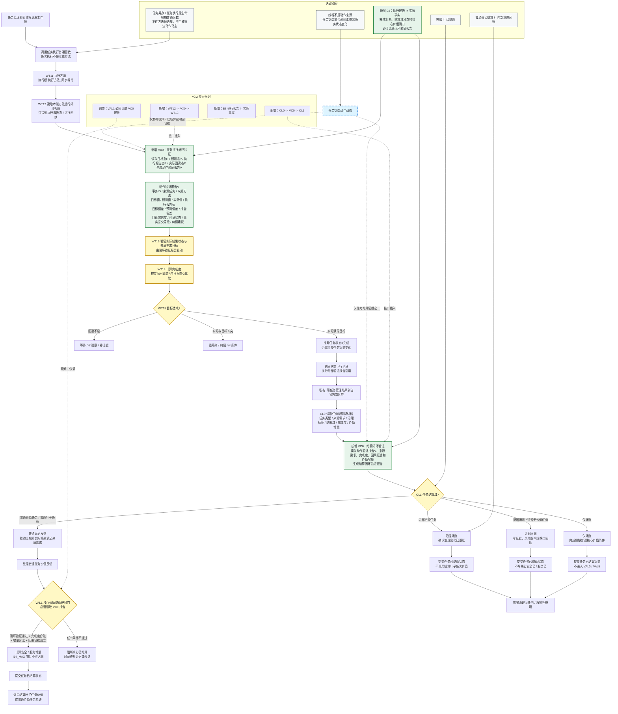

# 任务执行及结算流程图 v0.3

更新时间：2026-06-13

修订对象：`流程图/20260612_任务执行及结算流程图_v0.2.md`

## 依据

```text
用户本轮修订意见：编码前先把 v0.2 流程图补成闭环验证接口契约。
规范/禁止性规范20260611.md
规范/规范目录.md
计划/计划索引.md
规范/自我动作验证闭环规范20260612.md
规范/任务筹办与执行边界规范20260512.md
规范/自我内部循环实现规范20260512.md
规范/安全服务值结算规范20260518.md
流程图/20260612_任务执行及结算流程图_v0.2.md
计划/20260612_动作验证闭环工程落地实施计划_v0.1.md
```

## 说明

本版只做轻量接口契约修订，不表示代码已经实现闭环验证或结算重构。新增三个接口/边界节点：`VX0` 任务执行闭环验证、`VC0` 结算闭环验证、`B8` 执行报告不等于实际事实。后续实现顺序固定为：先落地闭环验证最小竖切片，再逐段接入执行、结算域分类和核心价值结算硬闸门。

## 与 v0.2 的主要差异

```text
1. 新增 VX0：插入 WT12 -> WT13 之间，生成动作验证报告。
2. 新增 VC0：插入 CL0 -> CL1 之间，生成结算闭环验证报告。
3. 新增 B8：执行报告 != 实际事实，完成判断和结算判断必须读取闭环验证报告。
4. VAL1 核心价值结算硬闸门增加对 VC0 报告的依赖。
5. 本图是接口契约图，不实施整张 v0.2 流程图。
```

## 报告接口字段

```text
动作验证报告最小字段：
    动作事务ID
    来源任务
    来源方法
    目标值
    预测值
    实际值
    执行报告值
    目标偏差
    预测偏差
    报告偏差
    回读置信度
    验证状态
    事实提交等级
    纠偏建议

结算闭环验证最小读取：
    动作验证报告
    来源需求
    任务类型 / 任务域
    治理标签
    结果域
    完成度
    价值增量
    因果证据
    是否允许核心价值结算
```

## 流程图



## 关键边界

```text
1. 本图只把 v0.2 补成接口契约，不代表执行闭环验证、结算域分类或核心价值结算已实现。
2. 执行报告态 E 不能冒充实际回读态 R；任务完成判断必须读取 VX0 动作验证报告。
3. WT13 / WT14 / WT15 后续应由闭环验证报告驱动；方法返回成功不等于目标达成。
4. CL0 / CL1 后续应读取 VC0 结算闭环验证报告；结算域分类不能只靠任务名或执行报告。
5. VAL1 核心价值结算硬闸门必须要求闭环验证通过、完成度合法、价值增量合法和因果证据成立。
6. 内部治理任务、证据任务和仅闭账任务可以进入已结算闭账，但不得调用结算叶子任务价值，不写核心安全值 / 服务值。
7. 后续编码顺序：先实现动作验证报告最小能力，再接 WT11-WT15，再接 CL0/VC0/CL1，最后接 VAL1 和 GOV/EVD/CLOSE。
```
