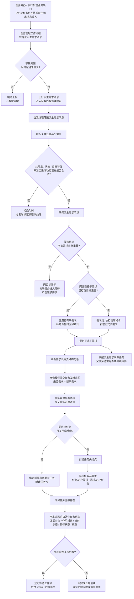

# 创建子任务相关流程图 v0.1

更新时间：2026-06-12

## 用途

本图用于梳理当前代码中“创建子任务”的实际链路。

当前口径：

```text
缺口 / 派生事实
-> 自我线程裁决生成或复用子需求
-> 子需求任务化
-> 任务管理界面线程创建或复用任务
```

这里的“子任务”不是任务线程直接裸建的子任务节点。任务父子关系从需求树推导，任务节点只绑定自己的 `对应需求`。

依据：

- `规范/禁止性规范20260611.md`
- `规范/需求树生长机制规范20260512.md`
- `规范/任务根据需求初始化规范20260509.md`
- `规范/子任务完成触发父任务重筹办规范20260508.md`
- `规范/任务筹办与执行边界规范20260512.md`
- `自我线程模块.impl.cpp`
- `任务模块.管理工作线程.ixx`
- `任务模块.管理界面线程.impl.cpp`
- `需求类.h`
- `需求类.cpp`
- `任务类.cpp`
- `任务主信息类.h`

## 总流程



## 对账点

1. 任务管理工作线程不直接写需求树，只上报 `结构_任务管理派生需求消息`。
2. 自我线程通过 `私有_确保派生需求节点` 裁决是否形成正式子需求。
3. 子需求入树时有目标重叠防重：与父需求目标重叠则停等；同父直接子需求目标重叠则复用。
4. 子需求任务化通过 `私有_提交任务发起请求到任务管理界面线程_线程侧` 提交任务发起意图。
5. 任务管理界面线程可复用 / 升级同目标任务；无法复用时才创建任务头结点。
6. 任务创建后必须绑定需求、确保任务虚拟存在，并用来源需求初始化任务语义。
7. 子任务创建后不等于父任务完成；父任务需要等待子需求结果，后续通过待重筹办 / 巡检派发重新进入筹办。

## 关键代码入口

```text
任务模块.管理工作线程.ixx
    私有_筹办派生需求消息稳定键
    私有_吸收筹办派生需求消息

自我线程模块.impl.cpp
    私有_确保派生需求节点
    私有_收到派生需求消息时完善需求树
    私有_提交任务发起请求到任务管理界面线程_线程侧

需求类.h / 需求类.cpp
    需求目标重叠_已加锁
    查找直接子需求_按目标重叠_已加锁
    添加子需求节点_已加锁
    需求类::绑定对应任务

任务模块.管理界面线程.impl.cpp
    提交任务治理请求
    私有_按需求创建任务并初始化
    私有_确保任务虚拟存在
    私有_用需求初始化任务虚拟存在

任务类.cpp
    任务类::创建任务头结点
    任务类::取或创建_任务虚拟存在
    任务类::初始化任务虚拟存在信息
```

## 边界

```text
任务筹办 / 任务执行不是本能方法。
任务线程不得直接写需求树。
只有需求需要任务化，任务筹办 / 任务执行本身不应被建成子任务。
子任务完成只触发父任务重新判断，不直接证明父需求完成。
```
