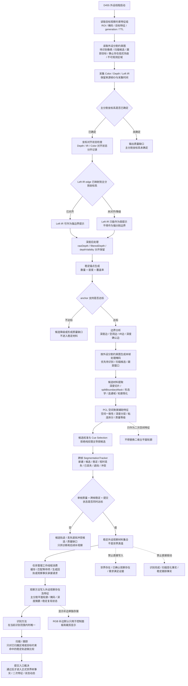
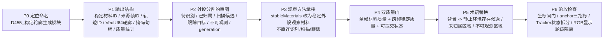

# D455 稳定轮廓项目适配流程图与说明

更新时间：2026-06-14

## 依据

```text
D:\D455\流程图\20260614_D455稳定轮廓算法流程图_v0.1.md
用户提供的优化信息：
    D455 稳定轮廓算法只生成稳定外设观察材料，不直接成为观察、识别、扫描、跟踪方法。
规范/禁止性规范20260611.md
规范/规范目录.md
计划/计划索引.md
规范/双目相机外设独占观察线程规范20260527.md
规范/相机外设综合工作流程规范20260607.md
规范/观察特征质量诊断与认知补偿规范20260525.md
规范/观察像素簇与存在候选分层规范20260527.md
规范/当前场景特征值明确标准规范20260602.md
规范/识别本能方法唯一性收敛规范20260607.md
```

## 说明

这份项目适配版把原图中的 D455 稳定轮廓算法收束为外设线程内部的 L0-L3 供料模块。它的职责是把抖动的单帧 RGB-D / IR 簇加工成跨帧稳定的外设观察材料，而不是确认世界存在、判断自我观察完成、提交扫描变化事实或提交跟踪事实。

项目侧正式链路保持为：

```text
D455 稳定外设观察材料
    -> 任务管理工作线程承接
    -> 观察方法写入外设观察存在及特征
    -> 识别在当前范围内判唯一
    -> 扫描 / 跟踪按需求比较变化或连续性
    -> 提交入口裁决后才可能进入世界树事实
```

本文件是路线和说明文档，不表示相关代码已经完成，也不表示 D455 自然业务样本已经验收通过。

## 项目适配流程图



## 实施路线图



## 关键边界

```text
1. D455 稳定轮廓生成模块属于外设线程内部工程算法，不登记为自我侧观察、识别、扫描或跟踪本能方法。
2. D455 输出只能叫稳定外设观察材料或稳定外设观察存在材料，不叫稳定存在、已确认存在或世界存在。
3. 外设材料、报告、队列项、目标观察约束和 tracker ID 都不是世界树事实主体。
4. RGB 不参与主分割决策；RGB 严格补边默认只生成显示补边平面轮廓，不能覆盖主分割平面轮廓。
5. PCL 聚类是空间辅助二次特征来源，只影响质量、空间一致性、深度分层和粘连拆分候选，不能替代主平面轮廓。
6. 自我认知中不使用“背景”作为存在类别；工程背景必须转写为静止环境存在候选、未归属区域、不可观测区域或已归属静止存在低优先级区域。
7. 单帧质量达标不等于可提交观察材料；必须同时满足单帧材料质量、跨帧稳定质量和可提交状态。
8. 缺坐标系对齐时，Left IR 边缘只能降级为弱提示；不能作为强分割边界。
9. 任务管理工作线程只做外设消息第一承接、缓存、等待项匹配、回执和承接请求，不直接写世界树真值。
10. 识别只在当前识别范围内判唯一；扫描和跟踪只在已归属区域、扫描候选或目标约束命中的稳定轨迹上做比较。
```

## 输出结构建议

稳定外设观察材料的队列项不应只存稳定轮廓图像，至少需要记录：

```text
外设稳定材料ID
来源帧ID
来源轨迹ID
主分割坐标系状态
左红外边缘坐标对齐状态
深度材料坐标对齐状态
RGB裁剪材料坐标对齐状态
平面轮廓 VecIU64
像素集合掩码句柄
主分割平面轮廓
显示补边平面轮廓
轮廓中心
ROI
深度摘要
稳定锚点数量
稳定锚点密度
稳定锚点覆盖率
连续命中帧数
连续丢失帧数
中心抖动方差
面积抖动方差
深度抖动方差
轮廓IoU均值
轮廓IoU方差
材料等级
单帧材料质量等级
跨帧稳定质量等级
外设观察存在提交状态
generation
TTL
来源材料页或 d455:// 句柄
```

## 输入约束建议

从自我侧或任务管理侧传入 D455 的约束应作为外设供料约束，不作为事实主体：

```text
目标观察约束特征组：
    单目标存在
    单目标特征
    当前值
    目标比较值域 / 误差
    ROI / 掩码 / AABB / 点集
    TTL
    约束generation
    目标特征generation
    来源需求 / 来源任务 / 约束ID

外设分割约束图：
    待识别像素掩码
    已归属存在掩码
    已归属静止存在低优先级掩码
    扫描候选掩码
    跟踪目标掩码
    不可观测区域掩码
    低价值区域掩码
    目标ROI
    目标特征ID
    目标约束generation
```

候选提取区域建议按以下规则生成：

```text
候选提取区域 =
    待识别像素掩码
    ∪ 扫描候选掩码
    ∪ 跟踪目标掩码

排除或降频：
    已观察完成且无变化需求区域
    已归属静止存在低优先级区域
    不可观测区域
    低价值区域
```

## 质量门控

坐标系闸门：

```text
主分割坐标系状态 == 已确定
深度材料.坐标对齐状态 == 已对齐
RGB裁剪材料.坐标对齐状态 == 已对齐

若左红外边缘.坐标对齐状态 != 已对齐：
    左红外边缘只能作为弱提示；
    不能作为强分割边界。
```

稳定锚点闸门：

```text
anchor数量 >= 最小anchor数量
anchor密度 >= 最小anchor密度
anchor覆盖率 >= 最小anchor覆盖率

稳定锚点覆盖率 =
    轮廓内稳定锚点像素数 / 轮廓有效深度像素数
```

跨帧稳定闸门：

```text
连续命中帧数 > 最小命中帧数
连续丢失帧数 < 最大丢失帧数
中心误差方差 < 最大中心误差方差
面积误差方差 < 最大面积误差方差
深度误差方差 < 最大深度误差方差
轮廓IoU方差 < 最大轮廓IoU方差
硬冲突数量 == 0
```

正式承接闸门：

```text
单帧材料质量等级 >= 可用
跨帧稳定质量等级 >= 优质
外设观察存在提交状态 == 可提交
来源材料可回查 == 是
generation / TTL 有效
```

## 与四类自我方法的对应关系

观察：

```text
D455 稳定外设观察材料
    -> 观察方法
        -> 外设观察存在
        -> 外设观察存在.平面轮廓 / 掩码 / 深度摘要 / 稳定复现状态
```

识别：

```text
识别只消费稳定外设观察存在及其已有特征。
识别目标是在当前识别范围内确定唯一存在。
不唯一时回观察补特征；唯一但冲突时进入复验。
```

扫描：

```text
扫描只处理已归属存在、扫描候选掩码、历史基准和稳定外设观察材料。
大量未归属区域出现时，扫描停止生成变化动态，转入观察 / 识别。
```

跟踪：

```text
跟踪只处理目标约束命中的稳定轨迹。
候选未稳定时，跟踪状态只能是待复验或证据不足，不能提交稳定跟踪事实。
```

## 术语替换

```text
旧词：未知背景
新词：未归属区域 / 不可观测区域

旧词：背景结构
新词：静止环境存在候选

旧词：背景过滤
新词：已归属静止存在低优先级过滤

旧词：背景保持黑色
新词：未归属/不可观测区域显示为黑色
```

## 后续代码切片建议

```text
1. 先做文档与接口命名收口：
   stableMaterials -> 稳定外设观察材料；
   保留 tracker 内部英文变量可以，但外显报告和文档不得称为稳定存在。

2. 再做最小结构补齐：
   增加坐标对齐状态、anchor 密度/覆盖率、Tracker 状态拆分和双质量门字段。

3. 再接入外设分割约束图：
   先允许空约束图等价于全局观察；
   非空约束图只改变外设处理区域和质量策略，不直接改变世界树事实。

4. 最后改承接链：
   稳定外设观察材料先进任务管理和观察方法；
   识别、扫描、跟踪只读观察方法写出的正式外设观察存在及合法辅助材料。
```

## 验收检查

```text
1. 搜索外显文档、报告字段和控制面板文案，确认不再把 D455 输出称为稳定存在、已确认存在或世界存在。
2. 检查 RGB 补边结果是否与主分割轮廓分开存储和使用。
3. 检查 Left IR 边缘与主分割坐标系不一致时是否降级为弱提示。
4. 检查 anchor 判断是否包含数量、密度、覆盖率，而不是只用 stable-contour-min-anchors。
5. 检查 Tracker 输出是否区分新建、候选、稳定、短时丢失、已丢失、遮挡候选和冲突。
6. 检查任务管理、自我观察、识别、扫描、跟踪之间是否仍保持 L0-L3 外设供料、L4 自我承接边界。
7. 构建和真实运行验证应另开代码切片执行；本文档不替代自然业务样本证据。
```
