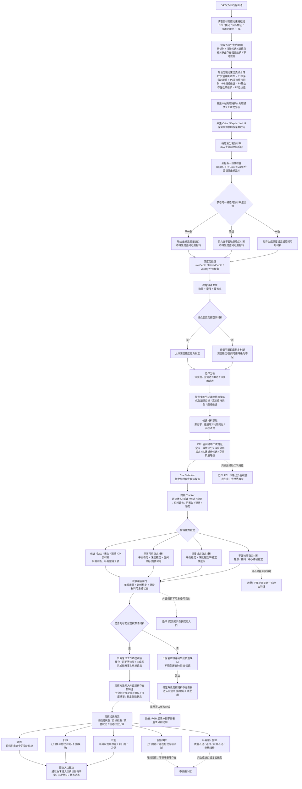
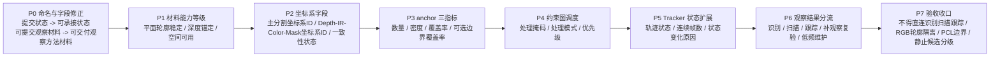

# D455 稳定轮廓项目适配流程图与说明 v0.2

更新时间：2026-06-14

## 依据

```text
流程图/20260614_D455稳定轮廓项目适配流程图_v0.1.md
D:\D455\流程图\20260614_D455稳定轮廓算法流程图_v0.1.md
用户对 v0.1 的修正意见：
    1. 外设侧不用“提交状态”，改为“外设材料可承接状态 / 稳定材料可交付状态”。
    2. 稳定材料按平面轮廓、深度锚定、空间可用分能力等级。
    3. 外设分割约束图增加优先级调度。
    4. 坐标系闸门增加坐标系ID和一致性状态。
    5. RGB 补边与主分割轮廓强制分离。
    6. PCL 只输出空间辅助二次特征。
    7. Tracker 状态进入材料结构。
    8. 观察方法之后增加观察结果分流。
    9. 静止环境存在候选不等于已归属静止存在。
    10. 验收增加“稳定外设观察材料不得直连识别/扫描/跟踪正式逻辑”。
规范/禁止性规范20260611.md
规范/规范目录.md
计划/计划索引.md
规范/相机外设综合工作流程规范20260607.md
规范/观察特征质量诊断与认知补偿规范20260525.md
规范/观察像素簇与存在候选分层规范20260527.md
规范/当前场景特征值明确标准规范20260602.md
规范/识别本能方法唯一性收敛规范20260607.md
```

## 说明

v0.2 保留 v0.1 的主边界：D455 稳定轮廓算法仍只是外设线程内部 L0-L3 供料模块。它负责把单帧 RGB-D / IR 簇熬成跨帧稳定的外设观察材料，不负责确认世界存在，不负责观察完成判断，不负责扫描或跟踪事实提交。

本版主要补齐三件事：

```text
1. 外设材料只能写“可承接 / 可交付”，不能写“提交状态”。
2. 稳定材料按能力分级：平面轮廓稳定、深度锚定、空间可用。
3. 稳定材料进入自我侧之前必须过观察承接闸门；观察方法写入外设观察存在后，再按状态分流到识别、扫描、跟踪或补观察 / 复验。
```

本文件是路线和说明文档，不表示相关代码已经完成，也不表示 D455 自然业务样本已经验收通过。

## 项目适配流程图



## 实施路线图



## v0.2 关键修正

```text
1. “提交状态”从外设侧删除，统一改为“外设材料可承接状态 / 稳定材料可交付状态 / 可交付观察方法材料”。
2. anchor 不再一刀切决定整份材料不可用；它决定深度锚定和空间可用能力，平面轮廓稳定材料可独立成立。
3. 外设分割约束图增加优先级合成，解决同一区域同时属于跟踪、扫描、待识别时的调度冲突。
4. 坐标系闸门增加坐标系ID；坐标系不一致时不得生成空间可用稳定材料。
5. 主分割平面轮廓和显示补边平面轮廓强制分离。
6. PCL 只输出空间辅助二次特征，不输出外设观察存在、正式空间存在、正式平面轮廓或世界事实。
7. Tracker 状态进入稳定材料结构，供观察承接、补观察、复验和跟踪恢复判断使用。
8. 观察方法之后增加观察结果分流，避免把观察、识别、扫描、跟踪误画成固定串行链。
9. 静止环境存在候选只是外设侧候选材料，不等于已归属静止存在。
10. 验收增加稳定外设观察材料不得直连识别、扫描、跟踪正式逻辑。
```

## 关键边界

```text
1. D455 稳定轮廓生成模块属于外设线程内部工程算法，不登记为自我侧观察、识别、扫描或跟踪本能方法。
2. D455 输出只能叫稳定外设观察材料、稳定外设观察存在材料或可交付观察方法材料，不叫稳定存在、已确认存在或世界存在。
3. 外设材料、报告、队列项、目标观察约束和 tracker ID 都不是世界树事实主体。
4. 任务管理工作线程只做外设消息第一承接、缓存、等待项匹配、回执和承接请求，不直接写世界树真值。
5. 观察方法是稳定外设观察材料进入正式外设观察存在的闸门；识别、扫描、跟踪只能读取观察方法写出的正式外设观察存在及合法辅助材料。
6. 识别只在当前识别范围内判唯一；扫描只处理已归属可比较区域；跟踪只处理目标约束命中的稳定轨迹。
7. RGB 显示补边不能覆盖主分割平面轮廓，不能直接参与识别、扫描、跟踪；未来若要参与正式观察，必须经观察方法复验、多帧稳定和合法特征写入。
8. PCL 聚类不能替代二维主平面轮廓；只能影响空间一致性评分、深度分层状态、粘连拆分候选状态和空间质量等级。
9. 自我认知中不使用“背景”作为存在类别；工程背景必须转写为静止环境存在候选、未归属区域、不可观测区域或已归属静止存在低优先级区域。
10. 静止环境存在候选不是已归属静止存在；它需要经过观察、识别、多帧稳定和归属确认，才可能成为已归属静止存在。
```

## 输出结构建议

稳定外设观察材料的队列项不应只存稳定轮廓图像，至少需要记录：

```text
外设稳定材料ID
来源帧ID
来源轨迹ID
来源材料页或 d455:// 句柄

主分割坐标系ID
深度材料.坐标系ID
左红外边缘.坐标系ID
RGB裁剪材料.坐标系ID
外设材料.坐标系一致性状态 == 一致 / 不一致 / 降级
深度材料.坐标对齐状态
左红外边缘.坐标对齐状态
RGB裁剪材料.坐标对齐状态

主分割平面轮廓 VecIU64
显示补边平面轮廓 VecIU64
像素集合掩码句柄
轮廓中心
ROI
深度摘要

稳定锚点数量
稳定锚点密度
稳定锚点覆盖率
边界锚点覆盖率，可选

轨迹状态
轨迹状态generation
轨迹状态连续帧数
轨迹状态变化原因
轨迹状态变化动态候选
连续命中帧数
连续丢失帧数
中心抖动方差
面积抖动方差
深度抖动方差
轮廓IoU均值
轮廓IoU方差

单帧材料质量等级
跨帧稳定质量等级
平面轮廓稳定状态
深度锚定状态
空间可用状态
外设材料可承接状态
可承接能力等级 == 平面轮廓 / 深度锚定 / 空间可用
稳定材料可交付状态

generation
TTL
```

不得在外设材料结构中把这些字段命名为：

```text
外设观察存在提交状态
可提交观察材料
D455 提交状态
```

## 输入约束和调度

从自我侧或任务管理侧传入 D455 的约束应作为外设供料约束，不作为事实主体：

```text
目标观察约束特征组：
    单目标存在
    单目标特征
    当前值
    目标比较值域 / 误差
    ROI / 掩码 / AABB / 点集
    TTL
    约束generation
    目标特征generation
    来源需求 / 来源任务 / 约束ID

外设分割约束图：
    待识别像素掩码
    已归属存在掩码
    已归属静止存在低优先级掩码
    扫描候选掩码
    跟踪目标掩码
    不可观测区域掩码
    低价值区域掩码
    目标ROI
    目标特征ID
    目标约束generation
```

约束优先级建议：

```text
P0：安全相关跟踪目标
P1：当前任务指定跟踪目标
P2：待识别高价值区域
P3：扫描候选区域
P4：已归属静止存在低频维护区域
P5：低价值区域
```

调度输出：

```text
本帧处理掩码
本帧处理模式
本帧处理优先级
本帧降频区域集合
本帧不可观测区域集合
```

候选提取区域建议按以下规则生成：

```text
候选提取区域 =
    待识别像素掩码
    ∪ 扫描候选掩码
    ∪ 跟踪目标掩码

排除或降频：
    已观察完成且无变化需求区域
    已归属静止存在低优先级区域
    不可观测区域
    低价值区域
```

## 质量与能力门控

坐标系闸门：

```text
任何参与同一候选材料生成的掩码、轮廓、深度、IR 边缘和 RGB 裁剪材料，
必须先声明所在坐标系ID。

外设材料.坐标系一致性状态 == 一致：
    可继续判定深度锚定和空间可用材料。

外设材料.坐标系一致性状态 == 降级：
    可生成平面轮廓稳定材料；
    不生成空间可用稳定材料。

外设材料.坐标系一致性状态 == 不一致：
    只能生成质量缺口或诊断线索；
    不得生成空间可用稳定材料。
```

稳定锚点闸门：

```text
anchor数量 >= 最小anchor数量
anchor密度 >= 最小anchor密度
anchor覆盖率 >= 最小anchor覆盖率

稳定锚点覆盖率 =
    轮廓内稳定锚点像素数 / 轮廓有效深度像素数
```

材料能力等级：

```text
平面轮廓稳定材料：
    平面轮廓、掩码、中心点跨帧稳定；
    深度可以不足。

深度锚定稳定材料：
    平面轮廓稳定；
    深度有效率、深度稳定性和 anchor 支持达标。

空间可用稳定材料：
    平面轮廓稳定；
    深度锚定；
    空间坐标 / 空间摘要可用；
    坐标系一致性状态必须为一致。
```

观察承接闸门：

```text
单帧材料质量等级 >= 可用
跨帧稳定质量等级 >= 对应能力等级要求
外设材料可承接状态 == 可承接
稳定材料可交付状态 == 可交付观察方法材料
来源材料可回查 == 是
generation / TTL 有效
```

## 观察结果分流规则

观察方法写入外设观察存在及特征后，再按状态分流：

```text
新外设观察存在 / 未归属 / 冲突：
    -> 识别

已归属稳定存在 / 已归属可比较区域：
    -> 扫描候选

目标约束命中的稳定轨迹：
    -> 跟踪候选

质量不足 / 遮挡 / 坐标降级 / 证据不足：
    -> 补观察 / 复验线索

已归属静止存在：
    -> 低频维护
```

不是所有稳定材料都必须先识别再扫描 / 跟踪。观察、识别、扫描、跟踪不是固定串行阶段，而是同一观察承接链上的状态分流。

## 与四类自我方法的对应关系

观察：

```text
D455 稳定外设观察材料
    -> 外设材料可承接状态达标
    -> 任务管理工作线程承接
    -> 观察方法
        -> 外设观察存在
        -> 外设观察存在.平面轮廓 / 掩码 / 深度摘要 / 稳定复现状态
```

识别：

```text
识别只消费观察方法写出的外设观察存在及其已有特征。
识别目标是在当前识别范围内确定唯一存在。
识别不补写一阶特征；缺特征时回观察或补观察。
```

扫描：

```text
扫描只处理已归属存在、已归属可比较区域、扫描候选掩码、历史基准和观察方法写出的正式外设观察存在。
大量未归属区域出现时，扫描停止生成变化动态，转入观察 / 识别。
```

跟踪：

```text
跟踪只处理目标约束命中的稳定轨迹和观察方法写出的正式外设观察存在。
候选未稳定时，跟踪状态只能是待复验或证据不足，不能提交稳定跟踪事实。
短时丢失不等于消失；遮挡不等于消失；冲突回识别 / 观察复验。
```

## 术语分级

```text
旧词：未知背景
新词：未归属区域 / 不可观测区域

旧词：背景结构
新词：静止环境存在候选

旧词：背景过滤
新词：已归属静止存在低优先级过滤

旧词：背景保持黑色
新词：未归属/不可观测区域显示为黑色
```

分级规则：

```text
静止环境存在候选：
    外设侧候选材料，不是静止存在。

已归属静止存在：
    自我侧已识别归属的存在。

静止存在低优先级区域：
    可以降频处理的已归属存在区域。
```

## 后续代码切片建议

```text
P0 命名与字段修正：
    stableMaterials -> 稳定外设观察材料
    外设观察存在提交状态 -> 外设材料可承接状态
    可提交观察材料 -> 可交付观察方法材料

P1 材料能力等级：
    增加平面轮廓稳定状态、深度锚定状态、空间可用状态、可承接能力等级。

P2 坐标系字段：
    增加主分割坐标系ID、深度/IR/RGB/Mask 坐标系ID、坐标系一致性状态。

P3 anchor 三指标：
    保留数量，同时增加 anchor密度、anchor覆盖率、边界anchor覆盖率。

P4 约束图调度：
    增加外设分割约束优先级、本帧处理掩码、本帧处理模式、本帧处理优先级。

P5 Tracker 状态扩展：
    输出轨迹状态、轨迹状态连续帧数、状态变化原因、轨迹状态generation。

P6 观察结果分流：
    D455 材料进入任务管理后必须先到观察方法；观察方法输出后再分流识别、扫描、跟踪、补观察 / 复验。
```

## 验收检查

```text
1. 搜索外显文档、报告字段和控制面板文案，确认不再把 D455 输出称为稳定存在、已确认存在或世界存在。
2. 检查外设侧字段不再使用“提交状态 / 可提交观察材料”作为正式新命名；提交只留给自我提交入口。
3. 检查稳定材料是否区分平面轮廓稳定、深度锚定、空间可用三种能力等级。
4. 检查坐标系ID和坐标系一致性状态是否进入材料结构；不一致时不得生成空间可用稳定材料。
5. 检查 anchor 判断是否包含数量、密度、覆盖率，而不是只用 stable-contour-min-anchors。
6. 检查外设分割约束图是否经过优先级合成，输出本帧处理掩码、处理模式和处理优先级。
7. 检查 RGB 显示补边结果是否与主分割轮廓分开存储和使用。
8. 检查 PCL 输出是否只作为空间辅助二次特征，不替代主平面轮廓。
9. 检查 Tracker 输出是否区分新建、候选、稳定、短时丢失、已丢失、遮挡候选和冲突，并进入材料结构。
10. 检查 D455 稳定外设观察材料是否必须先经过观察方法，不得直接进入识别、扫描或跟踪正式逻辑。
11. 检查静止环境存在候选是否仍停留在候选层，不得直接等同于已归属静止存在。
12. 构建和真实运行验证应另开代码切片执行；本文档不替代自然业务样本证据。
```
